# Reactor + ThreadPool

> 多个客户端可以同时向**Reactor服务器**发起请求，而Reactor服务器是可以同时处理这些请求的。其中，Reactor使用**IO多路复用技术**监听多个客户端，但是为了能与多个客户端进行连接，所以注册了一个<font color=red>**连接器Acceptor对象**</font>到Reactor中，进行连接事件的处理，也就是执行**accept()函数**，然后将连接交给Reactor对象，Reactor对象就对该连接进行对应的处理，读连接的数据，处理连接的数据，然后将处理好之后的数据发送给给个客户端，一条连接处理完毕之后继续处理下一条连接。其实这个过程，就是在Linux阶段，使用socket网络编程与IO多路复用（也就是epoll技术）实现的逻辑。

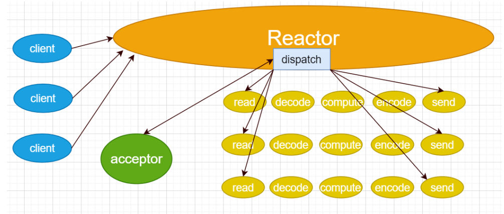

## :airplane:类的设计

#### 模块一 SOCKET

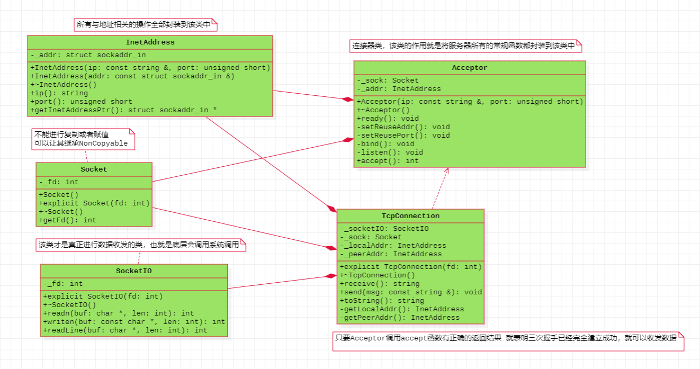

> **Socket类**：套接字类，将所有与套接字相关的操作都封装到该类中，包括：套接字的创建、套接字的关闭、套接字的获取。
>
> **InetAddress类**：地址类，将所有与地址相关的操作全部封装到该类中，包括：通过ip与端口号创建本对象、获取ip地址、获取port、获取struct sockarr_in的指针等等函数。
>
> **Acceptor类**：连接器类，将服务器的所有基本操作全部封装到该类中，包括：地址复用、端口复用、bind、listen、accept等。 
>
> **TcpConnection类**：TCP连接类，如果Acceptor类的对象调用accept函数有正确的返回结果，就表明三次握手建立成功了，就可以创建出一条通信的TCP连接。<font color=red>**以后就可以通过该连接的对象进行数据的收发：发送数据使用send函数、接收数据使用receive函数，具体的数据收发细节不在该类中，而是单独交给另外一个类SocketIO**</font>。(注意：为了起到调试代码的作用，这边增加对应的获取 服务器地址的函数getLocalAddr、获取客户端地址的函数getPeerAddr、以及打印服务器与客户端ip与端口号的函数toString) 
>
> ==**（ 回调思想对TcpConnection的修改 ）**==
>
> 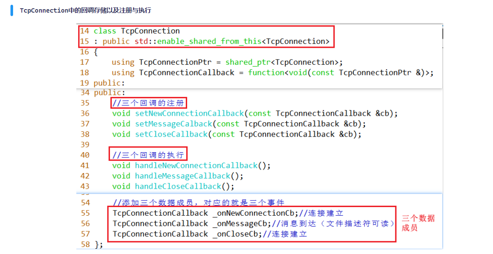
>
> 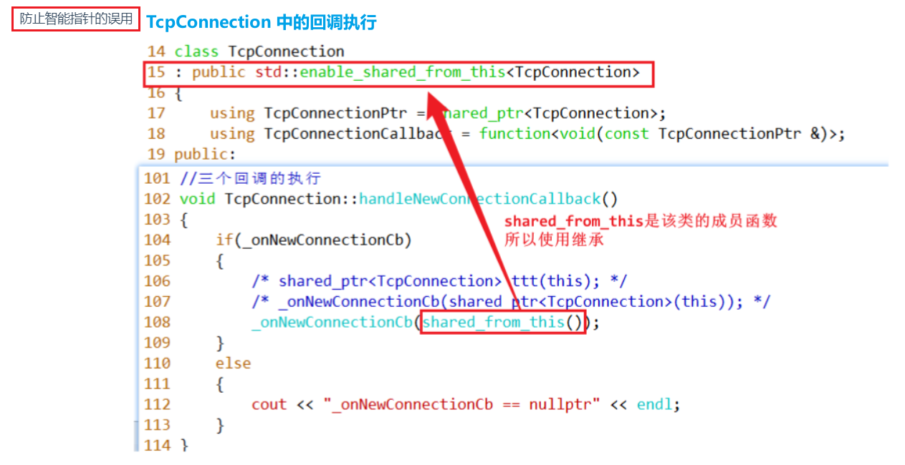
>
> **SocketIO类**：读写数据类，将真正数据收发的细节全部封装到该类中，例如：每次读任意个字节的数据、每次写任意个字节的数据、每次读一行的数据等。 

#### 模块二 EPOLL

>   添加对epoll的处理，也就是新增了一个**事件循环类EventLoop**：本质上就是将epoll的三个函数（epoll_create、epoll_ctl、epoll_wait）以及对应的两个文件描述符的可读事件的处理（Socket类创建的listenfd、以及Acceptor中的accept函数的返回的标识连接创建的文件描述符connfd）。
>
>   **对应的数据成员设计如下：**
>
>   - epoll_create函数的返回结果，需要将其设置为数据成员，因为该文件描述符需要被epoll的另外两个函数进行使用，所以要设置为数据成员int _epfd
>   - epoll_wait函数需要将就绪的文件描述符放在struct epoll_event结构体，也就是填充epoll_wait的第二个参数，后续还需要使用该结构体，也需要将其设置为数据成员，vector<struct epoll_event> _evtList
>   - 如果监听的文件描述符listenfd可读，就说明有新的连接，就需要调用accept函数进行接受，但是该函数被封装到Acceptor类中了，所以需要使用Acceptor类创建的对象，才能获取到accept函数，可以使用Acceptor的对象（对应的应用也可以、对象的指针也可以，目的都是为了获取其中的成员函数accept），<font color=red>**这里可以选Acceptor类型的引用**</font>， Acceptor &_acceptor 
>   - 对于每一个accept执行结束后，说明连接已经建立，所以需要有一个对应的连接对象，也就 TcpConnection，但是每个对象会关联一个文件描述符connfd，所以有一个记录文件描述符到 TcpConnection的数据结构，可以使用键值对进行存储，这样以后就可以通过文件描述符就可以找到对应的连接，同时文件描述符是不重复的，所以这里可以选择的数据结构有map或者 unordered_map，我们这里选择map，即map，但是注意， **TcpConnection是不能进行复制或者赋值的**，**并且创建出来之后还需要在后续使用该连接，所以最好可以设置为==堆对象==，否则有可能提前销毁了**，<font color=red>**所以为了更好的管理，可以使用智能指针 shared_ptr管理，也就是map<int, shared_ptr<TcpConnection>> _conns;**</font>
>
>   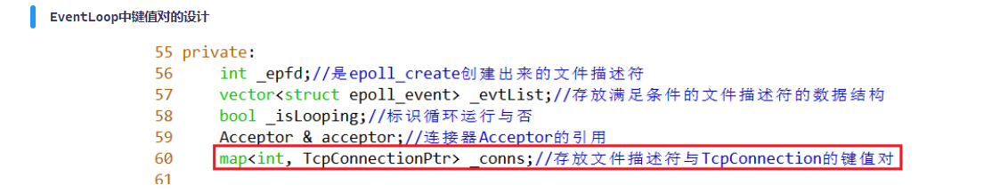
>
>   - 为了标识整个事件循环是否运行，可以设置标志位 bool _isLooping 
>
>   **成员函数的设计如下：**
>
>   - **createEpollFd函数**：作用就是为了封装epoll的epoll_create函数，创建文件描述符。 
>
>   - **addEpollReadFd函数**：作用就是为了封装epoll的epoll_ctl函数，监听对应的文件描述符，例如： listenfd与connfd（这两个文件描述符上述都有描述） 
>
>   - **delEpollReadFd函数**：作用也是为了封装epoll的epoll_ctl函数，不过是删除对文件描述符的监听。 
>
>   - **构造函数**：作用就是为了初始化数据成员，这里只有需要<font color=red>**对引用数据成员需要额外进行初始化**</font>，所以使用==EventLoop(Acceptor &acceptor)==。 
>
>   - **循环函数loop**：对于IO多路复用epoll而言，核心就是大循环，里面封装epoll_wait函数。 
>
>   - **非循环函数loop**：这里可以让其不循环，直接跳出。 
>
>   - **waitEpollFd函数**：里面封装epoll_wait函数，然后就是两大业务逻辑，文件描述符listenfd对应可读的新连接的建立、以及connfd文件描述符可读的读写操作。 
>
>     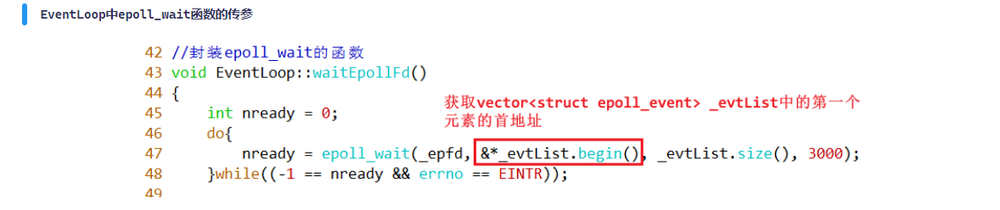
>
>   - **handleNewConnection函数**：处理文件描述listenfd的可读事件，调用Acceptor中的accept函数获得文件描述符connfd以及使用文件描述符connfd创建连接TcpConnection的对象，然后监听文件描述符connfd，**创建文件描述符connfd与连接TcpConnection的对象键值对，便于通过文件描述符可以找到对应的连接**。 
>
>   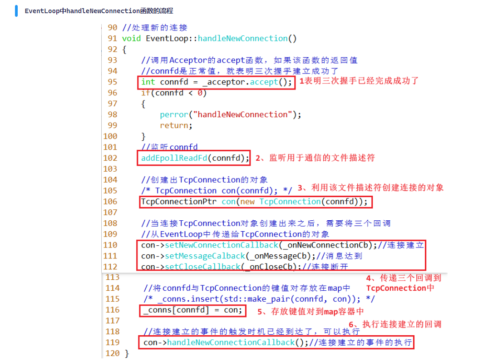
>
>   - **handleMessage函数：**通过文件描述符，映射出对应的连接，然后处理读写事件。
>
>     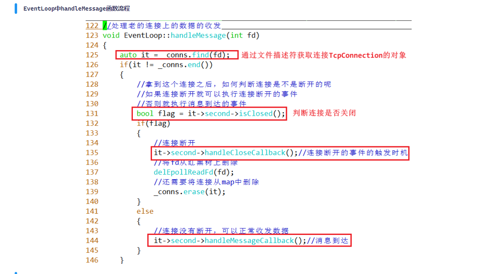

--------------------------------------------------------------------------------------------------------------------------------------

> **TCP网络编程的三个半事件**
>
> **连接建立**：包括服务器端被动接受连接（accept）和客户端主动发起连接（connect）。TCP连接一旦建立，客户端和服务端就是平等的，可以各自收发数据。 
>
> **连接断开**：包括主动断开（close、shutdown）和被动断开（read()返回0）。 
>
> **消息到达**：文件描述符可读。这是最为重要的一个事件，对它的处理方式决定了网络编程的风格（阻塞还是非阻塞，如何处理分包，应用层的缓冲如何设计等等）。 
>
> **消息发送完毕**：这算半个。对于低流量的服务，可不必关心这个事件；另外，这里的“发送完毕”是指数据写入操作系统缓冲区（内核缓冲区），将由TCP协议栈负责数据的发送与重传，不代表对方已经接收到数据.
>
> 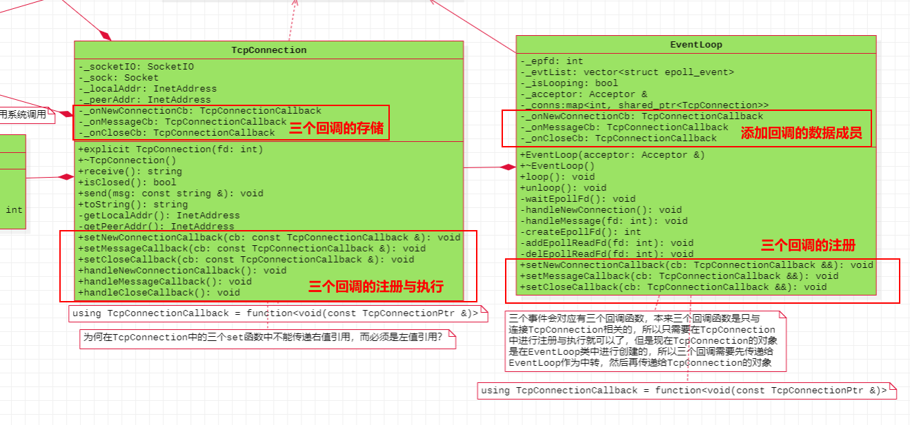
>
> > TCP网络编程中，确实存在主要的三个事件：连接的建立、连接的断开、消息到达（文件描述可读），那么这三个事件在发生的时候，我们的服务器到底要做什么，如何做这些事件呢，我们需要做处理。
> >
> > 比如：连接建立的时候，是不是可以可以知道服务器自己的信息ip与port、客户端的信息ip与port呢，这不就是连接建立可以做的事件吗，当然连接建立之后还有可能做其他事件，那到底做什么事件我们不得而知。
>
>   **但是可以预先将要做的事件框架注册上来，等满足条件的时候再执行不就可以了吗，这不就是回调函数的思想，注册回调函数与实现回调函数。**
>
>   也就是可以使用手段**std::function**将函数类型设置出来，然后创建对象，最后回调函数。（类似之前的基于对象的实现方式）。<span style=color:red;background:yellow>**三个事件对应三个回调函数，并且三个回调都是与连接TcpConnection相关的。但是连接TcpConnection对象本身都是在EventLoop中创建的，所以需要将三个回调先注册给EventLoop对象作为中转，然后交给 TcpConnection对象进行注册与执行，既然是使用std::function，就需要封装函数类型，但是本次每个函数类型都要与连接 TcpConnection对象相关，并且是需要以EventLoop作为中转最好交给TcpConnection对象的，所以类型是 function<void (const TcpConnectionPtr &)> ，因为在数据成员键值对map中存储的是TcpConnection的智能指针类型，所以后面使用的时候都是TcpConnection的智能指针类型**</span>（注意：这里是代码层面上的使用，使用智能指针类型）。
>
> 既然需要先注册给EventLoop，那么就需要在其中有三个数据成员：
>
> 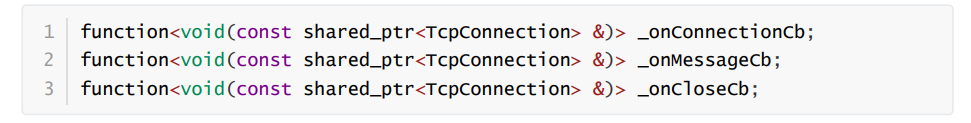
>
> 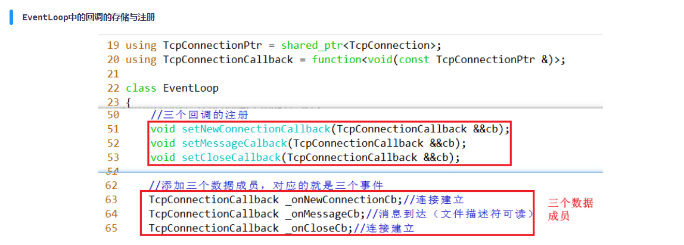  
>
> 然后三个成员函数**setNewConnectionCallback、setMessageCallback、setCloseCallback**，三个函数的参数类型与数据成员的类型一致，但是对于EventLoop而言，只需要注册，不需要执行，==**最终的执行要交给TcpConnection的对象**==。那么TcpConnection类中也需要注册三个回调函数，并且好需要执行三个回调函数。
>
>   这就是三个回调函数的添加思想。

--------------------------------------------------------------------------------------------------------------------------------------

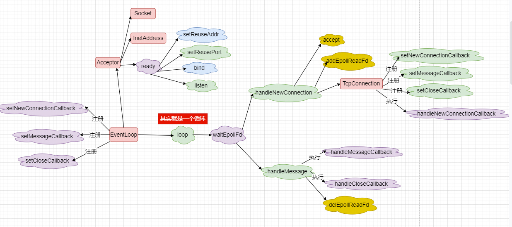

#### 对 SOCKET EPOLL 封装 

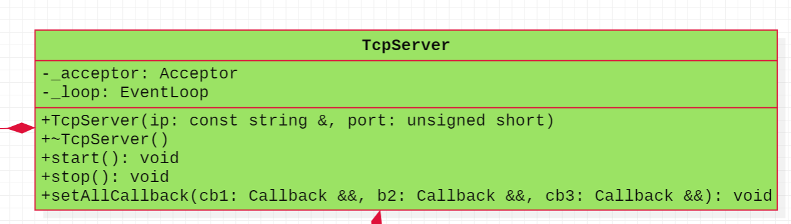

#### <span style=color:red;background:yellow>**思考:thinking:**</span>​ ​ ​-​ -  ​>:walking:**向线程池过渡**

> - 如果业务逻辑的处理比较复杂，那么版本中的onMessage函数中就不能处理业务逻辑，否者前一个连接处理耗费时间比较久，会影响对后一个客户端的处理。
>
>   **所以可以将业务逻辑的处理交给线程池去做**。==需要将msg交给线程池，但是如果msg处理好之后，也要发送给EventLoop，而发送数据的能力只有TcpConnection，所以就将连接与消息都发送给线程池==。也就是将连接TcpConnection的对象con与需要发送的数据msg打包交给MyTask，然后在MyTask的process函数处理msg这个业务逻辑。然后业务逻辑处理好之后通过con进行发送给EventLoop。
>
> - 线程池在处理好数据之后，就可以立马进行发送给EventLoop，所以需要通知EventLoop接收处理好之后的数据，也就是需要让线程池与EventLoop之间进行通信。
>
> - 进程或者线程之间进行通信的方式有一种：**eventfd**

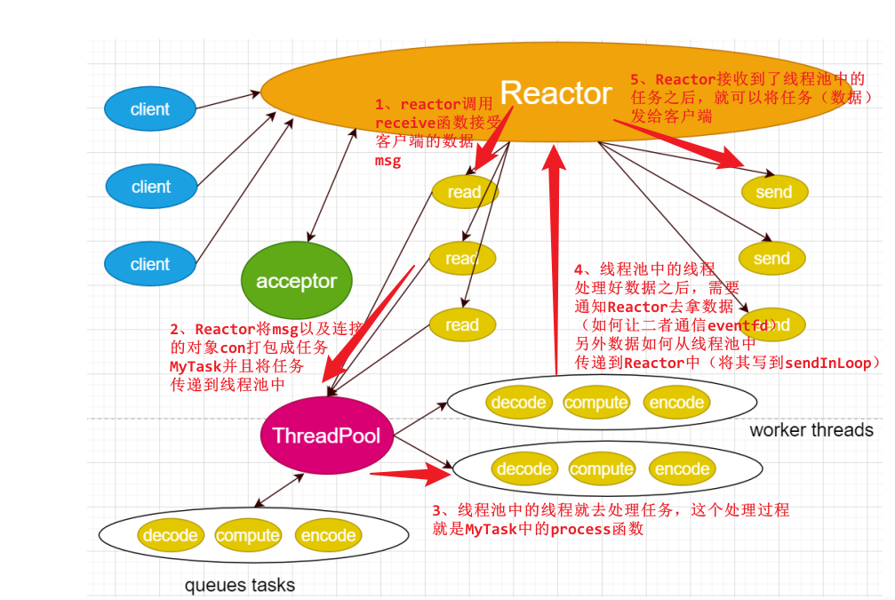

>  与**单线程Reactor模式**不同的是，增加了**线程池对象**，并将<span style=color:red;background:yellow>**业务逻辑的处理从Reactor线程中移出转交给工作的线程池来执行**</span>。这样能够提高Reactor线程的I/O响应，不至于因为一些耗时的业务逻辑而延迟对后面I/O请求的处理
>
>  --------------------------------------------------------------------------------------------------------------------------------
>
>  **使用线程池带来的好处有如下几点**： 
>
>  - 线程池中的线程是提前创建好的，这样可以在处理多个请求时分摊在线程创建和销毁过程产生的巨大开销。 
>  - 将IO操作与非IO操作分离，当请求到达时工作线程通常已经存在，因此不会由于等待创建线程而延迟任务的执行，从而提高了响应性。 
>  - 可以进行职责分离，让IO线程做IO操作，线程池处理业务逻辑，处理大量计算，充分利用CPU的计算优势。
>
>  --------------------------------------------------------------------------------------------------------------------------------
>
>  **使用模式：**
>
>  1、执行read与send操作的线程，将其称为IO线程，主要就是与网络打交道。
>
>  2、将执行decode、compute、encode的线程，称为计算线程。
>
>  3、基础的Reactor适用于计算操作比较简单，而主要的事件花费在IO操作。称为IO密集型。
>
>  4、如果处理业务逻辑比较耗时的时候，就可以再加上线程池，让线程池去处理业务逻辑，并发处理业务逻辑。称为计算密集型。

#### eventfd的使用

**1、作用**

用于**进程或者线程间通信**(如通知/等待机制的实现)  

**2、函数接口**

```C++
int eventfd(unsigned int initval, int flags);

initval：	初始化计数器值，该值保存在内核。
flags:		如果是2.6.26或之前版本的内核，flags 必须设置为0。
flags支持以下标志位：
	EFD_NONBLOCK 类似于使用O_NONBLOCK标志设置文件描述符。
	EFD_CLOEXEC 类似open以O_CLOEXEC标志打开，O_CLOEXEC 应该表示执行exec()时，之前通过open()打开的文件描述符会自动关闭。
    
返回值：函数返回一个文件描述符，与打开的其他文件一样，可以进行读写操作
```

> **eventfd返回的文件描述符可以被read、write、以及IO多路复用进行监听。内核计数器是一个累加器，一个进程或者线程A执行read的时候，如果内核计数器的值为0，就会阻塞住（阻塞模式）；另外一个进程或者线程B执行write操作，就会像内核计数器累加值，这样就可以达到B通知A的目的。**

**3、进程间通信原理图**

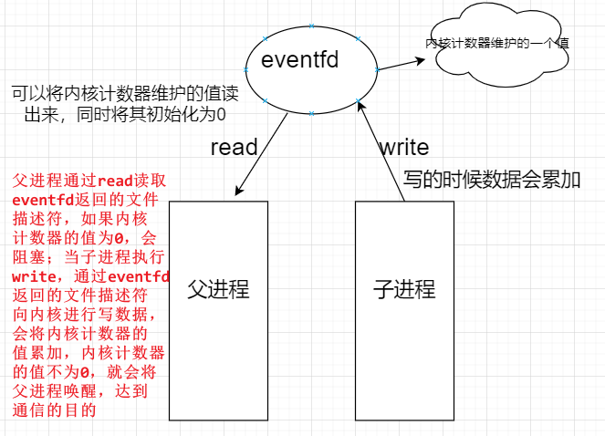s

### 引入线程池

**基于对象的线程池：**

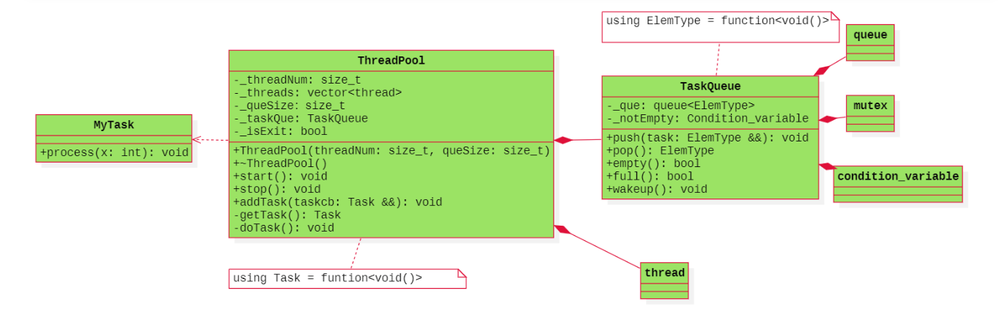

**流程图：**

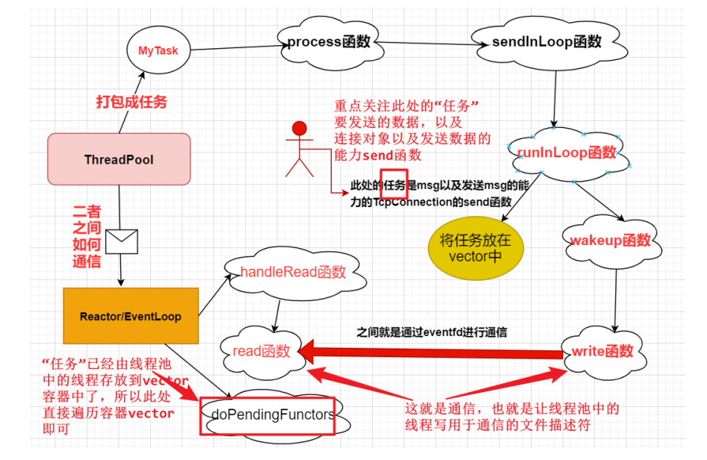

>       本模型相对于基本的Reactor模型而言，可以将**业务逻辑的处理交给线程池来进行处理**，这样能够提高Reactor线程的I/O响应，不至于因为一些耗时的业务逻辑而延迟对后面I/O请求的处理，可以进一步提高性能。但是在本模型中，Reactor在获得连接后，需要采用TcpConnection对象读取数据，也就是执行Read操作（代码中是receive函数），然后将获取到的数据交给线程池的对象进行处理，其实也即是将数据当做任务交给线程池即可，这个比较简单，之前的线程池版本中就实现了添加任务与获取任务，然后让线程池中的线程处理任务，当**线程池处理好业务逻辑的处理(decode、compute、encode)后，线程池中的线程（也就是线程池对象）需要通知Reactor对象，并将处理好之后的数据发送给客户端，这里就存在一个问题，线程池对象如何与Reactor线程之间进行通信？通信之后数据如何传递给 Reactor？Reactor如何将数据发送给客户端？**
>
>     问题一：线程池与Reactor之间通信的方式有哪些？ 
>
>     ​	<span style=color:red;background:yellow>**这里可以采用系统调用eventfd的方式,就可以让线程池中的线程与Reactor通信**</span>。 
>
>     问题二：数据如何传递给Reactor？ 
>
>     ​	<span style=color:red;background:yellow>**这里面会将数据通过相应的函数传递给Reactor，线程池中会有TcpConnection的对象，而TcpConnection对象都是在 EventLoop中创建的，所以很好传递到Reactor/EventLoop中。**</span>
>
>     问题三：Reactor如何将数据发送给客户端？
>
>     ​	<span style=color:red;background:yellow>**很简单，借助TcpConnection对象的send函数发送即可。**</span>

>     将用于通信的eventfd系统调用（也就是线程之间通信的代码）封装到**EventLoop类**中，然后只要线程池中的线程在执行完业务逻辑的处理之后，调用wakeup唤醒Reactor线程**（注意：名为唤醒，其实Reactor线程并不会真正的阻塞，而是负责监听用于通信的文件描述符即可，只要就绪，就可以处理发送任务给客户端了，如果真的Reactor在睡眠，那么新的连接上来了，线程不就阻塞住了吗）**，也就是通知Reactor线程即可，然后执行发送操作，将数据发送给客户端即可。

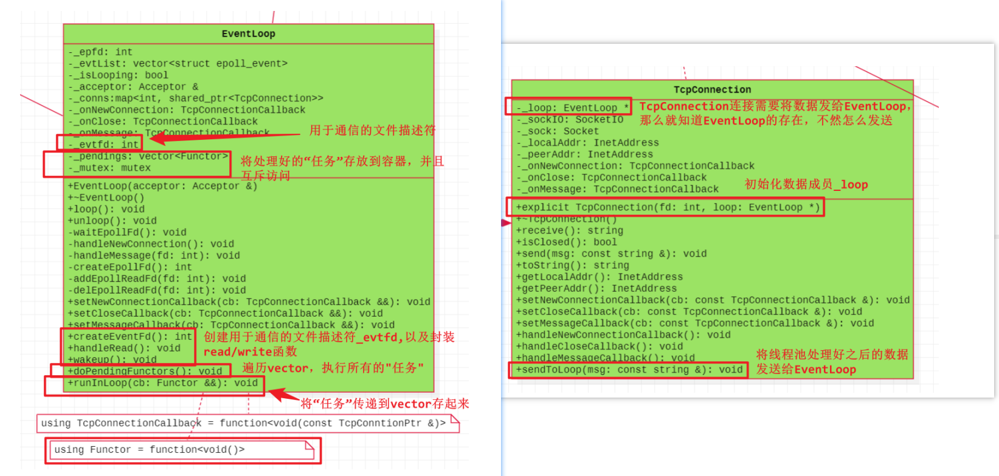

> **数据成员：** 
>
> - 就是将线程之间进行通信的文件描述符 **int _evtfd** 
> - 线程池处理完之后要通过Reactor发送给客户端的任务比较多，所以就用容器存起来 **vector _pengdings** 
> - 多个线程对容器vector的访问是互斥的，需要加锁 **mutex _mutex** 
>
> **成员函数：**
>
> - **createEventFd函数：**调用eventfd系统调用创建用于通信的文件描述符。 
> - **handleRead函数：**里面封装了read函数，该函数读取eventfd返回的文件描述符。 
> - **wakeup函数：**里面封装了write函数，该函数向eventfd返回的文件描述符中写数据，也就是唤醒 阻塞的线程，从而达到通信的目的。 
> - **doPengdingFunctors函数**：就是将存放在vector中的任务进行执行，这里的任务比较多，所以需 要遍历。 
> - **runInLoop函数：**vector中的任务是如何传递进来的？本函数就是将线程池处理好之后的要发送给客户端的数据，最终传递到vector中的，主要是做这个事情。

### 最后的封装（线程池加入）

**将线程池与TcpServer对象进一步封装**

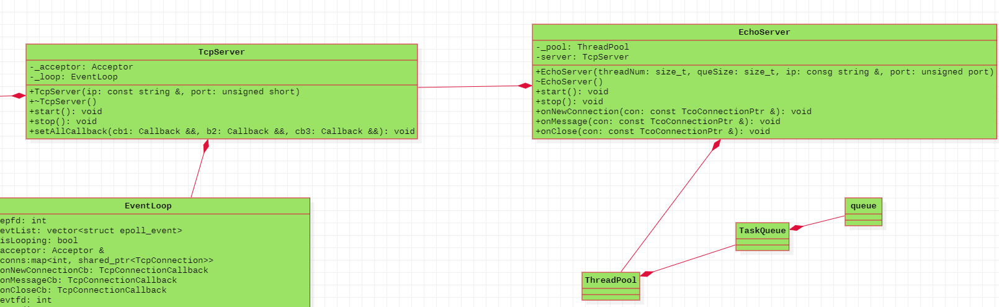

```C++
#include "ThreadPool.h"
#include "TcpServer.h"
class MyTask
{
public:
    MyTask(const string &msg, const TcpConnectionPtr &con);
    void process();
private:
    string _msg;
    TcpConnectionPtr _con;
};
class EchoServer
{
public:
    EchoServer(size_t threadNum, size_t queSize
               , const string &ip
               , unsigned short port);
    ~EchoServer();
    //服务器的启动与停止
    void start();
    void stop();
    //三个回调
    void onNewConnection(const TcpConnectionPtr &con);
    void onMessage(const TcpConnectionPtr &con);
    void onClose(const TcpConnectionPtr &con);
private:
    ThreadPool _pool;
    TcpServer _server;
};
```

