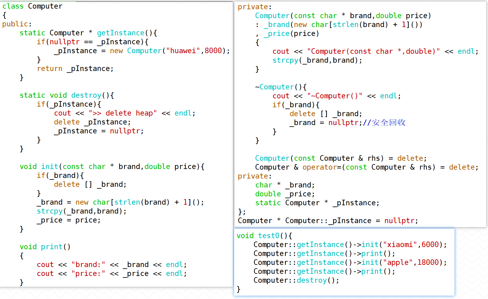
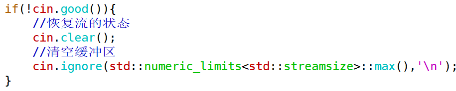

1. 实现一个单例的Computer类，包含品牌和价格信息。

> (1)构造函数、析构函数设为私有，拷贝构造、赋值运算符函数删除
>
> (2)添加Computer*类型的静态数据成员，保存创建出的Computer对象的地址
>
> (3)提供公有的静态成员函数getInstance用来创建（或使用）单例对象，公有的静态成员函数destroy用来回收单例对象
>
> (4)提供普通的成员函数init用来修改单例对象的内容（在此函数中需要注意回收原本品牌内容所占用堆空间资源）
>
> 


2. 创建存放Point对象的vector，尝试进行遍历


3. 创建存放“存放int数据的vector”的vector，尝试进行遍历，并体会vector对象和元素的存储位置


4. 当流失效时，如何重置流的状态，并重新再正常使用流呢？

> 先恢复流的状态，再清空缓冲区，以便下次输入操作能够获取新的键盘输入内容
>
> 


5. 实现一个自定义的String类，保证main函数对正确执行。实现时，记得采用增量编写的方式，逐一测试。

``` c++
class String
{
public:
	String();
	String(const char *pstr);
	String(const String &rhs);
	String &operator=(const String &rhs);
	~String();
	void print();
    size_t length() const;
    const char * c_str() const;

private:
	char * _pstr;
};

int main()
{
	String str1;
	str1.print();
	

	String str2 = "Hello,world";
	String str3("wangdao");
	
	str2.print();		
	str3.print();	
	
	String str4 = str3;
	str4.print();
	
	str4 = str2;
	str4.print();
	
	return 0;
}
```

