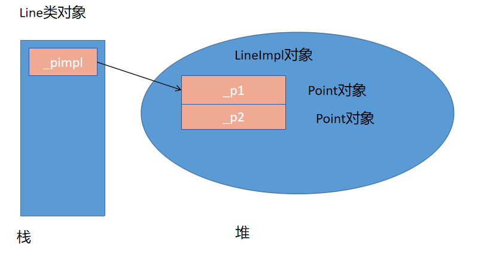
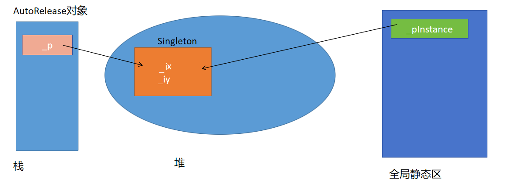
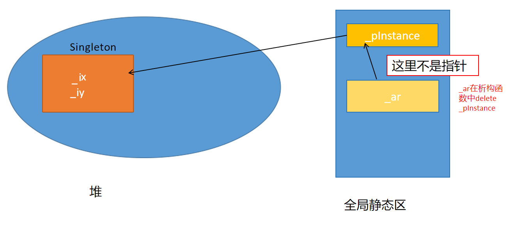

1. 实现课上实现的pimpl代码，并体会其思想。

> （1）头文件只给出接口：
>
> ``` c++
> //Line.hpp
> class Line{
> public:
>     Line(int x1, int y1, int x2, int y2);
>     ~Line();
>     void printLine() const;//打印Line对象的信息
> private:
>     class LineImpl;//类的前向声明
>     LineImpl * _pimpl;
> };
> ```
>
> 
>
> （2）在实现文件中进行具体实现，使用嵌套类的结构（LineImpl是Line的内部类，Point是LineImpl的内部类），Line类对外公布的接口都是使用LineImpl进行具体实现的
>
> ​		 在测试文件中创建Line对象（最外层），使用Line对外提供的接口，但是不知道具体的实现
>
> ``` c++
> //LineImpl.cc
> class Line::LineImpl
> {
>     class Point{
>     public:
>         Point(int x,int y)
>             : _ix(x)
>               , _iy(y)
>         {}
> 		//...
>     private:
>         int _ix;
>         int _iy;
>     };
>     //...
> };
> 
> //Line.cc
> void test0(){
>     Line line(10,20,30,40);
>     line.printLine();
> }
> ```
>
> 
>
> （3）打包库文件，将库文件和头文件交给第三方
>
> 
>
> 内存结构如下，用户从最外层的可见类只能知道如果创建Line对象，能够使用什么样的功能接口，无法了解到接口的具体实现。
>
> 


2. 在类之外定义一个全局类AutoRelease，实现单例模式的自动释放

> 
>
> 在AutoRelease的构造函数中接管资源（堆上的单例对象）
>
> 利用对象的生命周期管理资源——析构函数（在析构函数中会执行delete _p），当对象被销毁时会自动调用。
>
> 要注意：
>
> (1)如果还手动调用了Singleton类的destroy函数，会导致double free问题，所以可以删掉destroy函数，将回收堆上的单例对象的工作完全交给AutoRelease对象
>
> (2)不能用多个AutoRelease对象托管同一个堆上的单例对象。
>
> 
>
> ``` c++
> class AutoRelease{
> public:
>     AutoRelease(Singleton * p)
>     : _p(p)
>     { cout << "AutoRelease(Singleton*)" << endl; }
> 
>     ~AutoRelease(){
>         cout << "~AutoRelease()" << endl;
>         if(_p){
>             delete _p;
>             _p = nullptr;
>         }
>     }
> private:
>     Singleton * _p;
> };
> 
> void test0(){
>     AutoRelease ar(Singleton::getInstance());
>     Singleton::getInstance()->print();
> }
> ```
>
> 


3. 使用嵌套类和静态对象的方式，实现单例模式的自动释放

> 
>
> AutoRelease类对象_ar是Singleton类的对象成员，创建Singleton对象，就会自动创建一个AutoRelease对象（静态区），它的成员函数可以直接访问 _pInstance
>
> ``` c++
> class Singleton
> {
>     class AutoRelease{
>     public:
>         AutoRelease()
>         {}
>         ~AutoRelease(){
>           if(_pInstance){
>               delete _pInstance;
>               _pInstance = nullptr;
>           }
>         }
>     };
>     //...
> private:
>    //...
>     int _ix;
>     int _iy;
>     static Singleton * _pInstance;
>     static AutoRelease _ar;
> };
> Singleton* Singleton::_pInstance = nullptr;
> //使用AutoReleas类的无参构造对_ar进行初始化
> Singleton::AutoRelease Singleton::_ar;
> 
> 
> void test1(){
>     Singleton::getInstance()->print();
>     Singleton::getInstance()->init(10,80);
>     Singleton::getInstance()->print();
> }
> ```
>
> 
>
> 程序结束时会自动销毁全局静态区上的_ar，调用AutoRelease的析构函数，在这个析构函数执行delete _pInstance的语句，这样又会调用Singleton的析构函数，再调用operator delete，回收掉堆上的单例对象。
>
> 我们利用嵌套类实现了一个比较完美的方案，不用担心手动调用了destroy函数。
>
> 


4. 使用atexit函数结合静态destroy函数，实现单例模式的自动释放

> atexit函数来注册程序正常终止时要被调用的函数（C/C++通用）。
>
> ``` c++
> class Singleton
> {
> public:
>     static Singleton * getInstance(){
>         if(_pInstance == nullptr){
>             atexit(destroy);  
>             _pInstance = new Singleton(1,2);
>         }
>         return _pInstance;
>     }
>     //...
> }；
> ```
>
> atexit注册了destroy函数，相当于有了一次必然会进行的destroy（程序结束时），即使手动调用了destroy，因为安全回收的机制，也不会有问题。
>
> 


