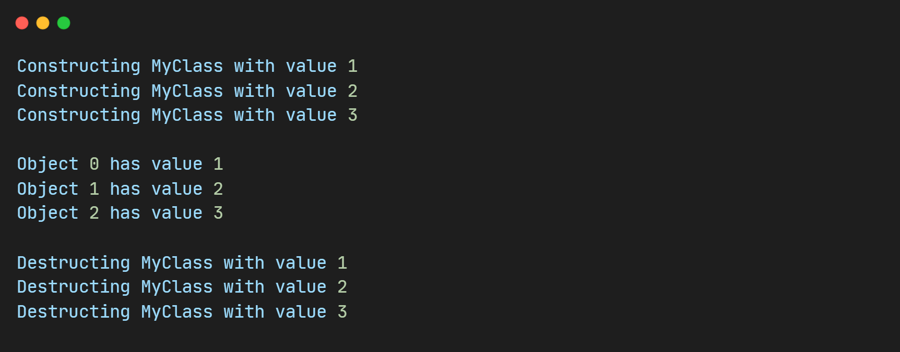

# 空间配置器(allocator)

#### 1.概述

>   在C++中，所有STL容器的空间分配其实都是使用的`std::allocator`，它是一个感知类型的空间分配器，并将空间的申请与对象的构建分离开来。理解这一点需要回顾new表达式的工作步骤。

  `new`表达式实际上包括两部分：

​	**内存分配**：为对象分配足够的内存空间。

​	**对象构建**：在已分配的内存空间上调用构造函数，创建对象。

对于单个对象，使用`new`的时候，空间的申请与对象的构造虽然是两个步骤，但通常在**一个表达式**中完成。然而，对于STL容器，如`vector`，情况有所不同。

> `std::vector`中的`reserve`函数就是一个很好的例子，它会==先申请足够的内存空间==，然后在需要时在该空间上构建对象。这种设计使得内存管理更加高效，特别是在批量操作时：
>
> 1. **减少内存碎片**：批量申请内存空间可以减少多次小规模内存分配所带来的内存碎片问题。
> 2. **提高效率**：一次性申请较大块内存，然后逐步在其中构建对象，可以减少频繁的内存分配操作，提高效率。

> ###### 以下是一个使用`std::allocator`的示例，展示了如何分离空间的分配与对象的构建：

``` c++
#include <iostream>
#include <memory>
#include <vector>

class MyClass {
public:
    MyClass(int value) : value(value) {
        std::cout << "Constructing MyClass with value " << value << std::endl;
    }
    ~MyClass() {
        std::cout << "Destructing MyClass with value " << value << std::endl;
    }
    int getValue() const {
        return value;
    }
private:
    int value;
};

int main() {
    std::allocator<MyClass> alloc;

    // 分配内存但不构建对象
    // 分配内存：alloc.allocate(3)分配了3个MyClass对象的内存，但此时并未调用构造函数。
    MyClass* ptr = alloc.allocate(3);
    
    // 在已分配的内存上构建对象
    // 构建对象：alloc.construct(ptr, 1)在已分配的内存上构建对象，调用构造函数
    alloc.construct(ptr, 1);
    alloc.construct(ptr + 1, 2);
    alloc.construct(ptr + 2, 3);

    // 使用对象,使用构建好的对象，调用其成员函数。
    for (int i = 0; i < 3; ++i) {
        std::cout << "Object " << i << " has value " << (ptr + i)->getValue() << std::endl;
    }

    // 销毁对象但不释放内存:alloc.destroy(ptr + i)显式调用析构函数，销毁对象，但内存未释放
    for (int i = 0; i < 3; ++i) {
        alloc.destroy(ptr + i);
    }

    // 释放内存:alloc.deallocate(ptr, 3)释放先前分配的内存。
    alloc.deallocate(ptr, 3);

    return 0;
}
```

> 运行结果:



#### 2.头文件与四个函数

``` c++
// 头文件
#include <memory>

template< class T >  struct allocator;
template<>  struct allocator<void>;

-------------------------------------------------------------------------------------
// 空间的申请,分配原始的未初始化内存 
pointer allocate( size_type n, const void * hint = 0 );			// n: 要分配的对象数量。  hint: 分配内存的提示，通常不使用。
T* allocate( std::size_t n, const void * hint);	
T* allocate( std::size_t n );

// 空间的释放，释放内存，但不调用对象的析构函数
void deallocate( T* p, std::size_t n );                           // p: 要释放的内存指针  n: 先前分配的对象数量

// 对象的构建，在指定的未初始化的空间上构建对象，使用的是定位new表达式
void construct( pointer p, const_reference val );                 // p: 要构造对象的内存指针  val: 用于构造对象的值

// 对象的销毁,调用对象的析构函数，但不释放内存
void destroy( pointer p );										// p: 要销毁的对象指针

```

#### 3.空间配置器的原理

###### 源码解析

``` c++
namespace std {

template <class T>
class allocator {
public:
    typedef T value_type;
    typedef T* pointer;
    typedef const T* const_pointer;
    typedef T& reference;
    typedef const T& const_reference;
    typedef size_t size_type;
    typedef ptrdiff_t difference_type;

    pointer allocate(size_type n, const void* hint = 0) {
        return static_cast<pointer>(::operator new(n * sizeof(T)));
    }

    void deallocate(pointer p, size_type n) {
        ::operator delete(p);
    }

    void construct(pointer p, const T& val) {
        new((void*)p) T(val);
    }

    void destroy(pointer p) {
        p->~T();
    }
};

} // namespace std

```

> C++ STL中的空间配置器设计得非常精细，它分为两级空间配置器：
>
> ​	第一级空间配置器使用`__malloc_alloc_template`
>
> ​	第二级空间配置器使用`__default_alloc_template`
>
> 这种设计可以有效地管理不同大小的内存分配需求，确保内存利用的高效性和减少内存碎片。
>
>   通过分成两级空间配置器，C++ STL能够高效地管理不同大小的内存需求。第一级空间配置器适用于较大的内存分配，直接使用`malloc`和`free`。第二级空间配置器针对小块内存使用内存池和自由链表，极大地减少了内存碎片，提高了内存管理的效率。这种设计使得STL容器在处理大量小对象时能够保持高性能。

为什么要将内存分配和对象构建分开？将内存分配与对象构建分开的原因主要有以下几点：

1. **减少内存碎片**：批量分配大块内存可以减少多次小规模内存分配导致的内存碎片问题。
2. **提高效率**：一次性分配大块内存，然后在需要时逐步构建对象，可以减少频繁的内存分配操作，提高效率。
3. **灵活性**：分离内存分配和对象构建使得内存管理更加灵活，可以在不释放内存的情况下销毁和重新构造对象。

##### 第一级空间配置器：`__malloc_alloc_template`

> 第一级空间配置器底层使用`malloc`和`free`进行内存的申请和释放。当内存需求较大时，直接调用`malloc`和`free`是合理的选择，因为这能够直接利用操作系统提供的内存管理功能。

##### 第二级空间配置器：`__default_alloc_template`

> 第二级空间配置器根据申请内存的大小进行不同的处理：
>
> 1. **大于128字节的内存分配**：直接使用第一级空间配置器`__malloc_alloc_template`进行内存管理。
> 2. **小于等于128字节的内存分配**：使用内存池和自由链表结构进行管理。

###### 内存池和自由链表

> `__default_alloc_template`使用内存池和16个自由链表来管理小块内存分配。当申请的内存小于等于128字节时，会根据申请大小分配到相应的自由链表中。
>
> 1. **内存池**：当需要分配内存时，如果对应自由链表中没有可用的内存块，就从内存池中一次性分配一大块内存，然后根据申请大小切分成多个小块，并将它们链接到相应的自由链表中。
> 2. **自由链表**：每个自由链表用于管理特定大小的内存块。例如，下标为3的自由链表管理32字节的内存块。


