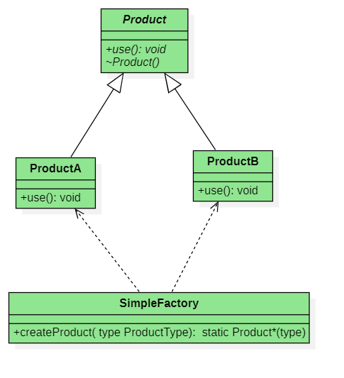

# **设计模式**

## 简单工厂模式的结构
简单工厂模式主要由以下几个部分组成：
1. **工厂类（Factory）**：负责创建具体产品对象。
2. **抽象产品类（Product）**：定义产品的共同接口。
3. **具体产品类（ConcreteProduct）**：实现抽象产品接口的具体类。

### 抽象产品类
首先定义一个抽象产品类，用于声明产品的公共接口：

**抽象产品类**：`Product` 类是一个接口类，定义了产品的公共接口 `use`。

```cpp
// Product.h
#pragma once
#include <iostream>

class Product {
public:
    // `use()`: 抽象方法，具体产品类需要实现该方法。
    virtual void use() = 0; // 纯虚函数，定义产品的公共接口
    virtual ~Product() = default; // 虚析构函数，确保派生类正确析构
};
```

### 具体产品类
然后定义几个具体产品类，继承抽象产品类，并实现其接口：

**具体产品类**：`ConcreteProductA` 和 `ConcreteProductB` 继承 `Product` 类并实现 `use` 方法。

```cpp
// ConcreteProductA.h
#pragma once
#include "Product.h"

class ConcreteProductA : public Product {
public:
    // 实现 `use()` 方法。
    void use() override {
        std::cout << "Using ConcreteProductA" << std::endl;
    }
};

// ConcreteProductB.h
#pragma once
#include "Product.h"

class ConcreteProductB : public Product {
public:
    // 实现 `use()` 方法。
    void use() override {
        std::cout << "Using ConcreteProductB" << std::endl;
    }
};
```

### 工厂类
接下来定义工厂类，通过它来创建具体产品对象：

**工厂类**：`SimpleFactory` 提供了一个静态方法 `createProduct`，根据输入的产品类型创建并返回相应的产品对象。

```cpp
// SimpleFactory.h
#pragma once
#include "Product.h"
#include "ConcreteProductA.h"
#include "ConcreteProductB.h"

class SimpleFactory {
public:
    enum ProductType {
        ProductA,
        ProductB
    };
// createProduct(ProductType type): 静态方法，根据输入的产品类型创建并返回相应的具体产品对象。
    static Product* createProduct(ProductType type) {
        switch (type) {
            case ProductA:
                return new ConcreteProductA();
            case ProductB:
                return new ConcreteProductB();
            default:
                return nullptr;
        }
    }
};
```

### 客户端代码
最后编写客户端代码，使用工厂类创建具体产品对象：

**客户端代码**：客户端代码通过工厂类创建具体产品对象，并调用其 `use` 方法。

```cpp
// main.cpp
#include "SimpleFactory.h"
#include <memory>

int main() {
    // 创建具体产品对象
    std::unique_ptr<Product> productA(SimpleFactory::createProduct(SimpleFactory::ProductA));
    if (productA) {
        productA->use(); // 使用具体产品对象
    }

    std::unique_ptr<Product> productB(SimpleFactory::createProduct(SimpleFactory::ProductB));
    if (productB) {
        productB->use(); // 使用具体产品对象
    }

    return 0;
}
```

### UML 图解释



- **SimpleFactory**: 工厂类，包含一个静态方法 `createProduct()`，用于创建具体产品对象。
- **Product**: 抽象产品类，定义产品的公共接口 `use()`。
- **ConcreteProductA** 和 **ConcreteProductB**: 具体产品类，继承抽象产品类并实现其接口。

在这个图中，`SimpleFactory` 通过静态方法 `createProduct` 创建具体产品对象。`Product` 是一个抽象类，定义了 `use` 方法。`ConcreteProductA` 和 `ConcreteProductB` 是具体的产品类，它们实现了 `Product` 类的 `use` 方法。

通过这种结构，客户端代码可以通过调用 `SimpleFactory::createProduct` 来获取具体的产品对象，而无需关心对象的创建细节。这种模式的一个主要优点是封装了对象的创建过程，简化了客户端代码。

### 优缺点分析
**优点**：
- **封装对象创建**：将对象创建逻辑集中在一个工厂类中，客户端代码不需要了解具体产品类的实现细节。
- **简化客户端代码**：客户端代码只需使用工厂类，不需要直接实例化具体产品对象，减少了代码耦合。

**缺点**：
- **违反开闭原则**：每次新增产品类时，都需要修改工厂类的代码，增加了维护成本。
- **单一职责原则**：工厂类负责创建所有产品对象，可能会导致类的职责过重。

适用场景

- **对象创建逻辑复杂**：当对象的创建逻辑比较复杂时，可以使用工厂模式将创建逻辑封装起来。
- **减少代码耦合**：当需要避免在客户端代码中直接实例化对象时，可以使用工厂模式。

扩展:可以通过结合其他设计模式（如工厂方法模式、抽象工厂模式）来进一步优化和扩展简单工厂模式，以满足更复杂的需求。

## 工厂方法模式

在软件开发及运行过程中，经常需要创建对象，但常出现由于需求的变更，需要创建的对象的具体类型 也要经常变化。
工厂方法通过采取**虚函数的方法**，实现了使用者和具体类型之间的解耦，可以用来解决 这个问题。

工厂方法模式对简单工厂模式中的工厂类进一步抽象。核心工厂类不再负责产品的创建，而是演变为一个抽象工厂角色，仅负责定义具体工厂子类必须实现的接口。同时，针对不同的产品提供不 同的工厂。即每个产品都有一个与之对应的工厂。这样，系统在增加新产品时就不会修改工厂类逻辑而 是添加新的工厂子类，从而弥补简单工厂模式对修改开放的缺陷。定义一个创建对象的接口，让子类决 定实例化哪个类。该模式使类对象的创建延迟到子类。

