# 面向对象设计

### 一、面向对象的基本概念

面向对象的分析（OOA）：找到需求，分析出需要，要干什么。

面向对象的设计（OOD）：将需求转换为类，设计出类中的数据成员、成员函数，以及类与类之间的关系，使用设计原则设计出更加健壮的代码。

面向对象的编程（OOP）：将面向对象的设计与分析出来的需求转换为代码。

统一建模语言：UML语言。

### 二、类与类之间的关系（==重要==）

#### 1、继承

派生类会继承基类，吸收基类中的数据成员与部分成员函数。基类部分会成为派生类的一部分 。在语义层面上：A is B。在类图的画法上：可以从派生类指向基类的空心三角箭头。

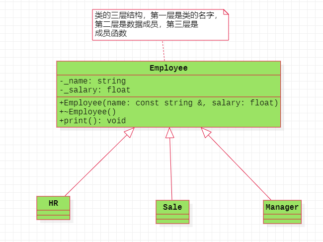

继承：先有基类，然后派生出新的类，也就是派生类。即：先有基类然后才有派生类。

泛化（一般化）：先有派生类，然后再抽象出基类。即：先有派生类然后才有基类。

#### 2、关联

##### 双向的关联关系

彼此知道对方的存在，但是彼此并不负责对方的生命周期。在代码层面上体现是：**使用的是指针或者引用**。在语义层面上：A has B。在类图的画法上：直接使用的是实心直线。

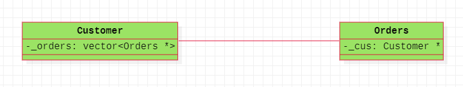

##### 单向的关联关系

A知道B的存在，但是B并不知道A的存在，这就是单向的关联关系。A并不负责B的生命周期。在代码层面上体现是：**使用的是指针或者引用**。在语义层面上：A has B。在类图的画法上：从A指向B的直线箭头。

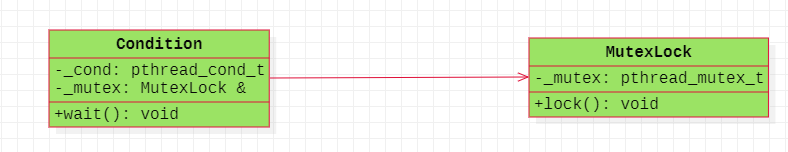

#### 3、聚合

是一种稍微强一点的关联关系，会分为整体与局部之间的区别，整体部分并不会负责局部对象的销毁。在代码层面上体现：**使用的是指针或者引用**。在语义层面上：A has B。在类图的画法上：使用的是从局部指向整体的空心菱形箭头。

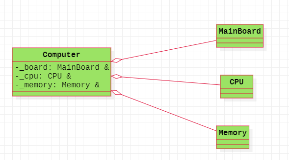

#### 4、组合

是一种最强的关联关系，表现为整体与局部的关系，但是整体会负责局部对象的销毁。在代码层面的体现：**使用的是子对象**。在语义层面上：A  has  B。在类图的画法上：使用局部指向整体的实心菱形箭头。

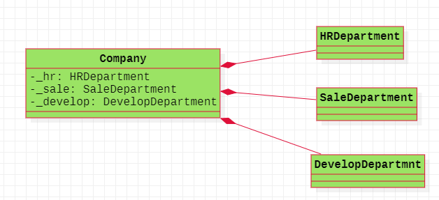

#### 5、依赖

是两个类之间的一种不确定的关系，语义上是一种：A use B的关系，这种关系是**偶然的，临时的，并非**
**固定的**。在类图的画法上：使用虚线的箭头，从A指向B  。在代码上表现为：

- B作为A的成员函数参数；
- B作为A的成员函数的局部变量（B作为A的成员函数的返回值）；
- A的成员函数调用B的静态方法。

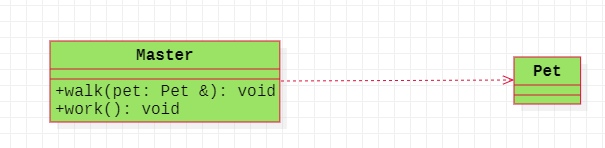

#### 总结

1、继承是一个垂直关系。其他四种是横向关系

2、从语义角度：继承：is  关联、聚合、组合：has   依赖：use

3、耦合强弱。依赖  < 关联 < 聚合 < 组合  < 继承

4、三种关联关系：关联、聚合、组合 强调的是数据成员的关系。依赖：从成员函数的角度进行考虑。继承：既有数据成员，也有成员函数。

### 三、面向对象的设计原则（==重要==）

满足的要求：低耦合，高内聚。

低耦合：类与类之间，或者模块与模块之间的关系。高内聚：强调的是类内部或者模块内部的关系。

#### 1、单一职责原则

核心思想：一个类，最好只做一件事，只有一个引起它变化的原因。

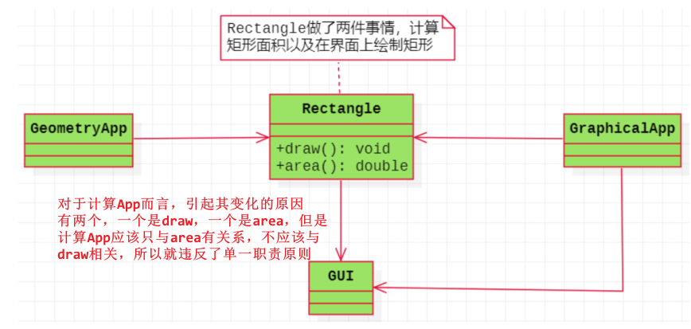  

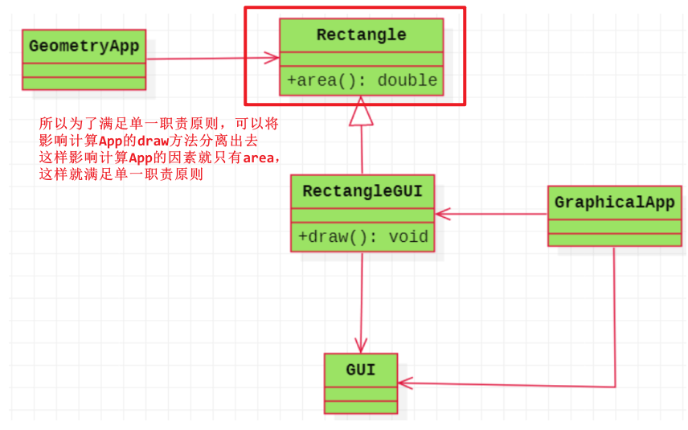

#### 2、开闭原则（==重要==）

核心思想：对抽象编程，而不对具体编程，因为抽象相对稳定。

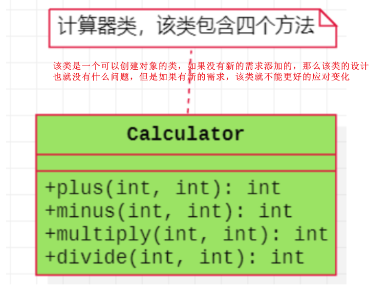

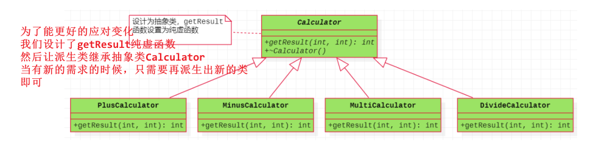

#### 3、里氏替换原则（==重要==）

核心思想：派生类必须能够替换其基类。表现为：

- 派生类（子类）可以实现基类（父类）的抽象方法，表现多态（C++中的多态）
- 不能覆盖基类（父类）的非抽象方法（C++中隐藏，消除C++中隐藏的概念）
- 派生类（子类）可以有自己的个性 （C++中新增特点）   

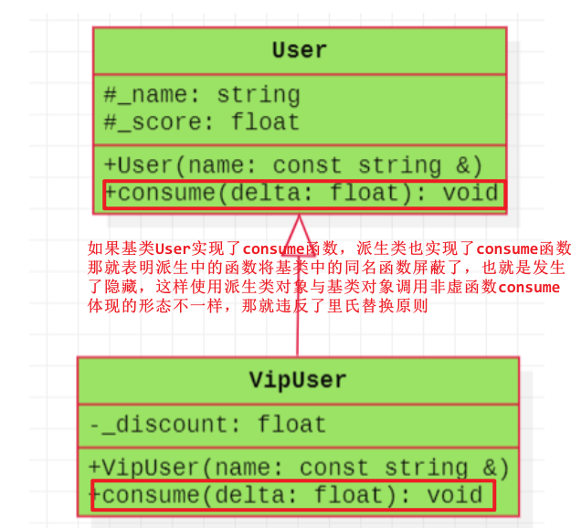

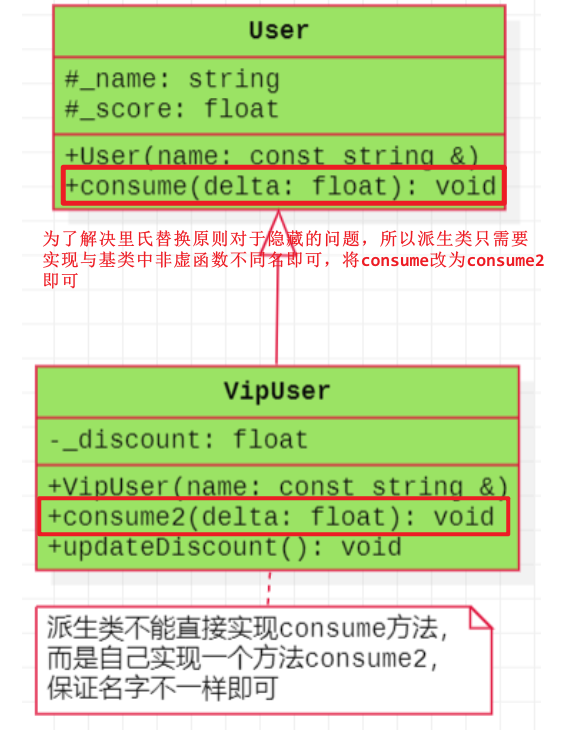

#### 4、接口分离原则

核心思想：使用多个小的专门的接口，而不要使用一个大的总接口。

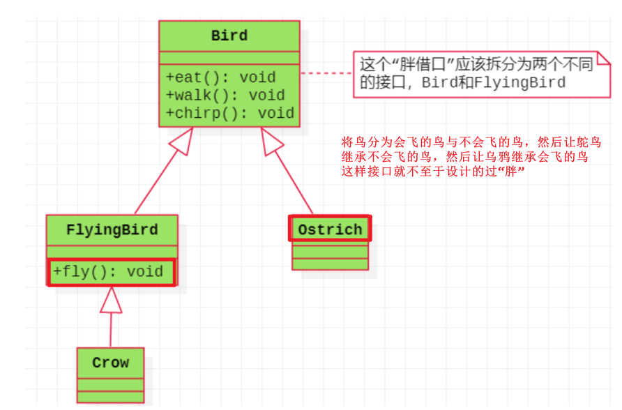

#### 5、依赖倒置原则（==重要==）

核心思想：面向接口编程，依赖于抽象。 

在大多数情况下，开闭原则、里氏替换原则和依赖倒置原则会同时出现，**开闭原则是目标，里氏替换原则是基础，依赖倒置原则是手段**  

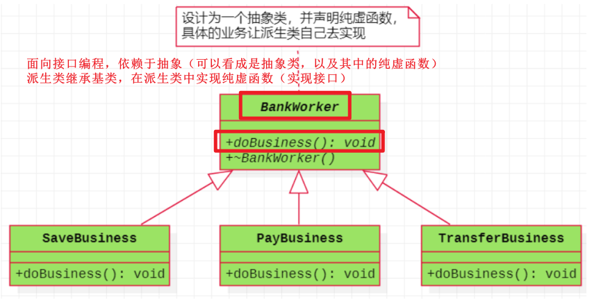

#### 6、迪米特原则

也称为最少知道原则，核心思想：尽量的降低类与类、模块与模块之间的耦合程度。

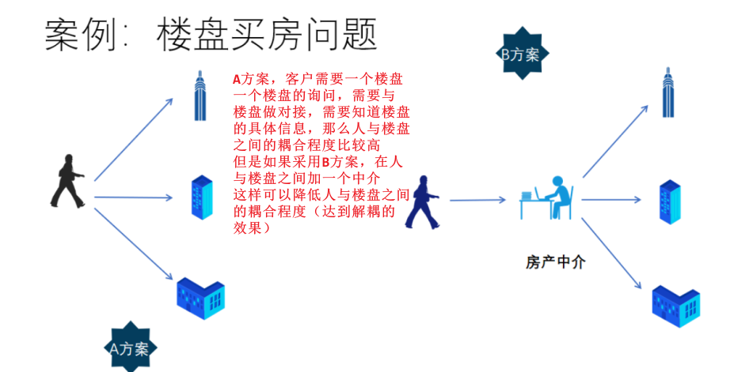

#### 7、组合复用原则

核心思想：在复用时要尽量使用组合/聚合关系（关联关系），少用继承。  

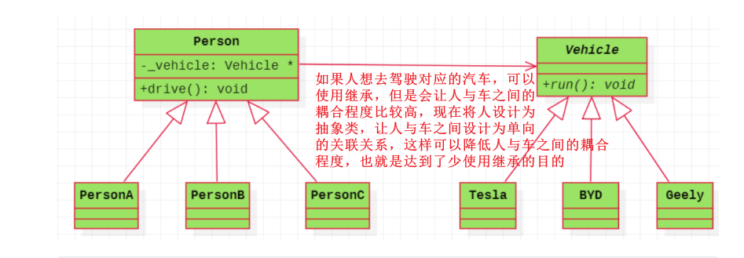

### 四、设计模式

#### 1、基本概念

它是解决特定问题的一系列套路，有一定的普遍性。它可以提高代码的可重用性、代码的可读性和代码的可靠性以及可扩展性。

#### 2、分类

创建型模式，结构型模式，行为型模式       

#### 3、简单工厂模式

##### 3.1、类图

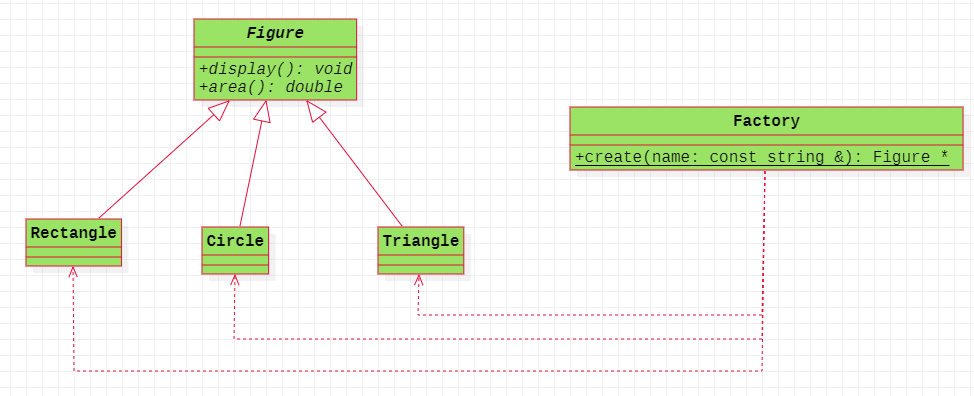

##### 3.2、重要代码

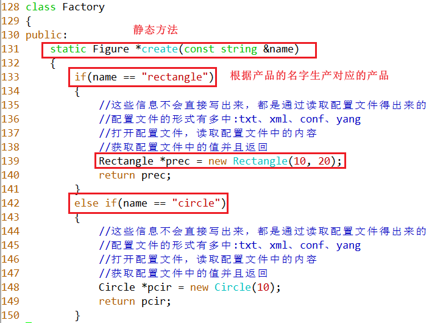

##### 3.3、优缺点

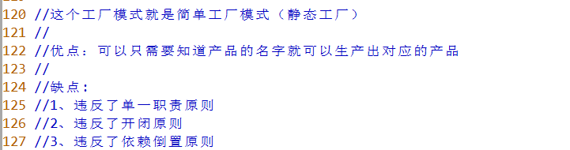

#### 4、工厂方法

##### 4.1、类图

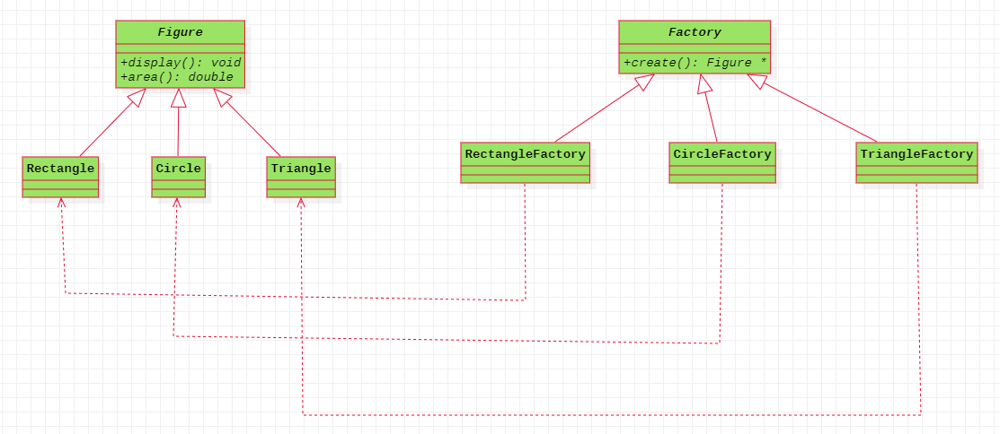

##### 4.2、重要代码

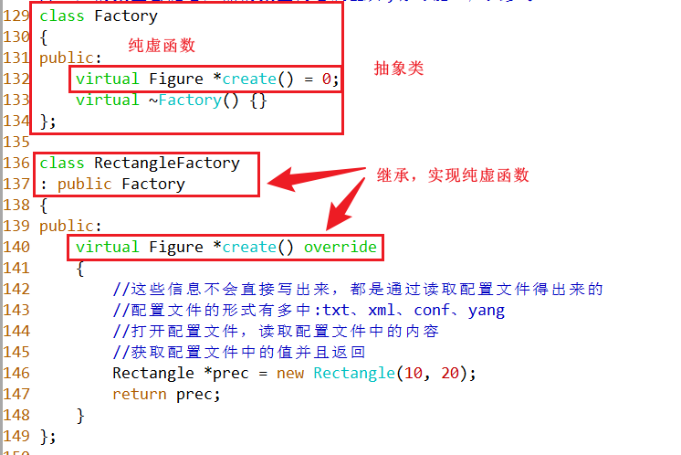

##### 4.3、优缺点

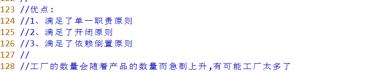

#### 5、抽象工厂

##### 5.1、类图

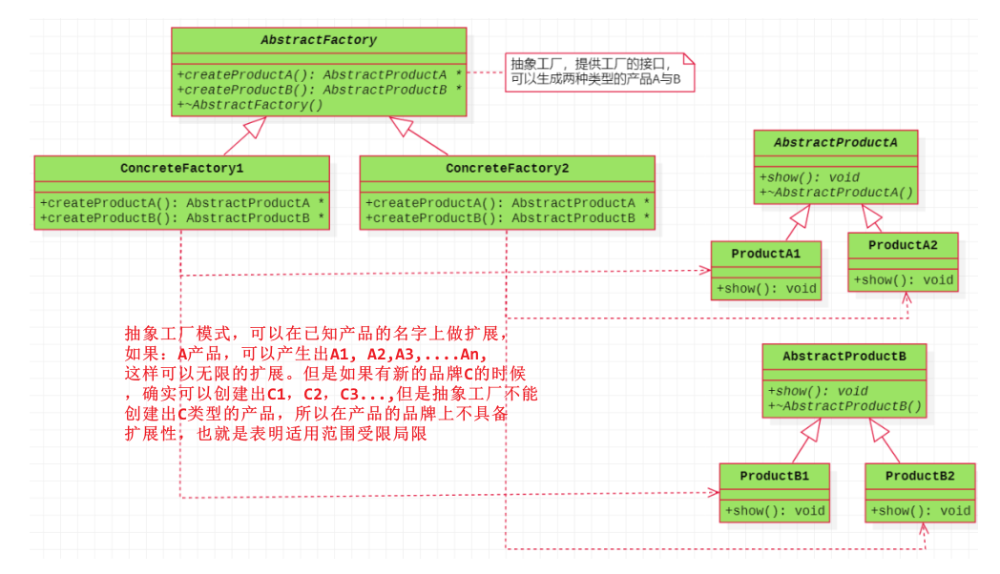

#### 6、观察者模式

##### 6.1、定义

定义对象的一种一对多的依赖关系，当一个对象的状态发生改变时，所有依赖于它的对象都得到通知并被自动更新。  

##### 6.2、类图

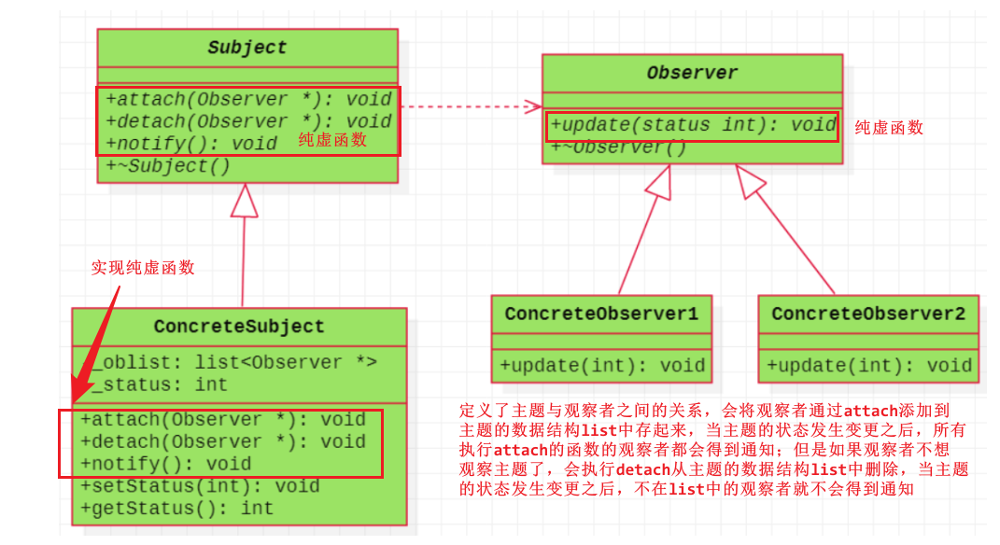

##### 6.3、重要代码

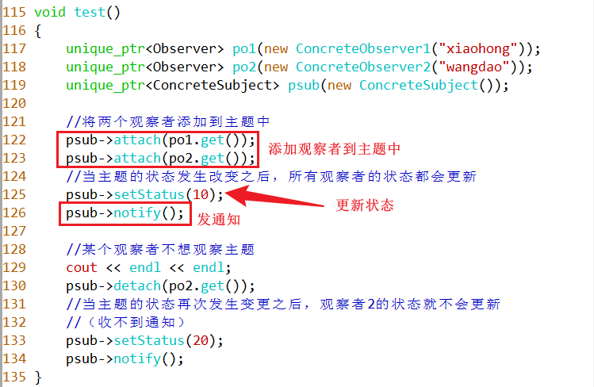