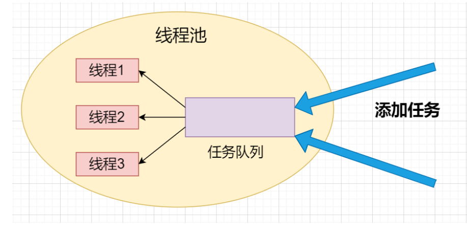
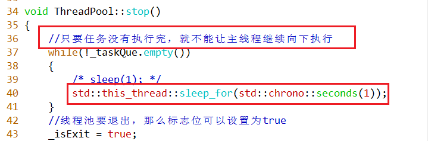

# 线程库

## 一、线程

### 1. C++11线程库概述
> 对于早期的C++语言而言，如果想使用线程，我们需要根据不同的平台使用不同的接口，比如：在Linux平台上，我们需要借助POSIX标准的线程库，在windows上需要借助windows线程库，因为C++自己没有独立的线程库。为了解决这个问题，在C++11标准中，做了完善，C++自己引入了与平台无关的线程库，这个库是语言层面的库，这就是C++11线程库。

### 2. thread线程

``` c++
#include <thread>
```

### 3. ==**函数接口**==
在C++11中，将线程封装成了类的概念，下面是线程类的构造函数形式。

``` c++
thread() noexcept; //(1)

thread( thread&& other ) noexcept; //(2)

template< class Function, class... Args >
explicit thread( Function&& f, Args&&... args ); //(3)

thread(const thread&) = delete;//(4)

```

- 第一种形式：创建一个空的线程对象，但是线程创建出来之后，需要做任务，单独使用这种形式没有意义。
- 第二种形式：可以从另外一个线程对象转移过来。
- 第三种形式：传递任何可调用对象的形式，这种形式使用的最为通用。
- 第四种形式：表明线程对象不能进行复制。

### 4. 线程的创建
创建线程有几种方法，可以直接传递函数指针、lambda 表达式、函数对象或成员函数。

**1. 使用普通函数与函数指针**


**2. 使用 `lambda` 表达式**

```cpp
#include <iostream>
#include <thread>

int main() {
    std::thread t(
        [] {std::cout << "Hello from thread!" << std::endl;}
    );
    t.join(); // 等待线程结束
    return 0;
}
```

**3. 使用函数对象**

```cpp
#include <iostream>
#include <thread>

class ThreadClass {
public:
    void operator()() const {
        std::cout << "Hello from thread!" << std::endl;
    }
};

int main() {
    ThreadClass threadObject;
    std::thread t(threadObject);
    t.join(); // 等待线程结束
    return 0;
}
```

**4. 使用成员函数**

```cpp
#include <iostream>
#include <thread>

class ThreadClass {
public:
    void memberFunction() {
        std::cout << "Hello from thread!" << std::endl;
    }
};

int main() {
    ThreadClass obj;
    std::thread t(&ThreadClass::memberFunction, &obj);
    t.join(); // 等待线程结束
    return 0;
}
```

**5.传递`function`对象**(`bind`绑定之后的函数类型)


### 5.管理线程

>   我们使用`std::thread`创建的线程对象是进程中的子线程，一般进程中还有主线程，在程序中就是`main`线程，那么当我们创建线程后至少是有两个线程的，那么两个线程谁先执行完毕谁后执行完毕，这是随机的，但是当进程执行结束之后，主线程与子线程都会执行完毕，进程会回收线程拥有的资源。并且，主线程`main`执行完毕，其实整个进程也就执行完毕了。
>
> 一般我们有两种方式让子线程结束:
>
> ​    一种是主线程等待子线程执行完毕，我们使用`join`函数，让主线程回收子线程的资源；
>
> ​    一种是子线程与主线程分离，我们使用`detach`函数，此时子线程驻留在后台运行，这个子线程就相当于被C++运行时库接管，子线程执行完毕后，由运行时库负责清理该线程相关的资源。使用detach之后，表明就失去了对子线程的控制。

##### 1. `join` 与 `detach`

- `join()`：阻塞当前线程，直到调用 `join()` 的线程完成。
- `detach()`：将线程从调用线程中分离，使其在后台运行，独立于主线程。

**示例：**

```cpp
#include <iostream>
#include <thread>

void threadFunction() {
    std::this_thread::sleep_for(std::chrono::seconds(2));
    std::cout << "Thread finished" << std::endl;
}

int main() {
    std::thread t(threadFunction);
    // t.detach(); // 分离线程
    t.join(); // 等待线程结束,这种等待子线程结束的方式是最常见的，也是最容易理解的，类似POSIX标准线程库中的pthread_join
函数。
    return 0;
}
```

**注意事项：** 
使用 `detach()` 需要特别小心，因为它会使得线程在后台运行，如果在主线程结束之前没有合适的方式来管理这些分离的线程，可能会导致程序崩溃或未定义行为。

#####  2.获取线程 ID

每个线程都有一个唯一的 ID，可以使用 `std::thread::id` 类型来表示，并通过 `std::thread::get_id()` 获取。

**示例：**

```cpp
#include <iostream>
#include <thread>

void threadFunction() {
    std::cout << "Thread ID: " << std::this_thread::get_id() << std::endl;
}

int main() {
    std::thread t(threadFunction);
    t.join(); // 等待线程结束
    return 0;
}
```


### 6.注意事项

>==**没有两个 std::thread 对象会表示同一执行线程；std::thread 不是可复制构造 (CopyConstructible) 或可复制赋值 (CopyAssignable) 的，它可移动构造 (MoveConstructible) 且可移动赋值 (MoveAssignable) 。**==

###### 不可复制构造和不可复制赋值

`std::thread` 对象不是可复制构造（CopyConstructible）或可复制赋值（CopyAssignable）的，这意味着你不能复制一个 `std::thread` 对象。这是因为每个 `std::thread` 对象都独自拥有其内部的系统线程资源，复制这些资源可能会导致资源竞争和混乱。

```cpp
#include <iostream>
#include <thread>

void print_message() {
    std::cout << "Hello from thread!" << std::endl;
}

int main() {
    std::thread t1(print_message);

    // 下面两行代码会导致编译错误，因为 std::thread 不支持复制构造或复制赋值
    // std::thread t2 = t1; // 复制构造
    // std::thread t3;
    // t3 = t1; // 复制赋值

    t1.join();
    return 0;
}
```

######  可移动构造和可移动赋值

虽然 `std::thread` 不能被复制，但它是可移动构造（MoveConstructible）和可移动赋值（MoveAssignable）的。这意味着你可以将一个 `std::thread` 对象移动到另一个 `std::thread` 对象。移动后，原来的 `std::thread` 对象将不再拥有其内部的系统线程资源。

```cpp
#include <iostream>
#include <thread>

void print_message() {
    std::cout << "Hello from thread!" << std::endl;
}

int main() {
    std::thread t1(print_message);

    // 移动构造
    std::thread t2 = std::move(t1);

    // 移动赋值
    std::thread t3;
    t3 = std::move(t2);

    // 不能再 join t1 或 t2，因为它们已经被移动
    // t1.join(); // 错误
    // t2.join(); // 错误

    t3.join(); // 正确，因为 t3 现在拥有原始线程

    return 0;
}
```

在这个例子中，我们首先创建了一个线程 `t1`。然后我们将 `t1` 移动到 `t2`，接着将 `t2` 移动到 `t3`。最终，我们使用 `t3` 来 `join` 线程，因为 `t3` 现在拥有原始的系统线程。

### 注意事项

1. **移动后原对象无效**：移动操作后，原来的 `std::thread` 对象将变为无效状态，不能再对其进行 `join` 或其他操作。
2. **确保 join 或 detach**：在程序结束前，确保每个 `std::thread` 对象要么被 `join`，要么被 `detach`，以避免程序崩溃。


## 二. 线程间同步

>   互斥锁是一种同步原语，用于协调多个线程对共享资源的访问。互斥锁的作用是保证同一时刻只有一个 线程可以访问共享资源，其他线程需要等待互斥锁释放后才能访问。在多线程编程中，多个线程可能同 时访问同一个共享资源，如果没有互斥锁的保护，就可能出现数据竞争等问题。 然而，互斥锁的概念并不陌生，在Linux下，POSIX标准中也有互斥锁的概念，这里我们说的互斥锁是 C++11语法层面提出来的概念，是C++语言自身的互斥锁std::mutex，互斥锁只有两种状态：上锁与解锁。
>
> C++11 提供了多种线程间同步机制，包括互斥锁（mutex）、条件变量（condition variable） 等。

### 互斥锁 (Mutex)

互斥锁（Mutex）是 C++11 线程库中用于线程间同步的基本工具。互斥锁提供了锁定和解锁机制，以保证多线程环境下对共享资源的访问是安全的。

#### 互斥锁的基本使用

C++11 标准库提供了 `std::mutex` 类来实现互斥锁。以下是 `std::mutex` 类的基本接口函数详解：

```cpp
#include <iostream>
#include <thread>
#include <mutex>

std::mutex mtx; // 定义一个全局互斥锁

void printThreadId(int id) {
    mtx.lock(); // 加锁
    std::cout << "Thread ID: " << id << std::endl;
    mtx.unlock(); // 解锁
}

int main() {
    std::thread t1(printThreadId, 1);
    std::thread t2(printThreadId, 2);
    
    t1.join();
    t2.join();
    
    return 0;
}
```

#### 互斥锁的接口函数

##### 1. `lock()`

`void lock();`

锁定互斥锁。如果互斥锁已经被锁定，则当前线程将被阻塞，直到互斥锁变为可用状态。

##### 2. `unlock()`

`void unlock();`

解锁互斥锁。如果当前线程没有持有互斥锁，调用 `unlock()` 会导致未定义行为。

##### 3. `try_lock()`

`bool try_lock();`

尝试锁定互斥锁。如果互斥锁当前未被锁定，则锁定互斥锁并返回 `true`；否则返回 `false`，且不会阻塞当前线程。

**示例：**

```cpp
#include <iostream>
#include <thread>
#include <mutex>

std::mutex mtx;

void tryToLock(int id) {
    if (mtx.try_lock()) {
        std::cout << "Thread " << id << " locked the mutex" << std::endl;
        std::this_thread::sleep_for(std::chrono::seconds(1));
        mtx.unlock();
    } else {
        std::cout << "Thread " << id << " could not lock the mutex" << std::endl;
    }
}

int main() {
    std::thread t1(tryToLock, 1);
    std::thread t2(tryToLock, 2);
    
    t1.join();
    t2.join();
    
    return 0;
}
```

**使用 std::lock_guard 和 std::unique_lock**

##### 4. std::lock_guard

> 是一个 <span style=color:red;background:yellow>**RAII (利用栈对象的生命周期管理资源)风格的锁管理类，在构造时自动锁定互斥锁，在析构时自动解锁。**</span>**但是不能像std::mutex一样，进行手动上锁与解锁**。

**示例：**

```cpp
#include <iostream>
#include <thread>
#include <mutex>

std::mutex mtx;

void printThreadId(int id) {
    std::lock_guard<std::mutex> lock(mtx); // 自动锁定和解锁
    std::cout << "Thread ID: " << id << std::endl;
}

int main() {
    std::thread t1(printThreadId, 1);
    std::thread t2(printThreadId, 2);
    
    t1.join();
    t2.join();
    
    return 0;
}
```

##### 5. `std::unique_lock`

> `std::unique_lock` 它同样是 RAII 风格，但允许手动锁定和解锁，是一种更灵活的锁管理类，提供了更多控制选项，如延迟锁定、提前解锁、重锁等。

**示例：**

```cpp
#include <iostream>
#include <thread>
#include <mutex>

std::mutex mtx;

void printThreadId(int id) {
    std::unique_lock<std::mutex> lock(mtx); // 自动锁定
    std::cout << "Thread ID: " << id << std::endl;
    lock.unlock(); // 提前解锁
    // ... 可以在这里执行不需要锁定的代码 ...
    lock.lock(); // 重新加锁
    // ... 需要锁定的代码 ...
}

int main() {
    std::thread t1(printThreadId, 1);
    std::thread t2(printThreadId, 2);
    
    t1.join();
    t2.join();
    
    return 0;
}
```

>==**注意：lock_guard没有unique_lock灵活，因为unique_lock可以手动上锁与解锁，但是lock_guard的使用效率更高，unique_lock还可以与条件变量一起使用**。==

##### **6.atomic原子变量**

> 在现代多线程编程中，保证数据一致性和线程安全是非常重要的。C++11 引入了 `std::atomic`，使我们可以方便地进行原子操作。原子操作是一种不可分割的操作，即在执行的过程中，不会被其他线程的操作打断。

###### 1.基本概念

`std::atomic` 是一个模板类，它可以封装几乎所有的基本数据类型，使其操作变成原子操作。例如，`std::atomic<int>` 表示一个整型的原子变量。对于这些变量，读、写、加减等操作都是原子的，不需要额外的锁机制。

###### 2.示例代码

以下是一个简单的例子，展示了如何使用 `std::atomic`：

```cpp
#include <iostream>
#include <atomic>
#include <thread>
#include <vector>

// 在这个例子中，我们创建了一个全局的原子变量 `counter`，并启动了10个线程，每个线程递增 `counter` 1000次。由于 `counter` 是一个原子变量，所以多个线程同时操作它时不会产生竞态条件。

// 一个全局的原子变量
std::atomic<int> counter(0);

void incrementCounter() {
    for (int i = 0; i < 1000; ++i) {
        ++counter;  // 原子操作：递增
    }
}
int main() {
    std::vector<std::thread> threads;
    // 创建10个线程
    for (int i = 0; i < 10; ++i) {
        threads.emplace_back(incrementCounter);
    }
    // 等待所有线程完成
    for (auto& t : threads) {
        t.join();
    }
    // 输出最终的计数值
    std::cout << "Final counter value: " << counter << std::endl;
    return 0;
}

// **输出结果**：最后输出 `counter` 的最终值。由于所有的操作都是原子的，所以最终结果应该是 10000。
```

###### 3.原子操作的优点

1. **高效**：原子操作比使用互斥锁（mutex）更高效，因为它们是硬件级别的操作，开销较小。

2. **简单**：使用原子变量可以避免很多复杂的同步问题，简化代码。

3. **可移植性**：C++11 的 `std::atomic` 是跨平台的，可以在不同平台上使用相同的代码。

###### 4.使用注意事项

1. **适用场景**：原子变量适用于简单的计数器、标志位等场景。如果需要保护更复杂的数据结构，还是应该使用互斥锁。

2. **性能考虑**：虽然原子操作开销较小，但在大量线程竞争同一个原子变量时，性能可能会下降。

3. **内存序模型**：`std::atomic` 提供了多种内存序（memory order）选项，如 `memory_order_relaxed`、`memory_order_acquire` 和 `memory_order_release` 等。合理选择内存序模型可以提高性能，但也需要谨慎使用，避免引入难以调试的并发问题。

> 原子操作会使用**CAS机制**，先比较内存中的值与预期值是不是相等的，如果相等才能设置为新值（因为是相等的，那么证明该值没有被其他线程修改）；但是如果发现内存中的值与预期值是不等的，表明其他线程已经修改了改变量，所以本线程就不能进行修改。

## 三、生产者消费者

#### 1.模型图


#### **2.类图**


#### **3.代码**

> **3.1、TaskQueue**.h

```C++
class TaskQueue
{
public:
    TaskQueue(size_t queSize);
    ~TaskQueue();

    //生产任务与消费任务
    void push(const int &value);
    int pop();

    //判断任务队列是不是空或者满
    bool full() const;
    bool empty() const;

private:
    size_t _queSize;//任务队列的大小
    queue<int> _que;//存放数据的数据结构
    mutex _mutex;//C++11中的互斥锁
    condition_variable _notFull;//非满条件变量
    condition_variable _notEmpty;//非空条件变量

};
```

> **3.2、TaskQueue中的push与pop流程**


> **3.3、代码测试**


## ==**四.面向对象的线程池封装**==

#### **1.原理图**



#### 2、类图设计


#### 3.代码序列图


#### **4.重要代码**

**两个问题**

> 1.任务执行不完，线程池就退出来了




> 2.线程池退不出来


**解决方案：**


**但是在唤醒的时候，出现了问题**


## ==五.基于对象的线程池封装==

> <span style=color:red;background:yellow>**与之前实现的 得到动态多态的效果  继承+纯虚函数（面向对象）可以作对比  <------> 利用std::bind (改变函数形态) + std ::fuction（接受函数形态）没有利用继承...实现静态多态(基于对象的形式）  **</span>


**2、重要代码**


