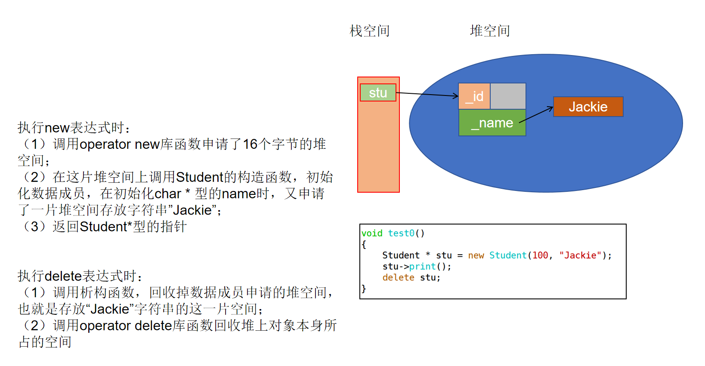
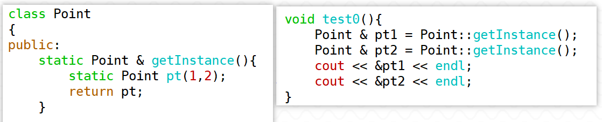

1. 写出以下程序运行的结果。（ ）

``` c++
class Sample 
{
public:
      Sample();
      void Display();
private:
      int i;
      static int k;
};
int Sample::k=0;

Sample::Sample() 
{
	i=0;
	k++;
}

void Sample::Display() 
{
   cout << "i=" << i << ",k=" << k << endl;
}


int main( ) 
{
    Sample a, b;
    a.Display();//0,2  静态数据成员被该类所有对象所共享
    b.Display();
    
    return 0;
}
```


2. 设有如下程序结构：

```cpp
class Box
{
    //....
};
int main()
{
    Box A,B,C; 
}
```

该程序运行时调用(3)次构造函数；调用(3)次析构函数。


3. 写出下面程序的运行结果（）

``` c++
class Sample 
{
	int i;
public:
	Sample();
	Sample(int val);
	void Display();
	~Sample();
};

Sample::Sample() 
{
    cout << "Constructor1" << endl;
    i=0;
}

Sample::Sample(int val) 
{
    cout << "Constructor2" << endl;
    i=val;
}

void Sample::Display() 
{
    cout << "i=" << i << endl;
}

Sample::~Sample() 
{
    cout << "Destructor" << endl;
}

int main() 
{
    Sample a, b(10);
    a.Display();
    b.Display();
	 
    return 0;
}
```


4. 写出下面程序的结果

``` c++
int i = 1;

class Test
{
public:
	Test()
	: _first(i++)  //1
    , _second(i++) //2
	, _third(i++)  //3
    , _fourth(_third) //3 ---> 4
	{
		_third = i; //4
	}
	void print()
	{  
		cout << "result : " << _first + _second + _third + _fourth << endl;//1 + 2 + 4 + 4
	}
private:
	int _first;
	int _second;
	int _third;
	int &_fourth;
};

int main()
{
	Test test;
	test.print();
	
	return 0;
}
```


5. 设已经有A,B,C,D 4个类的定义，程序中A,B,C,D析构函数调用顺序为？

   ```cpp
   C c;
   int main()
   {
       A *pa=new A();
       B b;
       static D d;
       delete pa;
       return 0;
   }
   ```


6. 特殊的成员函数有哪几种？各自的特点是什么？

> 1. static成员函数：
>
> （1）<span style=color:red;background:yellow>**静态成员函数不依赖于某一个对象；**</span>
>
> （2）静态成员函数可以通过对象调用，但更常见的方式是<font color=red>**通过类名加上作用域限定符调用**</font>；
>
> （3）静态成员函数没有this指针；
>
> （4）<font color=red>**静态成员函数中无法直接访问非静态的成员**</font>，只能访问静态数据成员或调用静态成员函数（因为没有this指针）。但是非静态的成员函数可以访问静态成员。
>
> 构造函数/析构函数/赋值运算符函数/拷贝构造比较特殊，可以在静态成员函数中调用。
>
> 构造函数/析构函数/赋值运算符函数/拷贝构造不能设为静态成员函数（因为这四个函数都会访问所有的数据成员，而static成员函数没有this指针）


> 2. const成员函数：
>
>    (1) const成员函数中，不能修改对象的数据成员；
>
>    (2) 当编译器发现该函数是const成员函数时，会自动将this指针设置为双重const限定的指针；
>
> **const对象与const成员函数的规则：**
>
> 1. 当类中有const成员函数和非const成员函数重载时，const对象会调用const成员函数，非const对象会调用非const成员函数；
> 2. 当类中只有一个const成员函数时，无论const对象还是非const对象都可以调用这个版本；
> 3. 当类中只有一个非const成员函数时，const对象就不能调用非const版本。
>
> **总结：**<span style=color:red;background:yellow>**如果一个成员函数中确定不会修改数据成员，就把它定义为const成员函数。**</span>


7. new表达式和delete表达式的底层实现是什么？

> 对于自定义类型
>
> <span style=color:red;background:yellow>**使用new表达式时发生的三个步骤**</span>：
>
> 1. 调用operator new标准库函数申请未类型化的空间             
>
> 2. 在该空间上调用该类型的构造函数初始化对象
>
> 3. 返回指向该对象的相应类型的指针
>
> <span style=color:red;background:yellow>**使用delete表达式时发生的两个步骤**</span>：
>
> 1. 调用析构函数,回收数据成员申请的资源(堆空间)
>
> 2. 调用operator delete库函数回收本对象所在的空间
>
> 


8. 实现将Point类型的单例对象创建在静态区的写法，并理解

> 将构造函数私有，通过公有的静态成员函数创建静态的局部对象，返回绑定这个对象的引用。
>
> 使用时通过引用来表示该对象。
>
> 将拷贝构造、赋值运算符函数私有，避免复制。
>
> 静态成员函数getInstance被多次调用，静态的局部对象只会被初始化一次。第一次调用时，静态对象初始化，后续的调用中，静态局部对象已经存在，不会再初始化，而是直接返回之前的对象。
>
> 


9. 实现将Point类型的单例对象创建在堆区的写法，并完善

   （1）需要提供回收单例对象的方法

   （2）需要灵活使用单例对象，让单例对象的数据成员可以有不同的值


