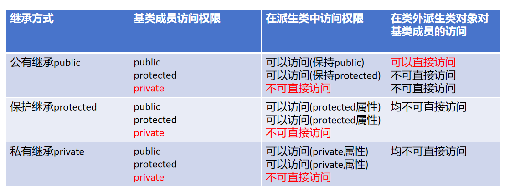
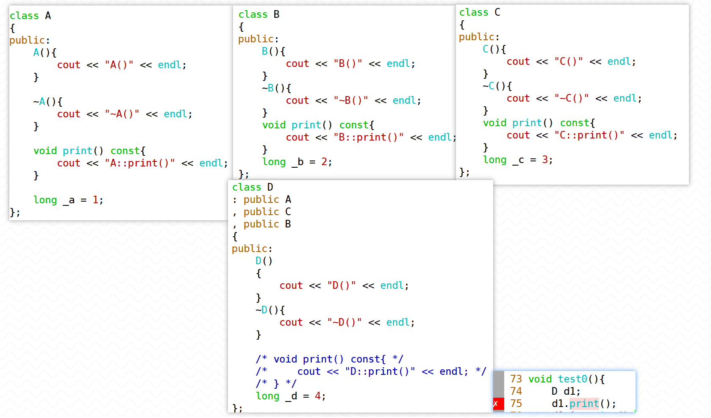
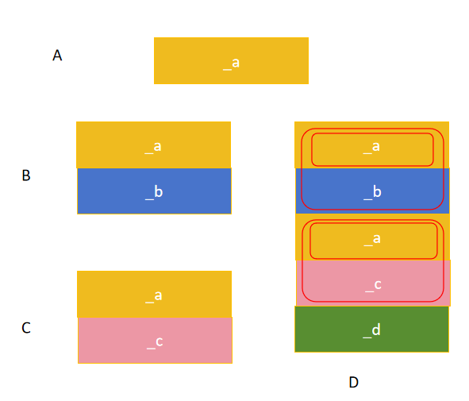
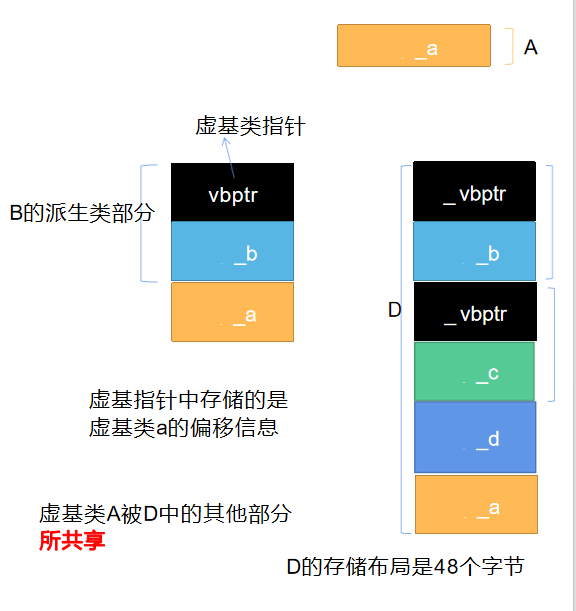
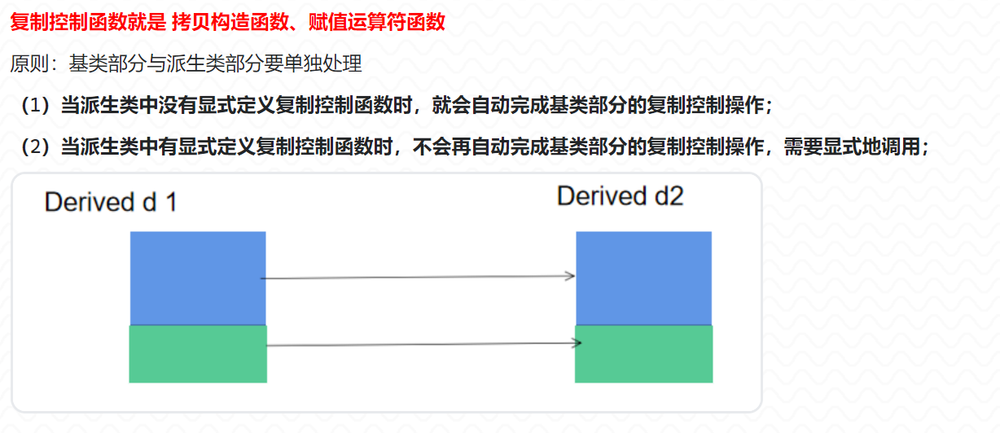

1. 三种继承方式对于基类成员的访问权限是怎样的？

> 
>
> 总结：派生类的访问权限如下：
>
> 1. 不管什么继承方式，派生类内部都不能访问基类的私有成员；
> 2. 不管什么继承方式，派生类内部除了基类的私有成员不可以访问，其他的都可以访问；
> 3. 不管什么继承方式，派生类对象在类外除了公有继承基类中的公有成员可以访问外，其他的都不能访问。
>
> **(记忆：1.私有的成员在类外无法直接访问； 2.继承方式和基类成员访问权限做交集)**


2. 多基派生（多继承）会产生的问题有哪些？怎样解决？

> 多基派生（多个基类）就是指的多继承，产生的问题包括：
>
> （1）**成员名访问冲突二义性**
>
> 如果多个基类中定义了同名的成员，而派生类中又没有定义这样同名的成员，通过派生类对象访问成员会有成员名访问冲突二义性
>
> 
>
> <font color=red>**解决方法：**</font>解决成员名访问冲突的方法：加类作用域（不推荐）—— 应该尽量避免。
>
> 同时，<span style=color:red;background:yellow>**如果D类中定义了同名的成员，可以对基类的这些成员造成隐藏效果**</span>，那么就可以直接通过成员名进行访问。
>
> 
>
> （2）**存储二义性**
>
> 
>
> 
>
> 菱形继承情况下，D类对象的创建会生成一个B类子对象，其中包含一个A类子对象；还会生成一个C类子对象，其中也包含一个A类子对象。所以D类对象的内存布局中有多个A类子对象，访问继承自A的成员时会发生二义性**(无论是否涉及A类的数据成员，单纯访问A类的成员函数也会冲突)**
>
> 因为编译器需要通过基类子对象去调用，但是不知道应该调用哪个基类子对象的成员函数。
>
> <font color=red>**解决方法：**</font>
>
> D类如果再写一个同名成员函数，会发生隐藏，但本质上没有解决D类对象中包含多个A类子对象的情况。
>
> <span style=color:red;background:yellow>**常用方法：中间层的基类采用虚继承顶层基类的方式解决存储二义性**</span>
>
> 这种方式实际上改变了派生类的内存布局。B类和C类对象的内存布局中多出一个虚基类指针，位于所占内存空间的起始位置，同时继承自A类的内容被放在了这片空间的最后位置。D类对象中只会有一份A类的基类子对象。
>
> 


3. 指出并改正下面程序中的错误。

``` c++
#include<iostream>
using std::cout;
using std::endl;

class Point
{   
public:
    Point(int a=0, int b=0) 
	{
		x = a; 
		y = b;
	}
    void move(int xoffset,int yoffset) 
	{
		x += xoffset; 
		y += yoffset;
	}
	
    int getx() 
    {	
    	return x;	
    }
    
    int gety() 
    {	
    	return y;	
    }

private:
	int x,y;
};

class Rectangle
:protected Point
{    
public:
	Rectangle(int x, int y, int l, int w)
	: Point(x,y)
	{   
		length = l;
		width  = w;
	}
	

	int getLength()
	{	
		return length;	
	}
	
	int getWidth()	
	{	
		return width;	
	}

private:
	int length;
	int width;
};
int main()
{ 
	Rectangle r(0, 0, 8,4);
 	r.move(23,56);
	cout << r.getx() 
	     << "," << r.gety()    //保护继承自基类的公有成员成为protected属性，只能在本类与派生类中访问，不能通过对象直接访问
		 << "," << r.getLength() 
		 << "," << r.getWidth() << endl;
	return 0;
}
```


4. 指出并改正下面程序中的错误。

``` c++
#include<iostream>
using std::cout;
using std::endl;

class A
{
 public:
    int x;
    A(int a = 0) 
	{
		x = a;
	}
    void display() 
	{ 
		cout<< "A.x = " << x << endl;
	}
};
class B
{ 
public:
	int x;
    B(int a = 0) 
	{
		x=a;
	}
 	
	void display() 
	{
		cout<<"B.x = " << x << endl; 
	}

};

class C
:public A
,public B
{   

 public:
    C(int a, int b, int c) 
	: A(a)
	, B(b)
    {    
		y=c;  
	}
	

   	int gety() 
   	{ 
   		return y;
   	}

private:
	int y;
};
int main()
{ 
	C myc(1,2,3);
 	myc.x = 10; //成员名访问冲突
 	myc.display();//成员名访问冲突

	return 0;

}
```


5. 看程序写结果

``` c++
#include<iostream>
using std::cout;
using std::endl;

class Base
{     
public:
	Base(int n)
	{
		cout <<"Constucting base class" << endl;
		_ix=n;
	}
	

    ~Base()
    {
    	cout <<"Destructing base class" << endl;
    }
    
    void showX()
    {
    	cout << _ix << ",";
    }
    
    int getX()
    {
    	return _ix;
    }

private:
	int _ix;
};

class Derived
:public Base
{     
public:
	Derived(int n, int m, int p)
	: Base(m)
	, _base(p)
	{
		cout << "Constructing derived class" <<endl;
        j = n;
    }

    ~Derived()
    {
    	cout <<"Destructing derived class"<<endl;
    }
    
    void show()
    {
    	Base::showX();
        cout << j << "," << _base.getX() << endl;
    }

private:
	int j;
    Base _base;
};
int main()
{ 
	Derived obj(8,13,24);
 	obj.show();
	return 0;
}
//Constucting base class
//Constucting base class
//Constructing derived class
//13,8,24
//Destructing derived class
//Destructing base class
//Destructing base class
```


6. 编写一个圆类Circle，该类拥有：

   ① 1个成员变量，存放圆的半径； ② 两个构造方法 Circle( ) // 将半径设为0 Circle(double r ) //创建Circle对象时将半径初始化为r ③ 三个成员方法 double getArea( ) //获取圆的面积 double getPerimeter( ) //获取圆的周长 void show( ) //将圆的半径、周长、面积输出到屏幕


7. 编写一个圆柱体类Cylinder，它继承于上面的Circle类，还拥有：

   ① 1个成员变量，圆柱体的高；
   ② 构造方法
   Cylinder (double r, double h) //创建Circle对象时将半径初始化为r
   ③ 成员方法
   double getVolume( ) //获取圆柱体的体积
   void showVolume( ) //将圆柱体的体积输出到屏幕

   编写应用程序，创建类的对象，分别设置圆的半径、圆柱体的高，计算并分别显示圆半径、圆面积、圆周长，圆柱体的体积。

> Cylinder类继承Circle类后，可以通过基类子对象调用Circle定义的接口函数；
>
> 同时，还可以定义圆锥类、球体类等与圆相关的类，都可以使用Circle类的成员实现自己的功能，体现了代码的可复用性。


8. 定义类Person，包含姓名`char*`、年龄，提供成员函数 display输出信息。类Employee由Person派生，包含部门`char*`、工资, 成员函数display用来输出职工姓名、年龄、部门、工资。要求Employee对象能够进行正确的复制、赋值操作，同时提供计算平均工资的功能。

> Person类用char*保存姓名，同时根据题目可知还需要进行复制、赋值操作，故Person类的复制控制函数（拷贝构造、赋值运算符函数）需要显式定义；
>
> Employee类用char*保存部门信息，那么Employee的复制控制函数也需要显式定义，在其中要注意，需要显式调用基类相应的复制控制函数。
>
> 
>
> 
>
> 


9. 定义一个点Point类，数据成员是横纵坐标（float）；
   定义一个颜色类Color数据成员只有颜色（char*）；
   一个直线类Line，数据成员是两个Point对象，表示起点和终点（即Point两个对象为Line的内嵌对象）；
   一个三角形类Triangle，继承自Line和Color，数据成员有三角形的高height（float），三角形理解成以基类Color为颜色，以基类直线为底，以height为高的直角三角形，(即直线和高分别为两条直角边)
   请实现相关函数，计算三角形的颜色、周长和面积并给出相关输出


