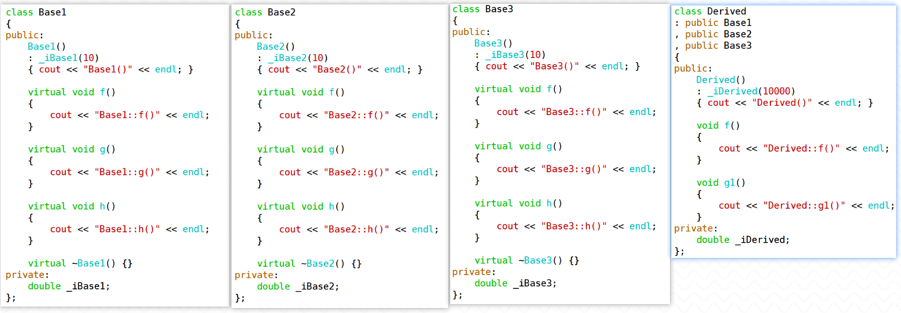
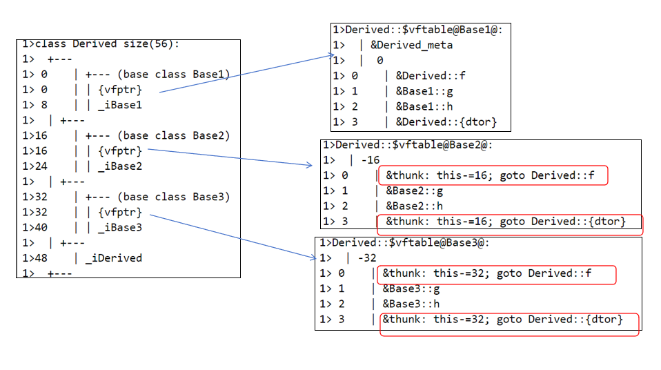
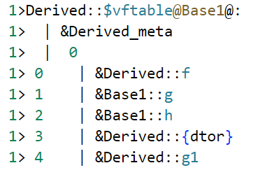
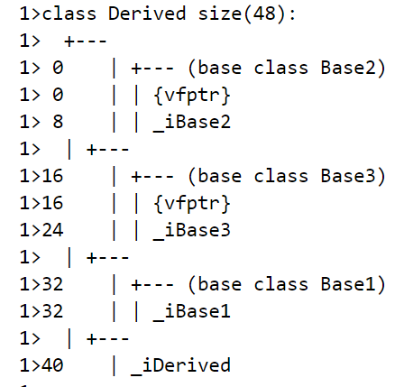
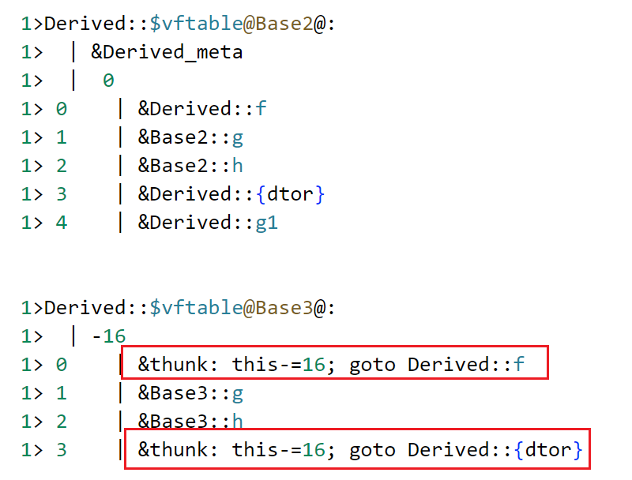

1. 根据给定的程序执行结果，将下列程序补充完整。

``` c++
#include <iostream>
using std::endl;
using std::cout;

class Base
{
public:
	Base(int i) 
	{
		b = i;
	}
　　(1)
    Base():b(0){}
    virtual void Print()
    {	cout << "Base 's Print() called." << endl;}
protected:
	int b;
};

class Derived1
:public Base
{
public:
　　(2)　　　
	void Print()
	{
		cout<<"Derived1's Print() called."<<endl;
	}
};

class Derived2
:public Base
{　　　
	(3)　　
public:
    void Print()
    {
        cout << "Derived2's Print() called. "<< endl;
    }
};
//Base  * obj
void fun(　　(4)　　)
{      
	obj->Print();
}

int main(void)
{ 
	(5)　　　
    Derived1 d1; //类名不一致
    Derived2 d2; //类名不一致
    fun(d1); //fun(&d1) 应传入对象的地址
    fun(d2); //fun(&d2)
	return 0;
}
//程序的执行结果如下：
//Derive1's Print() called.
//Derive2's Print() called.
```


2. 根据给定的程序，写出执行结果

``` c++
#include<iostream>
using std::endl;
using std::cout;

class Base1
{
public:
    virtual void fun()       
    {   
		cout<<"--Base1--\n";  
	}
};

class Base2
{
public:
    void fun()               	
    {   
		cout<<"--Base2--\n"; 
	}
};

class Derived
:public Base1
,public Base2
{
public:
    void fun()
    {   
        cout<<"--Derived--\n";  
    }
};

int main()
{
    Base1 obj1, *ptr1;   
    Base2 obj2, *ptr2;   	
    Derived obj3; 
	
    ptr1=&obj1;         	
    ptr1->fun(); 
    
    ptr2=&obj2;         	
    ptr2->fun(); 
    
    ptr1=&obj3;         	
    ptr1->fun(); 
    
    ptr2=&obj3;         	
    ptr2->fun(); 
    return 0;	                  
}
```


3. 带虚函数的多继承结构下，虚函数地址的存放规则是怎样？利用VS验证规则





通过VS平台展示类对象内存布局的功能，我们可以总结出以下规则：

> 1 .  每个基类都有自己的虚函数表（前提是基类定义了虚函数）
>
> 2 .  派生类如果有自己的虚函数，会被加入到第一个虚函数表之中 —— 希望尽快访问到虚函数
>
> 
>
> 
>
> 3 .  内存布局中，其基类的布局按照基类被声明时的顺序进行排列（<font color=red>**有虚函数的基类会往上放——希望尽快访问到虚函数**</font>）
>
> 如果继承顺序为Base1/Base2/Base3，在Derived对象的内存布局中就会先是Base1类的基类子对象，然后是Base2、Base3基类子对象
>
> 此时，如果Base1中没有定义虚函数，那么内存排布上会将Base1基类子对象排在Base2、Base3基类子对象之后。
>
> 
>
> 
>
> 4 .  派生类会覆盖基类的虚函数，只有第一个虚函数表中存放的是真实的被覆盖的函数的地址；其它的虚函数表中对应位置存放的并不是真实的对应的虚函数的地址，而是一条跳转指令 —— 指示到哪里去寻找被覆盖的虚函数的地址
>
> 


4. 请分析如下结构下的各种访问情况

``` c++
class A{
public:
    virtual void a(){ cout << "A::a()" << endl; } 
    void b(){ cout << "A::b()" << endl; } 
    virtual void c(){ cout << "A::c()" << endl; } 
    void e(){ cout << "A::e()" << endl; }
};

class B{
public:
    virtual void a(){ cout << "B::a()" << endl; } 
    void c(){ cout << "B::c()" << endl; } 
    void d(){ cout << "B::d()" << endl; } 
    virtual void f(){ cout << "B::f()" << endl; }
};

class C
: public A
, public B
{
public:
    virtual void a(){ cout << "C::a()" << endl; } 
    virtual void b(){ cout << "C::b()" << endl; } 
    void c(){ cout << "C::c()" << endl; } 
    void d(){ cout << "C::d()" << endl; } 
};

void test0(){
    C c;
    c.a(); 
    c.b(); 
    c.c(); 
    c.d(); 
    c.e();
    c.f();
    
    cout << endl;
    A* pa = &c;
    pa->a(); 
    pa->b(); 
    pa->c(); 
    pa->d();
    pa->e(); 
    pa->f();
    
    cout << endl;
    B* pb = &c;
    pb->a(); 
    pb->b(); 
    pb->c(); 
    pb->d();
    pb->e();
    pb->f(); 

    cout << endl;
    C * pc = &c;
    pc->a(); 
    pc->b(); 
    pc->c(); 
    pc->d(); 
    pc->e();
    pc->f();
}
```


