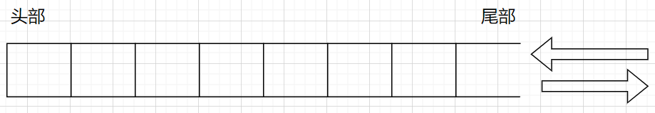
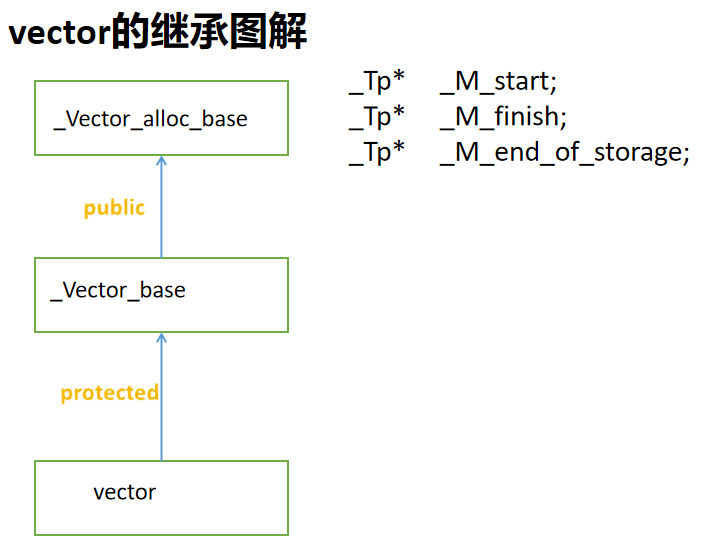
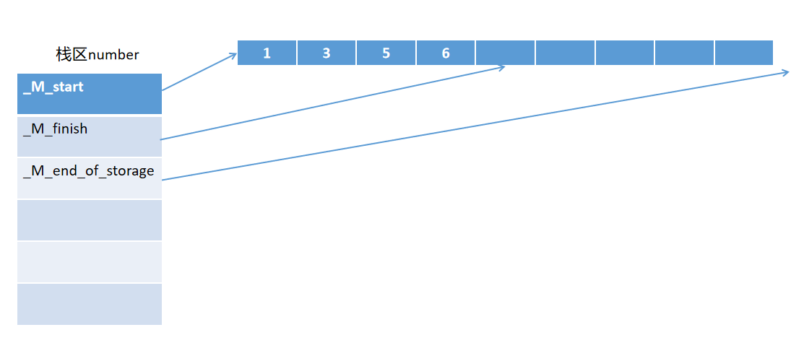
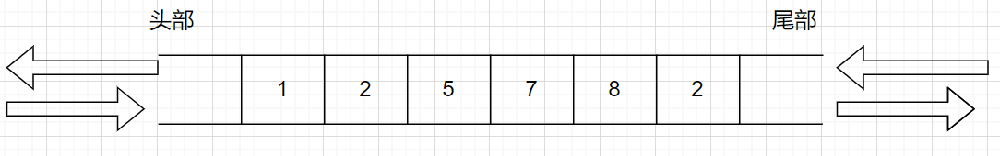
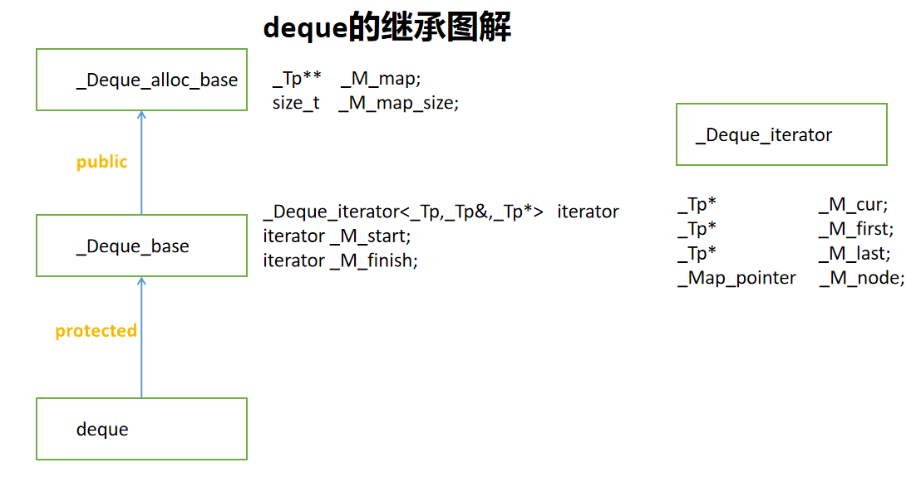
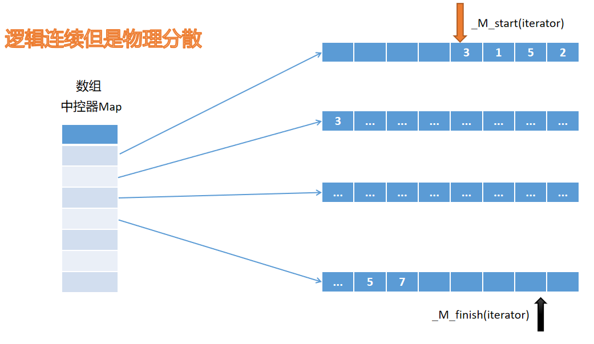
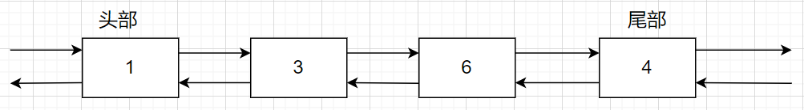
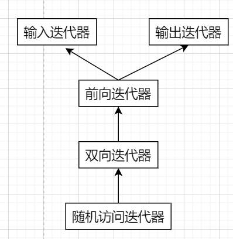
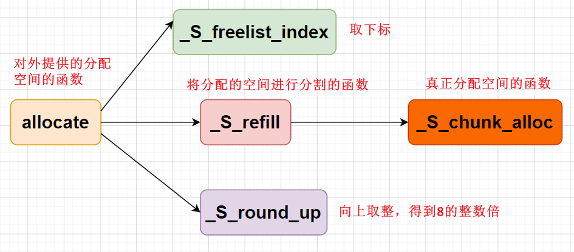

# 标准模板库STL

## 一、标准模板库

标准模板库，即Standard Template Library，简称STL，是一个具有工业强度的，高效的C++程序库。它被容纳于C++标准库中，是ANSI/ISO C++标准中最新的也是极具革命性的一部分。该库包含了诸多在计算机科学领域里所常用的基本数据结构和基本算法。为广大C++程序员们提供了一个可扩展的应用框架，高度体现了软件的可复用性。与之前学到的编程思想面向对象编程不一样，STL采用的是一种新的编程模式：**泛型编程**。它允许程序员编写通用的代码，即可适用于不同的数据类型，而不必为每种类型编写不同的代码。这种编程方法的基本思想是将数据类型抽象化，使用泛型来表示数据类型，并在编写代码时使用泛型来代替具体的数据类型。STL是很庞大复杂的系统，单单就STL就可写出厚达千页的技术书籍，所以，本章不可能做到面面俱到，重点在于介绍泛型编程的思想和本质，介绍一些常用的方法，为初学者学习STL提供一些感性认识，起到抛砖引玉的作用。

虽然STL的内容繁多，但是可以总结为六大组件：容器、迭代器、算法、适配器、函数对象、空间配置器。下面对六大组件的功能做一个概述。

- 容器：是一种数据结构。这里可以按照类别分为序列式容器（比如：vector、list）、关联式容器（比如：set、map）、无序关联式容器（比如：unordered_set、unordered_map）三类。
- 迭代器：是一种抽象的数据类型，可用于访问容器中的元素，行为类似于C语言中的指针一样，这里可以将其称为泛型指针。
- 算法：它是用于对容器中的元素进行操作的函数模板。STL中提供了大量的常用算法，包括：查找、排序、合并、去重、集合操作、取最值、数值计算等。
- 适配器：一种用来修饰容器或者访函数或者迭代器接口的东西。是使一种事物的行为类似于另外一种事物行为的一种机制，类似于生活中的转接器功能。
- 函数对象：也称为仿函数，可作为算法的某种策略。是一种封装了函数或函数指针的对象，它可以像函数一样被调用，也可以像对象一样被赋值或传递给其他函数，STL中的函数对象是做定制化操作的。
- 空间配置器：管理内存分配和释放。


## 二、容器(container)

容器就是用来存放数据的，也就是数据结构，这是STL中最基础、最重要的部分。STL中的容器可以分为三类：序列式容器、关联式容器、无序关联式容器，这里我们需要具体学习各个容器的用法。

### （一）序列式容器

序列式容器包括：==静态数组array、动态数组vector、双端队列deque、单链表forward_list、双链表list==。这五个容器中，我们需要讲解三个**vector、deque、list**的使用，包括：初始化、遍历、尾部插入与删除、头部插入与删除、任意位置进行插入与删除、元素的清空、获取元素的个数与容量的大小、元素的交换、获取头部与尾部元素等。

#### 1.0、头文件 

```C++
#include <vector>  
template<
    class T,
    class Allocator = std::allocator<T>
> class vector;

#include <deque>  
template<
    class T,
    class Allocator = std::allocator<T>
> class deque;

#include <list>
template<
    class T,
    class Allocator = std::allocator<T>
> class list;
```

#### 1.1、初始化容器对象

对于序列式容器而言，初始化的方式一般会有五种。

##### 1.1.1、初始为空

```C++
vector<int> number; 
deque<int>  number; 
list<int>  number;
```

##### 1.1.2、初始为多个相同的值

```C++
vector<int> number(10, 1);
deque<int> number(10, 1);
list<int> number(10, 1);
```

##### 1.1.3、使用迭代器范围

```C++
int arr[10] = {1, 2, 3, 4, 5, 6, 7, 8, 9, 10};
vector<int> number(arr, arr + 10);//左闭右开区间
//vector可以直接替换为deque与list
```

##### 1.1.4、使用大括号

```C++
vector<int> number = {1, 2, 3, 4, 5, 6, 7, 8, 9, 10};
//vector可以直接替换为deque与list
```

##### 1.1.5、拷贝构造或者移动构造

```C++
vector<int> number1 = {1, 2, 4, 6};
vector<int> number2(number1);
vector<int> number3(std::move(number1));
//vector可以直接替换为deque与list
```

#### 1.2、遍历容器中的元素

就是访问容器中的每个元素，一般可以采用下标或者迭代器的方式进行遍历。

```C++
//1、使用下标进行遍历(要求容器必须是支持下标访问的，list不支持下标，所以就不适用)
for(size_t idx = 0; idx != number.size(); ++idx)
{
    cout << number[idx] << " ";
}


//2、使用未初始化的迭代器进行遍历
vector<int>::iterator it;
for(it = numbers.begin(); it != numbers.end(); ++it)
{
    cout << *it << " ";
}

//3、使用初始化迭代器进行遍历
vector<int>::iterator it = number.begin();
for(; it != number.end(); ++it)
{
    cout << *it << " ";
}

//4、使用for加上auto进行遍历
for(auto &elem : number)
{
    cout << elem << " ";
}
```

#### 1.3、在容器的尾部插入与删除

可以向容器的尾部插入一个元素或者将容器的最后一个元素删除。

```C++
//尾部插入一个元素（注意：是拷贝一份副本到尾部）
void push_back( const T& value);
void push_back( T&& value);

//尾部删除
void pop_back();
```

这两个函数比较简单，三个都适用。

#### 1.4、在容器的头部插入与删除

可以向容器的头部插入一个元素或者将容器的第一个元素删除。

```C++
//头部插入
void push_front( const T& value);
void push_front( T&& value);

//头部删除
void pop_front();
```

对于deque与list而言，是支持这两个操作的，但是对于vector没有提供这两个操作。

==**思考题：为何vector不支持在头部进行插入元素与删除元素呢？**==可以从容器的底层结构上考虑。

#### 1.5、vector的原理



vector头部是固定的，不能进行插入与删除，只提供了在尾部进行插入与删除的操作，所以如果真的要在头部插入或者删除，那么其他的元素会发生移动，这样操作就比较复杂。

==**那么再思考一个问题，vector的底层可以采用什么方式进行实现呢？**==

探讨vector的**底层实现**，三个指针：

_M_start：指向第一个元素的位置

_M_finish：指向最后一个元素的下一个位置

_M_end_of_storage：指向当前分配空间的最后一个位置的下一个位置

那么这三个指针是怎么来的呢，我们可以从其源码中获取答案（这里需要阅读vector的源码）



搞清楚vector的继承图、原理、源码以后，==**可以再思考一个问题，如何获取vector中的第一个元素的首地址呢，可以直接给对象取地址吗？**==通过这个图就应该可以得到答案了。



```C++
&number;//error,只是获取对象栈上的地址,也就是_M_start的地址
&number[0];
&*number.begin();//ok
int *pdata = number.data();//ok
cout << "pdata = " << pdata << endl;//使用printf，思考一下printf与cout打印地址的区别
```

#### 1.6、deque的原理



==**继续思考一个问题，deque的底层采用什么方式进行实现呢？**==

探索deque的**底层实现**：

deque是由多个片段组成的，片段内部是连续的，但是片段之间不连续的，分散的，多个片段被一个称为中控器的结构控制，所以说deque是在物理上是不连续的，但是逻辑上是连续的。

我们依旧可以从其源码中获取答案（这里需要阅读deque的源码）



从继承图中可以看到，中控器其实是一个二级指针，由`_M_map`表示，还有一个表示中控器数组大小的`_M_map_size`，deque的迭代器也不是一个简单类型的指针，其迭代器是一个类类型，deque有两个迭代器指针，一个指向第一个小片段，一个指向最后一个小片段。其结构图如下：



#### 1.7、list的原理

list是双向链表，其实现如下：



双向链表这个大家都比较熟悉，所以这里就不再赘述了。

#### 1.8、在容器的任意位置插入

三种序列式容器在任意位置进行插入的操作是insert函数，函数接口如下

```C++
//1、在容器的某个位置前面插入一个元素
iterator insert( iterator pos, const T& value );
iterator insert( const_iterator pos, const T& value );
number.insert(it, 22);

//2、在容器的某个位置前面插入count个相同元素
void insert(iterator pos, size_type count, const T& value)
iterator insert(const_iterator pos, size_type count, const T& value)
number.insert(it1, 4, 44);

//3、在容器的某个位置前面插入迭代器范围的元素
template<class InputIt> 
void insert(iterator pos, InputIt first, InputIt last);
template<class InputIt> 
iterator insert(const_iterator pos, InputIt first, InputIt last)

vector<int> vec{51, 52, 53, 54, 55, 56, 57, 58, 59};
number.insert(it, vec.begin(), vec.end());

//4、在容器的某个位置前面插入大括号范围的元素
iterator insert(const_iterator pos, std::initializer_list<T> ilist)
number.insert(it, std::initialiser_list<int>{1, 2, 3});
```

三种序列式容器的插入示例如下

```C++
//此处list可以换成vector或者deque
list<int> number = {1, 4, 6, 8, 9};
++it;
auto it = number.begin();

//1、在容器的某个位置前面插入一个元素
number.insert(it, 22);

//2、在容器的某个位置前面插入count个相同元素
number.insert(it, 3, 100);

//3、在容器的某个位置前面插入迭代器范围的元素
vector<int> vec{51, 52, 53, 54, 55, 56, 57, 58, 59};
number.insert(it, vec.begin(), vec.end());

//4、在容器的某个位置前面插入大括号范围的元素
number.insert(it, {1, 2, 3});
```

==**思考题：上述代码中，三种容器在insert之后，迭代器it解引用之后的结果有什么区别**？==

insert在任意位置进行插入，<font color=red>**list使用起来很好，没有任何问题**</font >，但是deque与vector使用起来可能会出现问题，因为**vector是物理上连续的**，所以在中间插入元素会导致插入元素后面的所有元素向后移动，deque也有类似情况，**可能因为插入而引起底层容量不够而扩容，从而使得迭代器失效(申请了新的空间，但是迭代器还指向老的空间)**，即使没有扩容，插入之后的迭代器也失效了(不再指向之前的元素了)。

#### 1.9、vector的迭代器失效

以vector为例，如果使用insert插入元素，而每次插入元素的个数不确定，可能剩余空间不足以存放插入元素的个数，那么insert在插入的时候**==底层就可能导致扩容，从而导致迭代器还指向老的空间，继续使用该迭代器会出现迭代器失效的问题==**。

```C++
void test()
{
    vector<int> number = {1, 2, 3, 4, 5, 6, 7, 8, 9};
    display(number);
    cout << "number.size() = " << numbers.size() << endl;//9
    cout << "number.capacity() = " << numbers.capacity() << endl;//9

    cout << endl << "在容器尾部进行插入: " << endl;
    number.push_back(10);
    number.push_back(11);
    display(number);
    cout << "number.size() = " << number.size() << endl;//11
    cout << "number.capacity() = " << number.capacity() << endl;//18

    cout << endl << "在容器vector中间进行插入: " << endl;
    auto it = number.begin();
    ++it;
    ++it;
    number.insert(it, 22);
    display(number);
    cout << "*it = " << *it << endl;
    cout << "number.size() = " << number.size() << endl;//12
    cout << "number.capacity() = " << number.capacity() << endl;//18

    numbers.insert(it, 7, 100);//因为插入个数不确定，有可能底层已经发生了扩容
    display(numbers);
    cout << "*it = " << *it << endl;
    cout << "numbers.size() = " << numbers.size() << endl;//19
    cout << "numbers.capacity() = " << numbers.capacity() << endl;//24
    
    //正确办法是重置迭代器的位置
    vector<int> vec{51, 52, 53, 56, 57, 59};
    numbers.insert(it, vec.begin(), vec.end());//继续使用该迭代器就会出现问题（内存错误）
    display(numbers);
    cout << "*it = " << *it << endl;
    cout << "numbers.size() = " << numbers.size() << endl;
    cout << "numbers.capacity() = " << numbers.capacity() << endl; 
    
    //解决方案：每次在插入元素的时候，可以将迭代器的位置进行重置更新，避免因为底层扩容，迭代器还指向老的空间而出现问题
    vector<int> vec{51, 52, 53, 56, 57, 59};
    
    it = number.begin();//重新置位
    ++it;
    ++it;
   
    numbers.insert(it, vec.begin(), vec.end());//继续使用该迭代器就会出现问题（内存错误）
    display(numbers);
    cout << "*it = " << *it << endl;
    cout << "numbers.size() = " << numbers.size() << endl;
    cout << "numbers.capacity() = " << numbers.capacity() << endl;
}
```

==**思考题：insert插入数据导致容量不够，底层是不是也采用类似vector的push_back一样的两倍扩容呢？**==

<span style=color:blue>**因为vector的push_back操作每次只会插入一个，所以可以按照统一的形式2 * capacity()，但是insert的时候，插入的元素个数不定的，所以就不能一概而论。**</span>这里可以分别讨论一下，我们设置capacity() = n, size() = m, insert插入的元素个数为t个

- 如果t < n - m，这个时候就没有扩容，所以直接插入
- 如果n - m < t < m，就按照m的2倍去进行扩容，新的空间就是2 * m
- 如果n - m< t < n 且t > m,就按照 t + m去进行扩容
- 如果t > n时，依旧按照t + m去进行扩容  

这就是vector进行insert扩容的原理（这个原理可以了解一下，主要是为了告诉大家，不是两倍扩容）。

#### 1.10、在容器的任意位置删除元素

三种序列式容器的删除操作是erase函数，函数接口如下

```C++
//删除指定迭代器位置的元素
iterator erase(iterator position);
//删除一个迭代器范围的元素
iterator erase(iterator first, iterator last); 
```

对于vector而言，会导致删除迭代器之后的所有元素前移，从而导致删除元素之后的所有迭代器失效（<font color=red>**迭代器的位置没有改变，但是因为元素的移动，导致迭代器指向的不是删除之前的元素，所以失效）**</font>；deque比vector复杂，要看pos前后的元素个数来决定，deque的erase函数可以看STL源码，需要看删除位置与size()的一半的大小，然后看是挪动前一半还是后一半，尽量减少挪动的次数；list会删除指向的元素，从而导致指向删除元素的迭代器失效。

这里以vector的erase为例，看看其删除元素的操作与删除后的效果。

```C++
//题意：删除vector中所有值为4的元素。
--不可以删除连续重复的元素--
    
vector<int> vec = {1, 3, 5, 4, 4, 4, 4, 7, 8，4, 9};
for (vector<int>::iterator it = vec.begin(); it != vec.end(); ++it)
{
    if(4 == *it) 
    {
        vec.erase(it);
    }    
}
//发现删除后有些4没有删除掉，可以推测出是什么原因吗？是那些4没有删除呢？


//正确解法：
for (auto it = vec.begin(); it != vec.end();)
{
    if (4 == *it) 
    {
        vec.erase(it);   // 删除元素，后面的元素前移，迭代器不动
    }
    else 
    {
        ++it;            // 不删除元素时才让迭代器后移
    }
}
```

==**思考题：将上述的vector换成是list，看看如何删除所有值为4的元素？**==

> <span style=color:red;background:yellow>**需要接受删除迭代器返回后的值**</span>

#### 1.11、其他操作

```C++
//清除容器中的所有元素(三个序列式容器都有)
void clear();

//获取元素个数(三个序列式容器都有)
size_type size() const;

//获取容量大小（只有vector有）
size_type capacity() const;

//回收多余的空间，使得元素的个数与容量大小对应，不存在没有使用的空间（vector与deque有这个函数）
void shrink_to_fit();

//交换两个相同容器中的元素(三个序列式容器都有)
void swap( vector& other);
vector<int> number1 = {1, 2, 3};
vector<int> number2 = {10, 20, 30};
number1.swap(number2);//之后number1中的内容与number2中的内容做了交换

//更改容器中元素个数(三个序列式容器都有)
//以vector为例，执行resize时候，如果count < size(),就将多余的元素删除；如果count > size(),就在
//之前的元素后面执行insert添加元素（没有指定就添加默认值）,元素的个数在改变的同时，容量也在发生改变 //（上一次的两倍或者本次元素个数）
void resize( size_type count, T value = T() );
void resize( size_type count);
void resize( size_type count, const value_type& value);

//获取第一个元素(三个序列式容器都有)
reference front();
const_reference front() const;

//获取最后一个元素(三个序列式容器都有)
reference back();
const_reference back() const;

//C++11增加的可变参数模板的几个函数
//在容器的尾部就地构造一个-------元素
template< class... Args >
void emplace_back( Args&&... args);
vector<Point> vec;
vec.push_back(point(1, 2)) // 多执行一步拷贝构造
vec.emplace_back(1, 2);//就地将(1, 2)构建为一个对象存放在vector的尾部
```

#### 1.12、list的特殊操作

##### 1.12.1、排序函数sort

```C++
void sort();//默认以升序进行排序，其实也就是，使用operator<进行排序

template< class Compare > 
void sort(Compare comp);//其实也就是传入一个具有比较的类型，即函数对象

template <typename T1, typename T2>
struct Compare
{
    bool operator()(const T1 &a, const T2 &b) const
    {
        return a < b;
    }
};
```

##### 1.12.2、移除重复元素unique

```C++
void unique();  // 	去除连续重复元素
size_type unique();
```

<font color=red>**注意使用unique的时候，要保证元素list是已经排好顺序的，否则使用unique是没有用的。**</font>

##### 1.12.3、逆置链表中的元素reverse

```C++
void reverse();
void reverse() noexcept;
```

将链表中的元素逆置。

##### 1.12.4、合并链表的函数merge

```C++
//合并两个链表（other既可以是左值也可以是右值）
void merge( list& other );
void merge( list&& other );

template <class Compare>
void merge( list& other, Compare comp );
template <class Compare>
void merge( list&& other, Compare comp );
```

<font color=red>**合并的链表必须是有序的，如果没有顺序，合并没有效果。**</font><font color=red>**两个链表合并之后，并且另一个链表就为空了。**</font>

##### 1.12.5、从一个链表转移元素到另一个链表splice

```C++
//移动other链表到另一个链表的某个指定位置前面
void splice(const_iterator pos, list& other);
void splice(const_iterator pos, list&& other);

//移动other链表中的某个元素到另一个链表的某个指定位置前面
void splice(const_iterator pos, list& other, const_iterator it);
void splice(const_iterator pos, list&& other, const_iterator it);

//移动other链表的一对迭代器范围元素到另一个链表的某个指定位置前面
void splice(const_iterator pos, 
            list& other, const_iterator first, const_iterator last);
void splice(const_iterator pos, 
            list&& other,const_iterator first, const_iterator last);
```

整个list的特殊成员函数的使用

```C++
void test()
{
    list<int> number{8, 3, 4, 3, 6, 7, 6, 9, 1, 8, 9};
    number.unique();
    number.sort();//默认情况是以小于符号进行排序
    number.unique();//unique在去除重复元素的时候，链表必须为有序

    list<int> number2{11, 22, 33};
    number.merge(number2);

    number.reverse();

    list<int> number3{41, 42, 43, 44, 45, 46, 47};
    auto it = number.begin();
    ++it;
    ++it;

    auto it2 = numbers.begin();
    ++it2;
    ++it2;
    number.splice(it, numbers3, it2);

    auto it3 = number.end();
    it = number.begin();
    --it3;
    number.splice(it, numbers, it3);
}
```

==**思考题：调用splice函数时候，调用splice的对象能不能与参数中的other是同一个链表？**==

> **可以同一个列表**

### （二）关联式容器

关联式容器包括：set、multiset、map、multimap四种。它们的底层使用的数据结构都是红黑树。要学习它们的使用，也可以从：初始化、遍历、查找、插入、删除、针对自定义类型等方面进行学习。

####     2.1、红黑树的五大特征

- 节点不是红色就是黑色
- 根节点是黑色的
- 叶子节点也是黑色的
- 如果一个节点是红色的，那么它的左右孩子节点必须是黑色的
- 从根节点到叶子节点上所有路径要保证黑色节点的个数相同

#### 2.2、头文件与模板形式

```C++
#include <set>
template<
    class Key,
    class Compare = std::less<Key>,
    class Allocator = std::allocator<Key>
> class set;

#include <set>
template<
    class Key,
    class Compare = std::less<Key>,
    class Allocator = std::allocator<Key>
> class multiset;

#include <map>
template<
    class Key,
    class T,
    class Compare = std::less<Key>,
    class Allocator = std::allocator<std::pair<const Key, T> >
> class map;

#include <map>
template<
    class Key,
    class T,
    class Compare = std::less<Key>,
    class Allocator = std::allocator<std::pair<const Key, T> >
> class multimap;
```

#### 2.3、关联式容器的性质

#####      set特征

- 存放的是key类型，key值是唯一的，不能重复
- 默认按照key值进行升序排列
- 底层实现是红黑树

#####     multiset特征

- 存放的是key类型，key值是不唯一的，可以重复
- 默认按照key值进行升序排列
- 底层实现是红黑树

#####     map的特征

- 存放的是key-value类型，key值是唯一的，不能重复，value没有要求是否唯一
- 默认按照关键字key进行升序排列
- 底层实现是红黑树

#####     multimap的特征

- 存放的是key-value类型，key值是不唯一的，可以重复，value没有要求是否唯一
- 默认按照关键字key进行升序排列
- 底层实现是红黑树

#### 2.4、容器对象初始化

关联式容器的初始化方式与序列式容器初始化方式基本完全一致，包括：初始化空对象、使用迭代器范围、使用大括号、拷贝或者移动构造的方式，具体代码形式可以回看序列式容器。

```C++
template <typename Container>
void display(const Container &con)
{
    for(auto &elem : con)
    {
        cout << elem << "  ";
    }
    cout << endl;
}

set<int> number = {1, 4, 7, 6, 4, 3, 2, 6, 8, 4, 2};
display(number);
//注意：上述的set可以直接换成multiset
```

```C++
template <typename Container>
void display(const Container &con)
{
    for(auto &elem : con)
    {
        cout << elem.first << "  " << elem.second << endl;
    }
}

map<int, string> number = 
{
    {1, "北京"},//大括号方式进行初始化
    {2, "上海"},
    
    std::pair<int,string>(3, "广州"),//map中存的是pair类型，就直接使用pair初始化
    std::pair<int,string>(4, "深圳"),
    
    std::make_pair(5, "武汉"),//std::make_pair()函数返回类型就是pair类型
    std::make_pair(6, "南京"),
    std::make_pair(2, "上海")
};

display(number);
//注意：初始化时，map可以直接换成multimap
```

#### 2.5、遍历容器对象中元素

四种关联式容器的使用形式与序列式容器完全一致(可以参考序列式容器)

```C++
template <typename Container>
void display(const Container &c)
{
    for(auto &elem : c)
    {
        cout << elem << " ";
    }
    cout << endl;
}
```

#### 2.6、容器对象的查找

##### 2.6.1、count与find

四种关联式容器都有这两个函数

```C++
//查找满足条件的key的个数
size_type count( const Key& key ) const;

//查找满足条件的key的迭代器
iterator find( const Key& key );
const_iterator find( const Key& key ) const;
```

演示实例

```C++
//number对象可以是四种关联式容器中的任何一种
size_t cnt = number.count(1);//cnt = 1 表示key存在，否则key不存在

set<int>::iterator it = number.find(10);
if(it == number.end())
{
    cout << "该元素不存在number中" << endl;
}
else
{
    cout << "该元素存在number中： "  << *it << endl;
}
```

##### 2.6.2、另外三个查找函数

四种关联式容器都有这三个函数

```C++
//返回第一个不小于给定key值的迭代器
iterator lower_bound( const Key& key );
const_iterator lower_bound( const Key& key ) const;

//返回第一个大于给定key值的迭代器
iterator upper_bound( const Key& key );
const_iterator upper_bound( const Key& key ) const;

//返回满足给定key值范围的元素
std::pair<iterator,iterator> equal_range( const Key& key );
std::pair<const_iterator,const_iterator> equal_range( const Key& key ) const;
```

还有三个用于查找的函数，这个函数对于multiset与multimap效果要好一点。

```C++
auto it = number.lower_bound(2);//不大于key的第一个位置
auto it2 = number.upper_bound(2);//大于key的第一个位置


pair<multiset<int>::iterator, multiset<int>::iterator> ret = number.equal_range(2);
while(ret2.first != ret2.second)
{
    cout << *ret2.first << " ";
    ++ret2.first;
}
```

#### 2.7、容器对象的插入

```C++
//value_type，若是set/multiset代表的是key，若是map/multimap代表的是pair<const key, value>
//1、插入一个元素到容器中
std::pair<iterator,bool> insert( const value_type& value );
std::pair<iterator,bool> insert( value_type&& value );

//2、插入一个元素到容器的hint位置的前面
iterator insert( iterator hint, const value_type& value );
iterator insert( const_iterator hint, const value_type& value );
iterator insert( const_iterator hint, value_type&& value );

//3、插入一个迭代器范围的元素到容器中
template< class InputIt > void insert( InputIt first, InputIt last );

//4、插入一个大括号范围的元素到容器中
void insert( std::initializer_list<value_type> ilist );
```

具体代码示例如下：

```C++
//如果是set插入，需要判断返回值，multiset就不需要
set<int> number = {1, 4, 8, 7, 6, 4, 3, 2};
auto ret = number.insert(10);
if(ret.second)
{
    cout << "添加成功" << *ret.first << endl;
}
else
{
    cout << "添加失败，这个元素已经存在set之中: " << endl;
}

//添加一对迭代器范围元素
vector<int> vec{10, 9, 8, 5, 30, 20, 11, 39};
number.insert(vec.begin(), vec.end());

number.insert({100, 21, 500});
display(number);

//如果是map插入，需要判断返回值，multimap就不需要
map<string, Point> number;
auto ret3 = number.insert(std::make_pair("999", Point(10, 40)));
if(ret3.second)
{
    cout << "添加元素成功 :  " << ret3.first->first 
         << ret3.first->second << endl;
}
else
{
    cout << "添加失败，该元素存在于map之中 : " 
         << ret3.first->first 
         << ret3.first->second << endl;
}
```

#### 2.8、容器对象的删除

```C++
//1、删除迭代器指向的一个元素
void erase(iterator pos);//删除某个位置元素
iterator erase(const_iterator pos);
iterator erase(iterator pos);

//2、删除迭代器范围的元素
void erase(iterator first, iterator last);//删除某个返回的元素
iterator erase(const_iterator first, const_iterator last);
```

```C++
auto it = number.begin();
++it;
++it;
number.erase(it);
```

#### 2.9、下标访问

只有map支持下标访问，且兼具插入与修改的功能，所以使用起来比较方便

```C++
T& operator[]( const Key& key );
T& operator[]( Key&& key );
```

演示实例

```C++
map<string, Point>   number = {
    {"1", Point(1, 2)},
    {"4", Point(3, 4)},
    {"3", Point(4, 4)},
}

cout << "points[\"1\"] = " << points["1"] << endl;//查找
cout << "points[\"0\"] = " << points["0"] << endl;//插入

points["4"] = Point(10, 20);//修改
```

#### ==2.10、针对自定义类型的操作==

对于四种关联式容器而言，它们的模板参数中都有一个Compare，默认采用的是std::less，所以如果Key是自定义类型，需要自己传递Compare类型的参数才能满足条件，否则无法通过编译。下面以自定义类型Point为例，以点到原点的距离为标准进行比较

```C++
class Point
{
public:
    double getDistance() const
    {
        return hypot(_ix, _iy);
    }

    friend bool operator<(const Point &lhs, const Point &rhs);//std::less
    friend class ComparePoint;//函数对象

private:
    int _ix;
    int _iy;
};

//第一种方式：模板的特化。使用Compare的默认值std::less,只是Key类型是Point，所以需要特化
namespace std
{
template <>
struct less<Point>
{
    bool operator()(const Point &lhs, const Point &rhs)
    {
        if(lhs.getDistance < rhs.getDistance)
        {
            return true;
        }
        else if(lhs.getDistance == rhs.getDistance)
        {
            if(lhs.getX() < rhs.getX())
            {
                return true;
            }
            else if(lhs.getX() == rhs.getX())
            {
                if(lhs.getY() < rhs.getY())
                {
                    return true;
                }
                else
                {
                    return false;
                }
            }
            else
            {
                return false;
            }
        }
        else
        {
            return false;
        }
    }
};
}//end of namespace std

//第二种形式：运算符重载。因为std::less的本质就在比较lhs < rhs
bool operator<(const Point &lhs, const Point &rhs)
{
    //......
}


//第三种形式：函数对象。重新给Compare传递一个参数，不使用默认值std::less
struct ComparePoint
{
    bool operator()(const Point &lhs, const Point &rhs) const
    {
        //.......
    }
};
```

```C++
void test()
{
    set<Point, PointComparator> points = 
    {
        Point(1, 2),
        Point(3, 4),
        Point(-1, 2),
        Point(3, 4),
        Point(0, 6),
    };
    display(points);
}
//这样上述代码就可以正常编译通过，还可以运行
```


### （三）无序关联式容器

关联式容器包括：unordered_set、unordered_multiset、unordered_map、unordered_multimap四种。它们的底层使用的数据结构都是哈希表。要学习它们的使用，也可以从：初始化、遍历、查找、插入、删除、针对自定义类型等方面进行学习。但是首先需要学习关于哈希表的几个概念：哈希函数、哈希冲突、解决哈希冲突的方法、装载因子(装填因子、负载因子)

#### 3.1、哈希相关概念

##### 3.1.1、哈希函数

是一种根据关键码key去寻找值的数据映射的结构，即：根据key值找到key对应的存储位置。

```C++
size_t index = H(key)//由关键字获取所在位置
```

##### 3.1.2、哈希函数的构造

- 定址法：  H(key) = a * key + b
- 平方取中法： key^2 = 1234^2 = 1522756 ------>227
- 数字分析法：H(key) = key % 10000；
- 除留取余法：H(key) = key mod p  (p <= m, m为表长)

##### 3.1.3、哈希冲突

就是对于不一样的key值，可能得到相同的地址,即:H(key1) = H(key2)

##### 3.1.4、哈希冲突的解决办法

- 开放定址法
- 链地址法 (推荐使用这种，这也是STL中使用的方法)
- 再散列法
- 建立公共溢出区

##### 3.1.5、装载因子

装载因子 a = (实际装载数据的长度n)/(表长m)

a越大，哈希表填满时所容纳的元素越多，空闲位置越少，好处是提高了空间利用率，但是增加了哈希碰撞的风险，降低了哈希表的性能，所以平均查找长度也就越长；但是a越小，虽然冲突发生的概率急剧下降，但是因为很多都没有存数据，空间的浪费比较大，经过测试，装载因子的大小在[0.5~0.75]之间比较合理，特别是0.75

##### 3.1.6、哈希表的设计思想

用空间换时间，注意数组本身就是一个完美的哈希，所有元素都有存储位置，没有冲突，空间利用率也达到极致。

#### 3.2、头文件与模板形式

```C++
#include <unordered_set>
template < class Key,
           class Hash = std::hash<Key>,
           class KeyEqual = std::equal_to<Key>,
           class Allocator = std::allocator<Key>
         > class unordered_set;

template < class Key,
           class Hash = std::hash<Key>,
           class KeyEqual = std::equal_to<Key>,
           class Allocator = std::allocator<Key>
         > class unordered_multiset;

//unordered_map与unordered_multimap位于#include <unordered_map>中
template< class Key,
          class T,
          class Hash = std::hash<Key>,
          class KeyEqual = std::equal_to<Key>,
          class Allocator = std::allocator< std::pair<const Key, T> >
        > class unordered_map;

template< class Key,
          class T,
          class Hash = std::hash<Key>,
          class KeyEqual = std::equal_to<Key>,
          class Allocator = std::allocator< std::pair<const Key, T> >
        > class unordered_multimap;
```

针对内置类型，初始化、遍历、查找、插入、删除、修改、下标访问这些与关联式容器类似，无序关联式容器中元素没有顺序，底层采用的是**哈希表**。

#### ==3.3、针对于自定义类型的操作==

对于无序关联式容器而言，它们的模板参数中存在两个模板参数Hash与KeyEqual，它们针对的都是Key类型，而如果Key是自定义类型，我们就需要重新改写Hash与KeyEqual。

==针对于模板参数Hash而言，改写的方式有两种：特化默认的参数std::hash或者自己实现一个行为类似std::hash的类，我们称之为函数对象。==

```C++
namespace std 
{
    
template <>
class hash<类名> 
{
public:
    size_t operator()(const 类名 &rhs) const//注意返回类型确定了就是std::size_t
    {
        //自己在此处实现hash函数
    }
    
};
    
}//end of namespace std

struct HashPoint
{
    size_t operator()(const 类名 &rhs) const//注意返回类型确定了就是std::size_t
    {
        //自己在此处实现hash函数
    }    
};
```

==针对于模板参数KeyEqual而言，改写的方式有三种：特化默认的参数std::equal_to、函数对象的形式、运算符重载。==

```C++
//1、模板的特化
namespace std
{
template <>//模板的特化
struct equal_to<类名> //特化类型的类名
{
    bool operator()(const 类名 &lhs, const 类名 &rhs) const
    {
        //比较lhs与rhs是不是相等，相等就返回true，否则就是false
    }
};
}//end of namespace std

//2、函数对象的形式
struct EqualToPoint
{
    bool operator()(const T &lhs, const T &rhs) const 
    {    
        //比较lhs与rhs是不是相等，相等就返回true，否则就是false
    } 
};

//3、运算符重载形式
bool operator==(const 类名 &lhs, const 类名 &rhs) 
{
    //比较lhs与rhs是不是相等，相等就返回true，否则就是false
}
```

可以使用具体的例子Point进行测试：

```C++
class Point
{
public:
    Point(int ix = 0, int iy = 0)
    : _ix(ix)
    , _iy(iy)
    {      
    }

    ~Point()
    {     
    }

    double getDistance() const
    {
        return hypot(_ix, _iy);
    }

    int getX() const
    {
        return _ix;
    }

    int getY() const
    {
        return _iy;
    }
  
    friend std::ostream &operator<<(std::ostream &os, const Point &rhs);
    friend bool operator==(const Point &lhs, const Point &rhs);//std::equal_to

private:
    int _ix;
    int _iy;
};

std::ostream &operator<<(std::ostream &os, const Point &rhs)
{
    os << "("  << rhs._ix 
       << ", " << rhs._iy
       << ")";

    return os;
}

//改写模板参数Hash，使用模板的特化
namespace std
{
template <>//模板的特化
struct hash<Point>
{
    size_t operator()(const Point &pt) const
    {
        return (pt.getX() << 1) ^ (pt.getY() << 1);//哈希函数的设置
    }
};
}//end of namespace std

//改写模板参数Hash，使用函数对象的形式
struct PointHasher
{
	size_t operator()(const Point & pt) const 
	{
		cout << "PointHasher::opeator()(const Point &)" << endl;
		return (pt.getX() << 1)	^ (pt.getY() << 1);
	}
};

//改写KeyEqual，使用模板的特化
namespace std
{
template <>//模板的特化
struct equal_to<Point>
{
    bool operator()(const Point &lhs, const Point &rhs) const
    {
        return (lhs.getX() == rhs.getX()) && (lhs.getY() == rhs.getY());
    }
};
}//end of namespace std

//改写KeyEqual，使用函数对象
struct EqualToPoint
{
    bool operator()(const Point &lhs, const Point &rhs) const
    {
        return (lhs.getX() == rhs.getX()) && (lhs.getY() == rhs.getY());
    } 
};

//改写KeyEqual，使用运算符重载
bool operator==(const Point &lhs, const Point &rhs)
{
    return (lhs.getX() == rhs.getX()) && (lhs.getY() == rhs.getY());
}
```


### （四）容器适配器

适配器有三种，对于容器而言有容器适配器，而STL中列举出来的容器适配器有三种stack（栈）、deque（队列）、priority_queue（优先级队列），其他两种大家在之前已经大量运用过，所以这里单讲priority_queue。

#### 4.1、头文件与模板参数

```C++
#include <queue>

template < class T,
           class Container = std::vector<T>,
           class Compare = std::less<typename Container::value_type>
         > class priority_queue;
```

#### 4.2、容器对象的初始化

查看优先级队列priority_queue的构造函数，主要给我们三种方式：创建无参对象、拷贝构造或者移动构造、迭代器范围。

```C++
//1、创建无参对象
priority_queue<int> number;//创建无参对象

//2、拷贝构造或者移动构造
priority_queue<int> number2(number);
priority_queue<int> number3(std::move(number));

//3、迭代器范围
vector<int> vec{1, 4, 8, 3};
priority_queue<int> number4(vec.begin(), vec.end());
```

#### 4.3、容器对象的遍历

注意：==优先级队列是<font color=red>**没有迭代器与下标操作**</font>的，所以是不能使用传统的方式进行遍历，但是可以通过判断优先级队列是不是为空进行遍历==。

```C++
//容器是否为空
bool empty() const;

//查看元素个数
size_type size() const;
```

#### 4.4、插入与删除 

```C++
//将给定的元素value插入到容器中（传递左值或者右值都可以）
void push( const value_type& value);
void push( value_type&& value);

//获取顶部元素（也就是优先级最高的元素）
const_reference top() const;

//删除顶部元素(删除优先级最高的元素)
void pop();
```

#### 4.5、其他操作

```C++
//交换两个优先级队列中的元素内容
void swap( priority_queue& other);

//向优先级队列中存入元素
template< class... Args >
void emplace( Args&&... args );
```

#### 4.6、底层原理

优先队列底层使用的堆排序，默认使用的是大根堆。

==**思考题：可以回顾大根堆的创建、调整过程？**==

针对于内置类型的基本使用方式

```C++
void test()
{
    vector<int> number{2, 3, 6, 8, 9, 1, 4, 7, 5};
    priority_queue<int, vector<int>, std::greater<int>> pque;
    for(size_t idx = 0; idx != number.size(); ++idx)
    {
        pque.push(number[idx]);
        cout << "当前优先级队列中，优先级最高的元素是: " << pque.top() << endl;
    }

    while(!pque.empty())
    {
        cout << pque.top() << " ";
        pque.pop();
    }
    cout << endl;
}
```

#### 4.7、针对于自定义类型

优先级队列的第三个模板参数是Compare，需要针对容器的值类型进行比较，`std::less<typename Container::value_type>`，这种写法与关联式容器中的Compare完全一样。也可以进行三种改写方式：模板的特化、函数对象的形式、运算符重载。

```C++
class Point
{
public:
    Point(int ix = 0, int iy = 0)
    : _ix(ix)
    , _iy(iy)
    {      
    }

    ~Point()
    {     
    }

    double getDistance() const
    {
        return hypot(_ix, _iy);
    }

    int getX() const
    {
        return _ix;
    }

    int getY() const
    {
        return _iy;
    }

    friend std::ostream &operator<<(std::ostream &os, const Point &rhs);
    friend bool operator==(const Point &lhs, const Point &rhs);//std::equal_to
    friend class ComparePoint;

private:
    int _ix;
    int _iy;
};

std::ostream &operator<<(std::ostream &os, const Point &rhs)
{
    os << "("  << rhs._ix 
       << ", " << rhs._iy
       << ")";

    return os;
}

//1、模板的特化
namespace std
{
template <>
struct less<Point>
{
    bool operator()(const Point &lhs, const Point &rhs)
    {
        //具体的实现方式可以参考关联式容器中的写法
    }
};

//2、函数对象
struct ComparePoint
{
    bool operator()(const Point &lhs, const Point &rhs)
    {
        //具体的实现方式可以参考关联式容器中的写法
    }
};
    
//3、运算符重载    
bool operator<(const Point &lhs, const Point &rhs)
{
    //具体的实现方式可以参考关联式容器中的写法
}

void test()
{
    vector<Point> number = {
        Point(1, 2),
        Point(3, 4),
        Point(-1, 2),
        Point(5, 6),
        Point(0, 2),
        Point(-3, 2),
        Point(7, 8),
    };

    priority_queue<Point, vector<Point>, std::less<Point>> pque;
  
    for(size_t idx = 0; idx != numbers.size(); ++idx)
    {
        pque.push(numbers[idx]);
        cout << "当前优先级队列中，优先级最高的元素 : " << pque.top() << endl;
    }

    while(!pque.empty())
    {
        cout << pque.top() << " ";
        pque.pop();
    }
    cout << endl;
}
```


## 三、迭代器(iterator)

### 3.1、迭代器的基本概念

迭代器(iterator)模式又称为游标(Cursor)模式，用于提供一种方法顺序访问一个聚合对象中各个元素, 而又不需暴露该对象的内部表示。或者这样说可能更容易理解：Iterator模式是运用于聚合对象的一种模式，通过运用该模式，使得我们可以在不知道对象内部表示的情况下，按照一定顺序（由iterator提供的方法）访问聚合对象中的各个元素。

### 3.2、迭代器产生原因(或者本质)

Iterator类的访问方式就是把不同集合类的访问逻辑抽象出来，使得不用暴露集合内部的结构而达到循环遍历集合的效果。

### 3.3、迭代器的类型

输入迭代器(InputIterator)、输出迭代器(OutputIterator)、前向迭代器(ForwardIterator)、双向迭代器(BidirectionalIterator)、随机访问迭代器(RandomAccessIterator)。

每个迭代器类型对应的操作。

| 类别 | 输出output | 输入input | 前向Forward | 双向Bidirection |   随机Random    |
| :--: | :--------: | :-------: | :---------: | :-------------: | :-------------: |
|  读  |            |    =*p    |     =*p     |       =*p       |       =*p       |
| 访问 |            |    ->     |     ->      |       ->        |      -> []      |
|  写  |    *p=     |           |     *p=     |       *p=       |       *p=       |
| 迭代 |     ++     |    ++     |     ++      |      ++/--      | ++/--/+/-/+=/-= |
| 比较 |            |   ==/!=   |    ==/!=    |      ==/!=      | ==/!=/</>/<=/>= |

五种迭代器之间的关系图



### 3.4、为什么定义这么多迭代器

物尽其用，使得具体的操作使用具体类型的迭代器，避免迭代器的功能太大或者太小，导致使用起来不方便。每个容器及其对应的迭代器的类型图表如下：

|        容器        | 类内迭代器类别 |
| :----------------: | :------------: |
|       vector       | 随机访问迭代器 |
|       deque        | 随机访问迭代器 |
|        list        |   双向迭代器   |
|        set         |   双向迭代器   |
|      multiset      |   双向迭代器   |
|        map         |   双向迭代器   |
|      multimap      |   双向迭代器   |
|   unordered_set    |   前向迭代器   |
| unordered_multiset |   前向迭代器   |
|   unordered_map    |   前向迭代器   |
| unordered_multimap |   前向迭代器   |

### 3.5、流迭代器

流迭代器是特殊的迭代器，可以将输入/输出流作为**容器**看待(因为输入输出都有**缓冲区**的概念)。因此，任何接受迭代器参数的算法都可以和流一起工作。关于流迭代器的模板形式：

```C++
#include <iterator>

template< class T,
          class CharT = char,
          class Traits = std::char_traits<CharT>,
          class Distance = std::ptrdiff_t
        > class istream_iterator
: public std::iterator<std::input_iterator_tag, T, Distance, const T*, const T&>;

template< class T,
          class CharT = char,
          class Traits = std::char_traits<CharT>,
          class Distance = std::ptrdiff_t
        > class istream_iterator;
                                             
template< class T,
          class CharT = char,
          class Traits = std::char_traits<CharT> 
        > class ostream_iterator 
: public std::iterator<std::output_iterator_tag,  void, void, void, void>;

template< class T,
          class CharT = char,
          class Traits = std::char_traits<CharT>
        > class ostream_iterator;
```

以及两种流迭代器的构造函数

```C++
//输出流迭代器的构造函数
ostream_iterator(ostream_type& stream, const CharT* delim);
ostream_iterator(ostream_type& stream);

//输入流迭代器的构造函数
constexpr istream_iterator();
istream_iterator( istream_type& stream );
istream_iterator( const istream_iterator& other ) = default;
```

输入输出流迭代器的使用示例：

```C++
void test()
{
    vector<int> numbers{1, 2, 3, 4, 5};

    ostream_iterator<int> osi(cout, "\n");
    copy(numbers.begin(), numbers.end(), osi);
}

void test()
{
    vector<int> numbers;
    istream_iterator<int> isi(cin);
    
    ////对于vector插入元素应该调用push_back 
    //copy(isi, istream_iterator<int>(), numbers.begin());
    copy(isi, istream_iterator<int>(), std::back_inserter(numbers));

    copy(numbers.begin(), numbers.end(), ostream_iterator<int>(cout , "\n"));
}
```

==**思考题：可以自己查阅源码，看看上述两份代码背后如何实现的？**==

### 3.6、迭代器适配器

back_inserter是函数模板，返回类型是back_insert_iterator，而back_insert_iterator是类模板，底层调用了push_back函数。

front_inserter是函数模板，返回类型是front_insert_iterator，而front_insert_iterator是类模板，底层调用了push_front函数。

inserter是函数模板，返回类型是insert_iterator，而insert_iterator是类模板，底层调用了insert函数。

```C++
template< class Container >
std::back_insert_iterator<Container> back_inserter( Container& c );

template< class Container >
std::front_insert_iterator<Container> front_inserter( Container& c );

template< class Container >
std::insert_iterator<Container> 
inserter( Container& c, typename Container::iterator i );
```

三者对应的可能实现如下：

```C++
template< class Container >
std::back_insert_iterator<Container> back_inserter( Container& c )
{
    return std::back_insert_iterator<Container>(c);
}

template< class Container >
std::front_insert_iterator<Container> front_inserter( Container& c )
{
    return std::front_insert_iterator<Container>(c);
}

template< class Container >
std::insert_iterator<Container> 
inserter( Container& c, typename Container::iterator i )
{
    return std::insert_iterator<Container>(c, i);
}
```

具体的使用示例：

```C++
void test()
{
    vector<int> number1{1, 3, 5};
    list<int> number2{20, 30, 40};

    //back_insert_iterator底层是调用了push_back
    copy(number2.begin(), number2.end(), back_insert_iterator<vector<int>>(number1));
    copy(number1.begin(), number1.end(), ostream_iterator<int>(cout, " "));
    cout  << endl;
    
    //front_insert_iterator底层是调用了push_front
    copy(number1.begin(), number1.end(), front_insert_iterator<list<int>>(number2));
    copy(number2.begin(), number2.end(), ostream_iterator<int>(cout, " "));
    cout << endl;

    set<int> number3{12, 13, 16, 13};
    auto sit = number3.begin();
    ++sit;
    
    //insert_iterator底层是调用了insert
    copy(number1.begin(), number1.end(), insert_iterator<set<int>>(number3, sit)); 
    copy(number3.begin(), number3.end(), ostream_iterator<int>(cout, " "));
    cout << endl;
} 
```

### 3.7、逆向迭代器(反向迭代器)

```C++
void test()
{
    vector<int> number{1, 4, 6, 90, 34};
    vector<int>::reverse_iterator it = number.rbegin();
    /* auto it = number.rbegin(); */
    for(; it != number.rend(); ++it)
    {
        cout << *it << " ";
    }
    cout << endl;
}
```


## 四、适配器(adapter)

### 4.1、基本概念

适配器就是Interface(接口)，对容器、迭代器和算法进行包装，但其实质还是容器、迭代器和算法，只是不依赖于具体的标准容器、迭代器和算法类型，容器适配器可以理解为容器的模板，迭代器适配器可理解为迭代器的模板，算法适配器可理解为算法的模板。

### 4.2、本质

适配器是使一事物的行为类似于另一事物的行为的一种机制。

### 4.3、分类

- 容器适配器 stack、queue、priority_queue
- 迭代器适配器 back_insert_iterator、front_insert_iterator、insert_iterator
- 函数适配器 bind1st、bind2nd、bind、not1、not2 、mem_fn 

函数适配器也是算法适配器，后面在算法阶段，会讲解上述部分函数适配器。


## 五、算法(algorithm)

### 5.1、概述

算法中包含很多对容器进行处理的算法，使用迭代器来标识要处理的数据或数据段、以及结果的存放位置，有的函数还作为对象参数传递给另一个函数，实现数据的处理。这些算法可以操作在多种容器类型上,所以称为“泛型”，泛型算法不是针对容器编写，而只是单独依赖迭代器和迭代器操作实现。而且算法库中的算法都是普通函数（自由函数）。

### 5.2、头文件

```C++
#include <algorithm>  //泛型算法
#include <numeric>    //泛化的算术算法
```

### 5.3、分类

- 非修改式序列操作：不改变容器的内容，如find()、for_each()等.
- 修改式序列操作：可以修改容器中的内容，如transform()、random_shuffle()、copy等。
- 排序和相关操作：包括各种排序函数等，如sort()等。
- 通用数字运算：计算两个容器的内部乘积等。

### 5.4、**一元函数以及一元断言/一元谓词**：

​	**一元函数** ：函数的参数只有一个；

​	**一元断言/一元谓词** ：函数的参数只有一个，并且返回类型是bool类型。

​	**二元函数** ：函数的参数有两个；

​	**二元断言/二元谓词** ：函数的参数两个，并且返回类型是bool类型。

```C++
//一元断言/一元谓词				                   
bool func(int value)          					
{                                
    return value > 5;                               
}   

//一元函数
void func(int value)
{                                              
    cout << value << " ";
}
```

### 5.5、非修改式算法(for_each)

```C++
template< class InputIt, class UnaryFunction >
UnaryFunction for_each( InputIt first, InputIt last, UnaryFunction f );
//UnaryFunction一元函数
```

使用for_each的具体例子，进而衍生出**lambda表达式**的概念。（lambda表达式有专题讲解）

```C++
void display(int &value)
{
    ++value;
    cout << value << " ";
}

void test()
{
    vector<int> number{2, 4, 19, 34, 1, 2, 1, 3, 6, 9, 6, 9, 4, 2};
    sort(number.begin(), number.end());
    /* for_each(number.begin(), number.end(), display); */

    //lambda表达式c++11
    for_each(number.begin(), number.end(), [] (int &value){
             ++value;
             cout << value << " ";
             });

    int ret = count(number.begin(), number.end(), 3);
    auto it2 = find(number.begin(), number.end(), 3);
    bool flag = binary_search(number.begin(), number.end(), 3);
}
```

### 5.6、修改式算法(copy/remove_if)

介绍一下修改式算法中的算法copy，前面已经讲过，这个比较简单，源码上面可见：

```C++
vector<int>  number1(1, 3, 5, 8, 6, 3);
vector<int>  number2;
copy(number1.begin(), number1.end(), back_inserter(number2));
copy(number1.begin(), number1.end(), back_insert_iterator<vector<int>>(number2));
```

看看具体的使用方法，从具体的方法中了解remove_if的原理：

```C++
bool func(int value)
{
    return value > 5;
}

void test()
{
    vector<int> number{1, 3, 5, 4, 9, 7, 6, 2, 10};
    copy(number.begin(), number.end(), ostream_iterator<int>(cout, " "));
    cout << endl;

    auto it = remove_if(number.begin(), number.end(), [] (int value){
                        return value > 5;
                        });

    value.erase(it, value.end());
    copy(value.begin(), value.end(), ostream_iterator<int>(cout, " "));
    cout << endl;
}
```

### 5.7、函数绑定器

#### 5.7.1、头文件

```C++
#include <functional>
```

#### 5.7.2、模板形式

```C++
template< class F, class T >  std::binder1st<F> bind1st( const F& f, const T& x );
template< class F, class T >  std::binder2nd<F> bind2nd( const F& f, const T& x );
```

模板形式中，两个函数绑定器的第一个参数就是一个函数，第二个参数就是一个数字，如果F是一个二元函数(普通二元函数或者二元谓词)，我们可以绑定F的第一个参数(bind1st)或者第二个参数(bind2nd)，达到我们想要的效果(使用二元谓词的效果)

#### 5.7.3、使用形式

上面关于remove_if的代码中有使用

```C++
void test()
{
    vector<int> number{1, 3, 5, 4, 9, 7, 6, 2, 10};
    copy(number.begin(), number.end(), ostream_iterator<int>(cout, " "));
 
    std::greater<int> gt;

    auto it = remove_if(number.begin(), number.end(), std::bind2nd(gt, 5));
    number.erase(it, number.end());
    copy(number.begin(), number.end(), ostream_iterator<int>(cout, " "));
}
```

### 5.8、C++11中bind函数的使用(==非常重要==)

#### 5.8.1、模板形式

```C++
#include <functional> 

template< class F, class... Args >  
/*unspecified*/ bind( F&& f, Args&&... args );//返回类型没有确定

template< class R, class F, class... Args >
/*unspecified*/ bind( F&& f, Args&&... args );//返回类型没有确定
```

bind函数的使用相比于bind1st以及bind2nd更加的具有通用性，因为后者只能绑定一个参数，而bind可以绑定任意个参数。

#### 5.8.2、绑定函数类型

bind可以绑定到普通函数、成员函数。

```C++
int add(int x, int y)  
{
    cout << "int add(int, int)" << endl;
    return x + y;
}

class Example
{
public:
    int add(int x, int y)  //成员函数形式
    {
        cout << "int Example::add(int, int)" << endl;
        return x + y;
    }
};

void test()
{
    auto f = bind(add, 1, 2);
    cout << "f() = " << f() << endl;//类似C语言中函数指针的用法

    Example example;
    //非静态的成员函数的第一个隐含参数是this指针
    auto f2 = bind(&Example::add, &example, 10, 20);
    cout << "f() = " << f() << endl;
}
```

#### 5.8.3、函数指针的特点

```C++
typedef int(*pFunc)();//函数指针

int func1()
{
    return 5;
}

int func2()
{
    return 10;
}

void test2()
{  
    pFunc f = func1;//对于f注册回调函数，C语言是可以实现多态的(通过函数指针实现多态)
    cout << "f() = " << f() << endl;//执行回调函数

    f = func2;
    cout << "f() = " << f() << endl;
}
```

#### 5.8.4、占位符

如果使用bind绑定函数的时候，并不是一定要将所有的参数全部以具体的值进行传递，可以使用占位符占据绑定的参数。例如：

```C++
void test()
{
    //占位符
    using namespace std::placeholders;
    auto f3 = bind(add, 3, _1);//函数参数的绑定并不固定，并不一定要全部给出
    cout << "f3(10) = " << f3(10) << endl; 
}
```

那么占位符整体代表什么含义、占位符中的数字代表什么含义呢？可以使用下面例子进行推导：

```C++
void func(int x1, int x2, int x3, const int &x4, int x5)
{
    cout << "x1 = " << x1 << endl
         << "x2 = " << x2 << endl
         << "x3 = " << x3 << endl
         << "x4 = " << x4 << endl
         << "x5 = " << x5 << endl;
}

void test3()
{
    using namespace std::placeholders;//占位符作用域
    int number = 100;
    auto f = bind(func, 2, _3, _2, std::cref(number), number);

    number = 300;
    f(20, 30, 400, 50000, 5678);//对于没有作用的实参是无效的参数
}
```

- 占位符整体代表的是形参的位置。也就是func函数中的x2被占位符`_3`替代，x3被占位符`_2`替代。
- 占位符中的数字代表的是实参的位置，比如：x2是实际传递的第三个值400，因为占位符中的数字是3，x3是实际传递的第二个值30，因为占位符中的数字是2.
- bind默认采用的是值传递，而不是引用传递，即使func的第四个参数使用的是引用
- 可以使用std::ref或者std::cref这两个引用包装器，传递引用。

#### 5.8.5、bind的返回类型

```C++
int  add(int x, int y)
{
    return x + y;
}

auto f = bind(add, 100, _1);
cout << "f(200) = " << f(200) << endl;
```

以上述代码为例，bind绑定的函数是add，该函数的返回类型是int，并且有两个参数，所以我们就说add函数也是有类型的，可以通过函数的返回类型与函数的参数列表共同决定，也即是函数也有类型，可以使用int(int, int)表示add的函数类型（或者称为函数的标签）。使用bind将add的第一个参数固定为了100，相当于给add传递了一个参数，那么add的函数参数就只剩下一个int，所以bind的返回结果应该是int(int)，正因为如此，在后面接受的时候f需要传递一个参数200。那么能不能直接将auto改为int(int)吗？尝试之后步行。

#### 5.8.6、函数的容器function

```C++
#include <functional>

template< class >   class function; 

template< class R, class... Args >   
class function<R(Args...)>//R就是返回类型，Args是参数
```

可以看到function的模板参数，R(Args...)，这个写法中的R不正好是函数的返回类型，Args正好是函数的参数列表，所以我们就可以用function接受bind的返回类型。

```C++
function<int(int)> f = bind(add, 100, _1);
cout << "f(200) = " << f(200) << endl;
```

这样以后就可以明确的写出bind的返回类型的问题了。

#### 5.8.7、bind绑定到数据成员

```C++
class Example
{
public:
    int add(int x, int y)  //成员函数形式
    {
        cout << "int Example::add(int, int)" << endl;
        return x + y;
    }
    
    int data = 100;//C++11中初始化数据成员的新方式
};
```

将公有的数据成员data看成是返回类型是int，参数是无参的函数，然后函数名字就是data。

```C++
Example ex;
function<int()>  f = bind(&Example::data, &ex);
cout << "f() = " << f() << endl;//打印的结果就是100
```

#### 5.8.8、bind绑定成员函数的传参

```C++
Example ex;
function<int()>  f = bind(&Example::add, &ex, 1, 2);
cout << "f() = " << f() << endl;

function<int()>  f2 = bind(&Example::add, ex, 1, 2);
cout << "f2() = " << f2() << endl;
```

上述既可以传递==**对象地址**==也可以传递==**对象**==，区别是：对象地址的传递就是一个指针的传递，不会出现拷贝操作，但是使用对象传递，会存在拷贝对象操作，对象如果占用内存较大，会浪费空间；第二就是，使用对象地址，如果在使用的时候，对象已经销毁了，就有空指针的问题，但是拷贝一份对象，那原对象销毁了，这里采用的是拷贝操作，就不会有影响。

#### 5.8.9、基于对象的写法

std::bind与std::function的结合使用，是一种==**非常非常非常**==强大的用法，因为bind具备改变函数形态的功能，只要函数的返回类型相同，任何参数类型的函数都可以被bind绑定之后，变成函数类型完全一致的函数类型，然后都可以被function进行接收。例如：再来看看std::function与std::bind结合使用体现出多态性的例子，也就是注册回调函数与执行回调函数。

```C++
class Figure
{
public:
    using DisplayCallback = function<void()>;
    using AreaCallback = function<double()>;
    
    DisplayCallback  _displayCallback;
    AreaCallback  _areaCallback;

    //注册回调函数
    void setDisplayCallback(DisplayCallback &&cb)//思考：此处的cb到底是左值还是右值？
    {
        _displayCallback = std::move(cb);
    }

    void setAreaCallback(AreaCallback &&cb)
    {
        _areaCallback = std::move(cb);
    }

    //执行回调函数
    void handleDispalyCallback() const
    {
        if(_displayCallback)
        {
            _displayCallback();
        }
    }

    double handleAreaCallback() const
    {
        if(_areaCallback)
        {
            return _areaCallback();
        }
        else
        {
            return 0;
        }
    }
};

//执行回调函数
void test(const Figure &fig)//这里使用const对象，所以处理函数必须定义为const版本
{
    fig.handleDispalyCallback();
    cout << "'s area is : " << fig.handleAreaCallback() << endl;
}

class Rectangle
{
public:
    Rectangle(double length, double width)
    : _length(length)
    , _width(width)
    {
    }

    void display(int ix) const //相比之前，这里display函数可以传参
    {
        cout << "Rectangle ";
    }

    double area() const
    {
        return _length * _width;
    }
private:
    double _length;
    double _width;
};

class Circle
{
public:
    Circle(double radis)
    : _radis(radis)
    {
    }

    void show() const
    {
        cout << "Circle ";
    }

    double getArea() const
    {
        return _radis * _radis * 3.1415;
    }
private:
    double _radis;
};

class Traingle
{
public:
    Traingle(double a, double b, double c)
    : _a(a)
    , _b(b)
    , _c(c)
    {
    }

    void print() const
    {
        cout << "Traingle ";
    }

    //海伦公式
    double calcArea() const
    {
        double tmp = (_a + _b + _c)/2;

        return sqrt(tmp * (tmp - _a) * (tmp - _b) * (tmp - _c));
    }
private:
    double _a;
    double _b;
    double _c;
};

void test()
{
    Rectangle rectangle(10, 20);
    Circle circle(10);
    Traingle traingle(3, 4, 5);

    Figure figure;
    figure.setDisplayCallback(bind(&Rectangle::display, &rectangle, 10));
    figure.setAreaCallback(bind(&Rectangle::area, &rectangle));
    test(figure);

    figure.setDisplayCallback(bind(&Circle::show, &circle));
    figure.setAreaCallback(bind(&Circle::getArea, &circle));
    test(figure);

    figure.setDisplayCallback(bind(&Traingle::print, &traingle));
    figure.setAreaCallback(bind(&Traingle::calcArea, &traingle));
    test(figure);
}
```

### 5.9、成员函数绑定器

#### 5.9.1、头文件与模板

```C++
#include <functional>
template< class M, class T >
/*unspecified*/ mem_fn(M T::* pm);

template< class M, class T >
/*unspecified*/ mem_fn(M T::* pm) noexcept;
```

#### 5.9.2、特点

因为成员函数与算法库中的算法不能直接很好的适配，所以二者结合使用的时候，需要使用成员函数适配器进行适配。例如：

```C++
class Number
{
public:
    Number(size_t data = 0)
    : _data(data)
    {
    }
    void print() const
    {
        cout << _data << " ";
    }
    //判断是不是偶数
    bool isEven() const
    {
        return (0 == _data % 2);
    }
    //判断是不是质数
    bool isPrime() const
    {
        if(1 == _data)
        {
            return false;
        }
        //质数/素数
        for(size_t idx = 2; idx <= _data/2; ++idx)
        {
            if(0 == _data % idx)
            {
                return false;
            }
        }
        return true;
    }
private:
    size_t _data;
};

void test()
{
    vector<Number> numbers;
    for(size_t idx = 1; idx != 10; ++idx)
    {
        numbers.push_back(Number(idx));
    }
    
    //for_each与成员函数print并不能很好的适配，需要使用mem_fn进行适配
    for_each(numbers.begin(), numbers.end(), mem_fn(&Number::print));

    //删除所有的偶数
    numbers.erase(
        remove_if(numbers.begin(), numbers.end(), mem_fn(&Number::isEven)),  // 返回待删除首迭代器 
        numbers.end()
    );
    for_each(numbers.begin(), numbers.end(), mem_fn(&Number::print));

    //删除所有的质数
    numbers.erase(remove_if(numbers.begin(), numbers.end(), 
                            mem_fn(&Number::isPrime)), numbers.end());
    for_each(numbers.begin(), numbers.end(), mem_fn(&Number::print));
}
```

==**思考题：上述的men_fn的功能就是让成员函数与算法进行适配，那么大家可以想象一下，此处的mem_fn能否用之前所学的知识点进行替换呢？**==


## 六、函数对象(functor)

函数对象是可以以函数方式与()结合使用的任意对象，包括：(functor-仿函数)
1、函数名；
2、指向函数的指针；
3、重载了()操作符的类对象(即定义了函数operator()()的类)。

以上就是对函数对象做了一个扩充，具体的使用形式已经用过，此处不再赘述。


## 七、空间配置器(allocator)

### 7.1、概述

在C++中所有STL容器的空间分配其实都是使用的std::allocator,它是可以感知类型的空间分配器，并将空间的申请与对象的构建分离开来。其实单个对象使用new的时候，空间的申请与对象的构造好像是没有连在一起的，也是分开的（可以回顾new表达式的工作步骤），另外对于容器vector而言，其有个函数叫做reserve函数，先申请空间，然后在在该空间上构建对象。那么**为什么要将空间的申请与对象的构建分开呢？**因为STL中的容器的申请都是批量的，那么对于批量元素而言，肯定不是申请一个空间，然后在该空间构建对象，然后再申请一个空间，接着再构建对象，那么空间的申请就非常频繁，就有可能出现内存碎片问题以及效率问题。

### 7.2、头文件

```C++
#include <memory>

template< class T >  struct allocator;

template<>  struct allocator<void>;
```

### 7.3、四个函数

```C++
//空间的申请,申请的是原始的，未初始化的空间
pointer allocate( size_type n, const void * hint = 0 );
T* allocate( std::size_t n, const void * hint);	
T* allocate( std::size_t n );

//空间的释放
void deallocate( T* p, std::size_t n );

//对象的构建，在指定的未初始化的空间上构建对象，使用的是定位new表达式
void construct( pointer p, const_reference val );

//对象的销毁
void destroy( pointer p );
```

将内存的申请与对象的构建分开的例子，比如：自己实现一个自定义Vector

### 7.4、空间配置器的原理（==重难点==）

查看源码，我们知道空间配置器会分为两级，即：两级空间配置器，第一级空间配置器使用类模板__malloc_alloc_template ，其底层使用的是malloc/free进行空间的申请与释放，二级空间配置器使用类模板，__**default_alloc_template**，其底层根据申请空间大小又分为两个分支，第一分支是当申请的空间大于128字节的时候，还是走**malloc_alloc_template** ，当申请的空间小于128字节的使用，使用**内存池+16个自由链表**的结构进行。也就是由一个16维的数组组成，每一维会按照8的整数倍申请空间，比如：下标为3，也就是会按照32字节为基本单位申请空间，每次申请空间的大小都是32字节，而且每次申请的时候一次申请很大一片空间，然后按照32字节为一个等分，分成多个等分，然后挂接在下标为3的下面，形成链表形式，这样以后需要32字节的时候，直接在下标为3的下面取出一个节点，就是32字节即可。其他下标的处理方式完全一致。


#### 7.4.1、为什么要分成两部分呢？

- 向系统堆要求空间
- 考虑多续状态(multi-threads)
- 考虑内存不足时的应变措施
- 考虑过多小块内存造成的内存碎片（==重点==）

##### 7.4.1.1、内存碎片

内部碎片：页式管理、段式管理、段页式管理(局部性原理)，无法避免，但是通过算法可以优化。

外部碎片：申请堆内存之间的片段空隙，这个是可以合理使用的。

#### 7.4.2、分成两部分的总结

一级空间配置器：使用malloc/free系统调用，缺点：频繁的用户态到内核态的切换，开销大(brk,mmap)

二级空间配置器：内存池+16个自由链表，优点：以空间换时间，缺点：内存占用比较大，如果内存有限，内存不可控，这也是早期STL提出时候不被重用的原因，那是内存较小。

#### 7.4.3、源码解析

以《STL源码剖析》这本书的例子进行研究，先申请32字节空间（此时内存充足），然后申请64字节空间（此时内存充足），接着申请96字节空间（此时内存充足），最后申请72字节(**假设此时内存池耗尽、堆空间没有大于72字节的连续空间**)，按照这个思路去解读源码。搞清楚这几个函数的含义、字节、调用关系。




##### 7.4.3.1、释放内存的deallocate

对应一级空间配置器，直接使用free将内存回收到堆空间。

对应二级空间配置器，直接将用完后的空间链回到相应的链表下面，使用头插法进行连接。

##### 7.4.3.2、定位new表达式

定位new表达式接受指向未构造内存的指针，并在该空间中初始化一个对象或者数组。不分配内存，它只在特定的，预分配的内存地址构造一个对象。

```C++
template <class _T1, class _T2>
inline void construct(_T1* __p, const _T2& __value) 
{
    _Construct(__p, __value);
}

template <class _T1, class _T2>
inline void _Construct(_T1* __p, const _T2& __value) 
{
    new ((void*) __p) _T1(__value);//定位new表达式，在执行空间__p上构建对象
}

template <class _Tp>
inline void destroy(_Tp* __pointer) 
{
  _Destroy(__pointer);
}

template <class _Tp>
inline void _Destroy(_Tp* __pointer) 
{
  __pointer->~_Tp();
}
```

