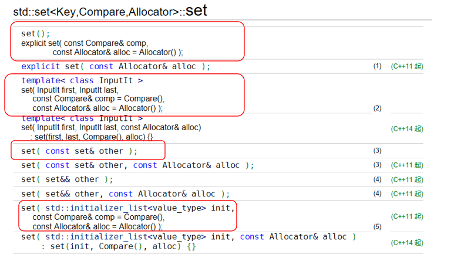

# 第六章 关联式容器

学到这里，我们可以提前学习一些STL的内容了，以帮助我们完成作业。本章我们介绍两个容器set、map，它们属于STL中的关联式容器。

## set

### set的构造

包含在头文件< set >，打开C++参考文档，主要关注这样的几个构造函数



1. 无参构造
2. 迭代器方式进行构造，传入一个first迭代器，传入一个last迭代器
3. 拷贝构造
4. 标准初始化列表（大括号的形式）


``` c++
set<int> number;
set<int> number2 = {1,3,9,8,9}；
```


set的创建与vector很类似，尝试着调用以上四种构造方式进行创建，并实现对set中元素的遍历


<span style=color:red;background:yellow>**set的特征：**</span>

**（1）set中存放的元素是唯一的，不能重复；**

**（2）默认情况下，会按照元素进行升序排列；**


### set的查找操作


**count：**输入一个值，在set中查找，如果有就返回1，没有就返回0


**find:**输入一个值，在set中进行查找，如果找到，就返回这个元素相应的迭代器。若找不到，则返回end()获取的迭代器。

——请实践一下这两个函数的使用


### set的插入操作


可以看到insert函数的第一种形式中，参数是一个key，返回的值是一个pair类型（包含一个迭代器和一个bool值）

我们先来看看pair是什么 

—— pair定义在头文件< utility >中，类似于结构体，可以存储两种不同类型的变量。

当然，C++中结构体已经演变为了类，所以可以认为一个特定的pair是一个类，包含两个对象成员(它们的类型在定义pair时给出)。

重点关注：pair的对象成员如何访问

``` c++
#include <utility>
void test1(){
    pair<int,string> num = {1,"wangdao"};
    cout << num.first << ":" << num.second << endl;
}
```


#### 对set进行插入

- 插入单个元素

insert函数的返回类型是pair类型，包含两个对象成员，第一个是对应set的迭代器，第二个是bool值

如果插入成功，则返回“<span style=color:red;background:yellow>**插入元素对应迭代器**</span>和<font color=red>**true**</font>” ；

如果插入失败，则返回<span style=color:red;background:yellow>**“阻止插入的元素（原本就有的这个元素）对应迭代器**</span>和<font color=red>**false**</font>”.


``` c++
 pair<set<int>::iterator,bool> ret = number.insert(8);
    if(ret.second){
        cout << "该元素插入成功:"
            << *(ret.first) << endl;
    }else{
        cout << "该元素插入失败，表明该元素已存在" << endl;
    }
```


- 插入多个元素

  

  （1）传入两个迭代器（首迭代器和尾后迭代器），尝试插入这两个迭代器范围中的元素；

  （2）传入大括号列表，尝试插入列表中的元素。

  

``` c++
int arr[5] = {18,41,35,2,99};
number.insert(arr,arr + 5); //思考，如果想要插入arr的全部元素，此处应该是arr + 5 还是 arr + 4 ？
```


<span style=color:red;background:yellow>**注意：**</span>

- **set容器不支持下标访问**，因为没有operator[] 重载函数

- **不能通过set的迭代器直接修改key值**，set的底层实现是红黑树，结构稳定，不允许直接修改。


##  map

### map的构造

map中存放的元素的类型是pair类型（键值对），构造map需要关注三种方式，也可以把它们结合到一起。如下：

```` c++
void test0(){
	map<int,string> number = {
        {1,"hello"},
        {2,"world"},
        {3,"wangdao"},
        pair<int,string>(4,"hubei"),
        pair<int,string>(5,"wangdao"),
        make_pair(9,"shenzhen"),
        make_pair(3,"beijing"),
        make_pair(6,"shanghai")
    }; 
}
````


使用迭代器方式遍历map，注意访问map的元素pair的内容时的写法

``` c++
	map<int,string>::iterator it = number.begin();
    while(it != number.end()){
        cout << (*it).first << " " << it->second << endl;
        ++it;
    }
    cout << endl;
```


使用增强for循环变量map

``` c++
    for(auto & nu : number){
        cout << nu.first << " " << nu.second  << endl;
    }
```


<span style=color:red;background:yellow>**map的特征：**</span>

（1）元素唯一：创建map对象时，舍弃了一些元素，key值相同的元素被舍弃。key不同，即使value相同也能保留

（2）默认以key值为参考进行升序排列

### map的查找操作

根据key值在map中进行查找

count函数的返回值：如果找到返回1，如果没找到返回0（size_t类型）

find函数的返回值：如果找到返回相应元素的迭代器，如果没找到返回end( )的结果

——请实践一下这两个函数的使用


### map的插入操作


插入单个元素，此时insert函数的返回值是一个pair（第一个对象成员是map元素相应的迭代器，第二个对象成员是bool值）

``` c++
 	pair<map<int,string>::iterator,bool> ret = number.insert(pair<int,string>(7,"nanjing"));

    if(ret.second){
        cout << "该元素插入成功" << endl;
        //ret.first取出来的是指向map元素（pair<int,string>）的迭代器
        //再用箭头运算符访问到的是int和string的内容
        cout << ret.first->first << " : " << ret.first->second << endl;
    }else{
        cout << "该元素插入失败" << endl;
    }
    cout << endl;
```


插入一组元素

``` c++
	//再创建一个map
	map<int,string> number2 = {{1,"beijing"},{18,"shanghai"}};

    //迭代器方式
    number2.insert(number.begin(),number.end());
  
    //列表方式
    cout << endl;
    number2.insert({{4,"guangzhou"},{22,"hello"}});
```


### map的下标操作（重点）

map支持下标操作

1. map下标操作返回的是map中元素（pair）的value

2. 下标访问运算符中的值代表key，而不是传统意义上的下标

3. 如果进行下标操作时下标值传入一个不存在的key，那么会将这个key和空的value**（默认的value值）**插入到map中

4. 下标访问可以进行写操作（只是对value进行写操作，不影响排序）

   


map的元素是pair（key-value），key和value的类型可以自由选择，但要保证key的类型可以进行判重和排序


