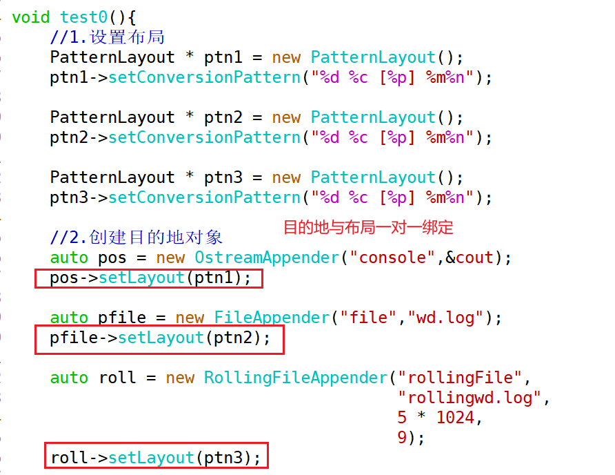
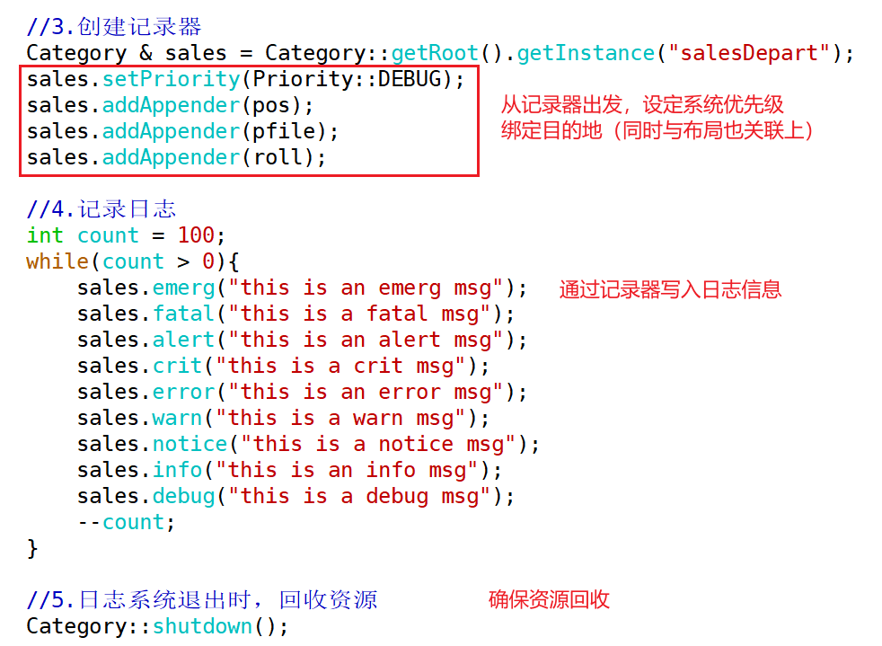

1. 使用log4cpp格式化输出的信息，同时要求输出到终端、文件和回卷文件中。




2. 什么是友元？友元的存在形式有？友元有何特点？

> 友元是C++中用以访问类的私有成员的一种方法，友元的形式如下：
>
> （1）可以将一个普通函数func1声明为A类的友元函数，那么在func1中可以访问A类的私有成员；
>
> （2）可以将类B的某个成员函数func2声明为A类的友元函数，那么在func2中可以访问A类的私有成员；
>
> （3）如果想让类B的所有成员函数成为类A的友元函数，那么可以直接将类B声明为类A的友元类。
>
> 
>
> 友元的特点：
>
> 1. **友元不受类中访问权限的限制**——可访问私有成员
> 2. **友元破坏了类的封装性**
> 3. **不能滥用友元 ，友元的使用受到限制**
> 4. **友元是单向的**——A类是B类的友元类，则A类成员函数中可以访问B类私有成员；但并不代表B类是A类的友元类，如果A类中没有声明B类为友元类，此时B类的成员函数中并不能访问A类私有成员
> 5. **友元不具备传递性**——A是B的友元类，B是C的友元类，无法推断出A是C的友元类
> 6. **友元不能被继承**——因为友元破坏了类的封装性，为了降低影响，设计层面上友元不能被继承


3. 运算符重载的原则是什么？有哪些规则？不能重载的运算符有哪几个？

> 运算符重载的原则是<span style=color:red;background:yellow>**希望自定义类类型在操作时与内置类型保持一致**</span>。
>
> 
>
> 运算符重载有以下规则：
>
> 1. 运算符重载时 ，<font color=red>**其操作数类型必须要有自定义类类型或枚举类型**</font> ——不能全都是内置类型
>
> 2. 其优先级和结合性还是固定不变的       a ==   b + c
>
> 3. <font color=red>**操作符的操作数个数是保持不变的**</font>
>
> 4. <font color=red>**运算符重载时 ，不能设置默认参数**</font>     ——如果设置了默认值，其实也就是改变了操作数的个数
>
> 5. 逻辑与 && 逻辑或 || 就不再具备短路求值特性 ，进入函数体之前必须完成所有函数参数的计算, 不推荐重载
>
> 6. 不能臆造一个并不存在的运算符         @ $ 、
>
>    
>
> 不能重载的运算符包括：
>
> 
>
> 记法：**带点的运算符不能重载，加上sizeof**


4. 编写Base类使下列代码输出为1

   ``` c++
   int i=2;
   int j=7;
   
   Base x(i);
   Base y(j);
   cout << (x+y == j - i) << endl;
   ```

   提示：本题考查的其实就是运算符重载的知识点。


5. 利用运算符重载，使Point对象能够进行+、+=、前置++、后置++操作（对坐标进行计算）


6. 用所学过的类和对象的知识，封装log4cpp，实现一个单例的效果。让其使用起来更方便，要求：可以像printf一样，同时输出的日志信息中最好能有文件的名字，函数的名字及其所在的行号(这个在C/C++里面有对应的宏，可以查一下)

   代码模板：

   ```C++
   class Mylogger
   {
   public:
   	void warn(const char *msg);
   	void error(const char *msg);
   	void debug(const char *msg);
   	void info(const char *msg);
   	
   private:
   	Mylogger();
   	~Mylogger();
       
   private:
     //......
   };
   
   void test0()
   {
       //第一步，完成单例模式的写法
       Mylogger *log = Mylogger::getInstance();
   
       log->info("The log is info message");
       log->error("The log is error message");
       log->fatal("The log is fatal message");
       log->crit("The log is crit message");
       
       //规范使用单例模式的写法
       Mylogger::getInstance()->info("The log is info message");
   }
   
   void test1() 
   {
       printf("hello,world\n");
       //第二步，像使用printf一样
       //只要求能输出纯字符串信息即可，不需要做到格式化输出
       LogInfo("The log is info message");
       LogError("The log is error message");
       LogWarn("The log is warn message");
       LogDebug("The log is debug message");
   }
   
   //最终希望的效果
    //LogDebug("The log is debug message");
   //日期 记录器名字 [优先级] 文件名 函数名 行号 日志信息
   ```

   

   


