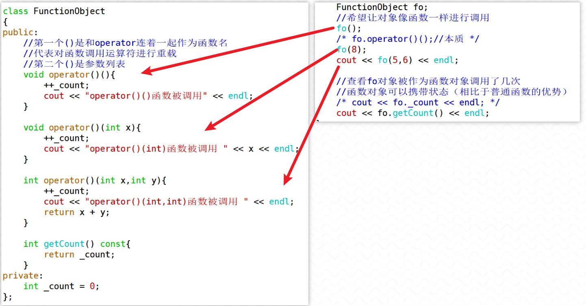
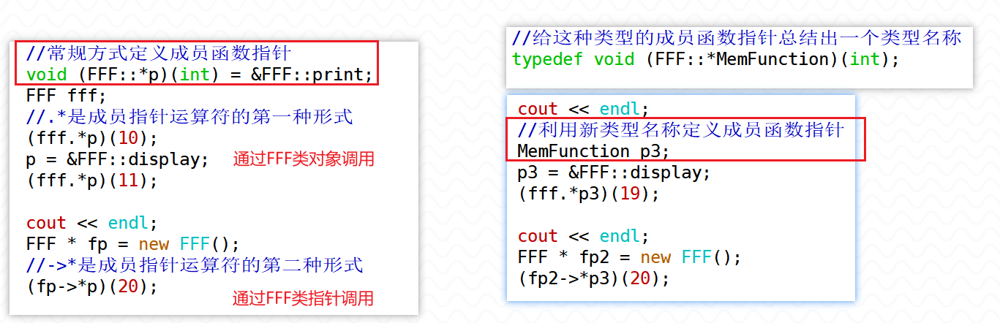
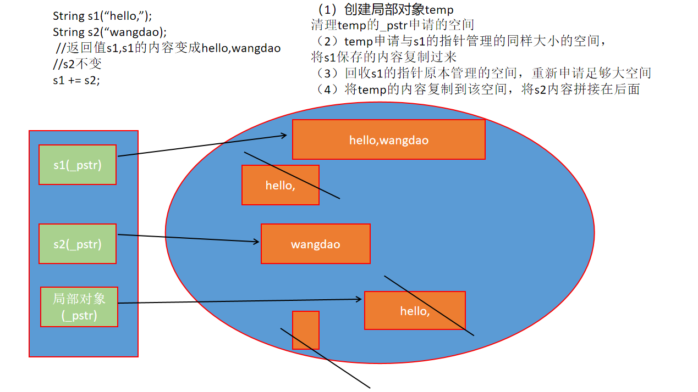
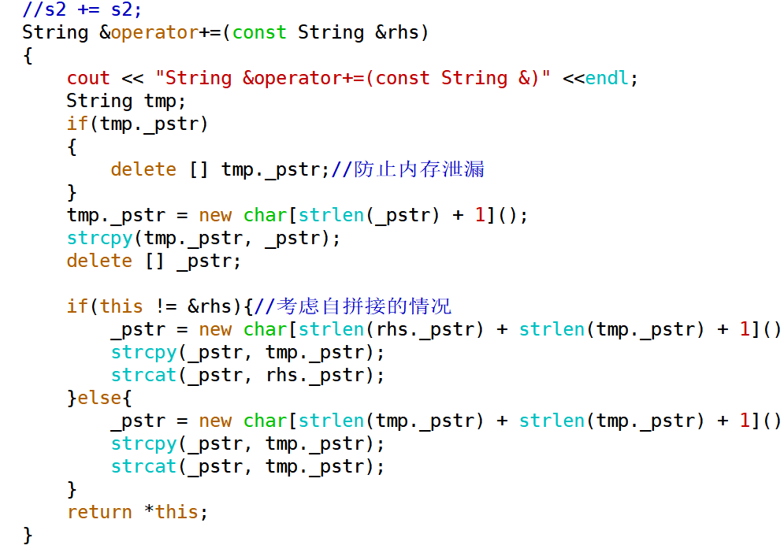
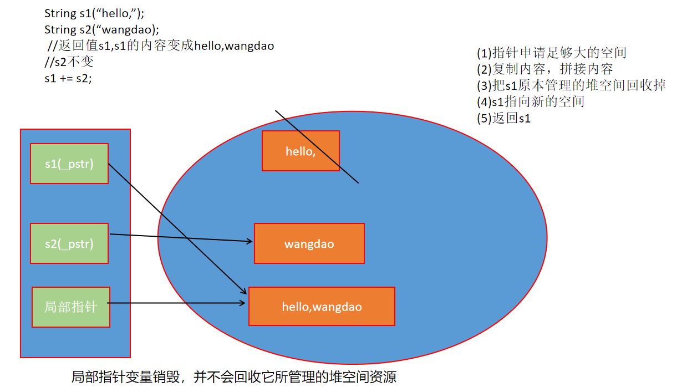
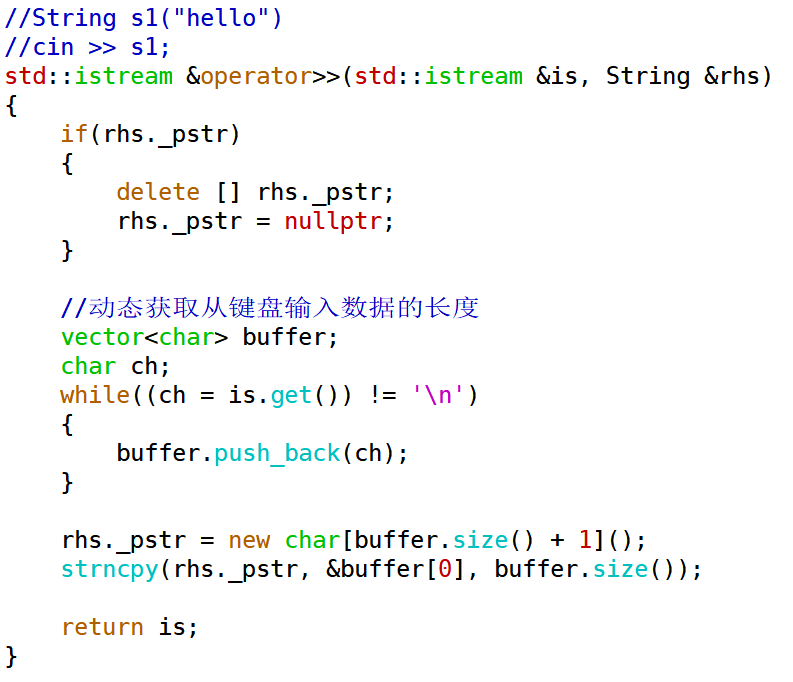

1. C++中函数对象、成员函数指针该如何使用呢？请用代码给出示例。

> 对于其他能够重载的运算符而言，操作数个数都是固定的，<font color=red>**但函数调用运算符不同，它的参数是根据需要来确定的， 并不固定**</font>。
>
> <span style=color:red;background:yellow>**重载了函数调用运算符的类的对象称为函数对象**</span>，由于参数列表可以随意扩展 ，所以可以有很多重载形式（对应了普通函数的多种重载形式）
>
> 

> 定义一个函数指针要明确指针指向的函数的返回类型、参数类型，那么<span style=color:red;background:yellow>**定义一个成员函数指针还需要确定的是这个成员函数是哪个类的成员函数（类的作用域）**</span>
>
> 与普通函数指针不一样的是，<font color=red>**成员函数指针的定义和使用都需要使用完整写法**</font>，不能使用省略写法，定义时要完整写出指针声明，使用时要完整写出解引用（解出成员函数后接受参数进行调用）。
>
> 
>
> ```` c++
> class FFF
> {
> public:
> 	void print(int x){
>   		cout << "FFF::print:" << x << endl;
> 	}
> };
> 
> void (FFF::*p)(int) = &FFF::print;
> FFF ff;
> ff.print(4);
> //成员指针运算符的第一种形式
> (ff.*p)(4);
> 
> FFF * fp = new FFF();
> fp->print(5);
> //成员指针运算符的第二种形式
> (fp->*p)(5);
> ````
>
> 
>
> 可以使用typedef来定义这种成员函数指针类,使用这个成员函数指针类型的变量调用FFF类的成员函数print
>
> ``` c++
> typedef void (FFF::*MemberFunction)(int); //定义成员函数类型MemberFunction
> 
> MemberFunction mf = &FFF::print; //定义成员函数指针
> FFF fff;  
> (fff.*mf)(15);//通过对象调用成员函数指针
> 
> FFF * fp = new FFF();
> (fp->*mf)(65);//通过指针调用成员函数指针
> ```
>
> <font color=red>**这里有一个要求，成员函数指针指向的成员函数需要是FFF类的公有函数**</font>
>
> 


2. 自定义一个String类保存字符串内容，实现以下String类的各个函数，并给出相应的测试用例

``` c++
class String 
{
public:
	String();
	String(const char *);
	String(const String &);
	~String();
	String &operator=(const String &);
	String &operator=(const char *);

	String &operator+=(const String &);
	String &operator+=(const char *);
	
	char &operator[](std::size_t index);
	const char &operator[](std::size_t index) const;
	
	std::size_t size() const;
	const char* c_str() const;
	
	friend bool operator==(const String &, const String &);
	friend bool operator!=(const String &, const String &);
	
	friend bool operator<(const String &, const String &);
	friend bool operator>(const String &, const String &);
	friend bool operator<=(const String &, const String &);
	friend bool operator>=(const String &, const String &);
	
	friend std::ostream &operator<<(std::ostream &os, const String &s);
	friend std::istream &operator>>(std::istream &is, String &s);

private:
	char * _pstr;
};

String operator+(const String &, const String &);
String operator+(const String &, const char *);
String operator+(const char *, const String &);
```

（1）字符串拼接

> 
>
> 这种写法还需要考虑自拼接情况
>
> 


> 
>
> 
>
> 这种写法自拼接也没问题


（2）字符串输入




