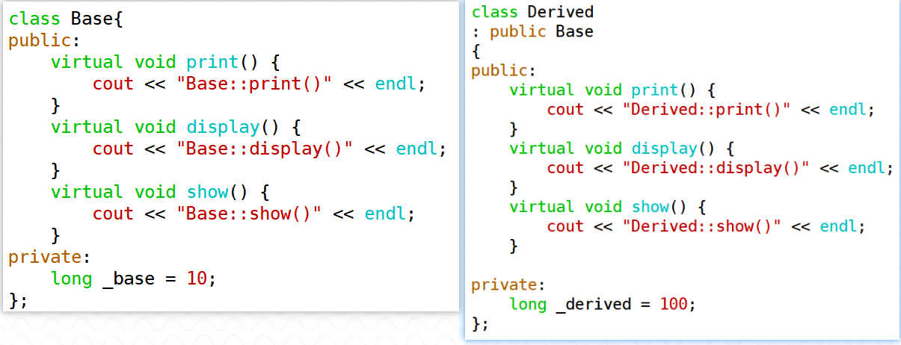
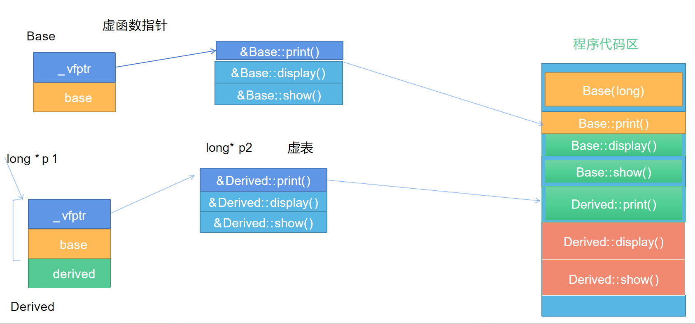
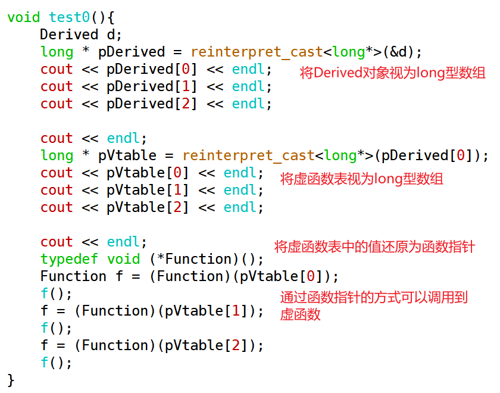

1. C++中有哪几种多态？请详细说明一下

> **编译时多态**：也称为静态多态，我们之前学习过的**函数重载**、**运算符重载**就是采用的静态多态。
>
> 函数重载指的是在同一作用域中， 可以定义多个名称相同的函数 ，只要这些函数的参数类型、顺序 、个数任一不同，在编译时C++编译器会将这些函数的名称改编为包含参数信息的名字。最终调用函数时根据传入的具体参数信息来决定调用哪个函数。
>
> 
>
> 运算符重载允许编码者定义一系列特殊的函数，其函数名均为“operator + 运算符”的形式，这些函数用来定义自定义类型对象使用运算符的操作逻辑。
>
> 进行了运算符重载的自定义类，其对象可以像内置类型数据一样使用相应的运算符。对于绝大多数运算符都可以进行运算符重载，具体计算逻辑由编码者自行定义，但一般尽量使重载的运算符与其内置的、广为接受的语义保持一致。对于一个自定义类，还可以对同一个运算符定义多个重载函数，比如赋值运算符函数 ，可以让Point对象接受int型数据的赋值，也可以接受Complex类对象的赋值。有了运算符重载函数的支持，内置的运算符可以被各种自定义类型对象使用，这也体现了多态性。


> **运行时多态**：也称为动态多态，<font color=red>**C++通过虚函数来实现动态多态**</font>。
>
> 虚函数机制的底层是通过虚函数表实现的。当类中定义了虚函数之后，就会在对象的存储开始位置，多一个虚函数指针，该虚函数指针指向一张虚函数表，虚函数表中存储的是虚函数入口地址。当同时满足如下条件时，虚函数机制被触发。
>
> - 基类定义虚函数
>
> - <font color=red>**派生类中要覆盖虚函数 **</font>（覆盖的是虚函数表中的地址信息）
>
> - 创建派生类对象
>
> - **基类的指针指向派生类对象（或基类引用绑定派生类对象）**
>
> - <font color=red>**通过基类指针（引用）调用虚函数**</font>
>
> 最终的效果：基类指针调用到了派生类实现的虚函数。（如果没有虚函数机制，基类指针只能调用到基类的成员函数）


2. 写出下列程序的输出结果。

``` c++
class A
{
public:
    A() 
	{ cout << "A's cons." << endl; }
	virtual ~A() 
	{ cout << "A's des." << endl; }
	virtual void f() 
	{ cout<<"A's f()."<<endl; }
	
	void g() 
	{ f();}
};

class B 
: public A
{
public:
    B(){ 
		f(); 
		cout << "B's cons." << endl; 
	}
	~B(){ 
		cout << "B's des." << endl; 
	}
};

class C 
: public B
{
public:
	C() { 
		cout<<"C's cons."<<endl; 
	}
	~C(){ 
		cout<<"C's des."<<endl;
	}
	void f() { 
		cout<<"C's f()."<<endl; 
	}
};
int main(void)
{  
	A *pa=new C();//A's cons.  A's f(). B's cons. C's cons.
    pa->g();  //C's f().
    delete pa; //C's des. B's des. A's des.
    return 0;
}
```


3. 写出下列程序的输出结果。

   (学究性问题，系统中已删除，实际开发中不这样写)

``` c++
class A
{ 
public:
    virtual
    void func(int val = 1)
    {
        cout << "A->" << val << endl;
    }
    virtual void test()
    {
        func();
    }
private:
    long _a;
};

class B
: public A
{ 
public:
    virtual
    void func(int val = 10)
    {
        cout << "B->" << val << endl;
    }
private:
    long _b;
};

class C
: public B
{
    virtual
    void func(int val = 10)
    {
        cout << "C->" << val << endl;
    }   
};

int main(void)
{
    B b;
    A *p1 = (A*)&b;
    B *p2 = &b;
    p1->func();
    p2->func();
    return 0;
}
```

> （1）C++ 中，虚函数的默认参数值在编译时决定，而不是在运行时决定。当调用虚函数时，编译器会使用声明函数时的默认参数值。
>
> （2）p1->func()根据动态多态机制调用B类的func函数，p2->func()调用B类的func函数。


4. 根据给定的程序，写出执行结果

``` c++
#include <iostream>
using std::endl;
using std::cout;

class A
{
public:
	A(int i,int j) 
	{
		a=i;
		b=j;
	}
	void move(int i,int j) 
	{
		a += i;
		b += j;
	}
	void disp() 
	{ 
		cout << "(" << a << "," << b << ")" << endl;
	}
private:
	int a,b;
};

class B
: public A
{
public:
	B(int i,int j,int k,int l)
	:A(i,j)
	,x(k)
	,y(l)
	{ 
	}
	
	void disp() 
	{
		cout << x << "," << y << endl;
	}
	void fun() 
	{
		move(3,5);
	}

private:
	int x,y;
};

int main()
{
	A m(1,2);
	m.disp();
	B d(3,4,5,6);
	d.fun();
	d.A::disp();
	d.disp();
	return 0;
}
//(1,2)
//(6,9)
//5,6
```


5. 根据给定的程序，写出执行结果

``` c++
class A
{
public:
 void FuncA()
 {
     printf( "FuncA called\n" );
 }
 virtual void FuncB()
 {
     printf( "FuncB called\n" );
 }
};

class B 
: public A
{
public:
 void FuncA()
 {
     A::FuncA();
     printf( "FuncAB called\n" );
 }
    
 virtual void FuncB()
 {
     printf( "FuncBB called\n" );
 }
};

int main( void )
{
	B	b;
	A	*pa;
	pa = &b;
	A *pa2 = new A;
	pa->FuncA(); （ 3） 
	pa->FuncB(); （ 4）
	pa2->FuncA(); （ 5）
	pa2->FuncB();
	delete pa2;
	return 0；
}
//FuncA called
//FuncBB called
//FuncA called
//FuncB called
```


6. 根据给定的程序，写出执行结果

``` c++
class Base
{
public:
    Base(int j)
    : i(j) 
    {
        
    }
    virtual  ~Base() 
    {
        
    }
    
    void func1() 
    {
        i *= 10; //10
        func2();
    }
    
    int getValue()
    {
        return  i;
    }
    
protected:
    virtual void func2()
    {
        i++;
    }
    
protected:
    int i;
};

class Child
: public Base
{
public:
    Child(int j)
    : Base(j) 
    {
        
    }
    void func1()
    {
        i *= 100;
        func2();
    }
    
protected:
    void func2()
    {
        i += 2; //12
    }
};

int main() 
{
    Base * pb = new Child(1);
    pb->func1();
    cout << pb->getValue() << endl;   //12
	delete pb;
	return 0；
} 
```


7. 带虚函数的单继承结构下，虚函数地址的存放规则是怎样？请用代码验证

> 单继承结构下，一个类只会有一张虚函数表，其中存放虚函数的入口地址。虚函数入口地址的存放顺序与其在基类中声明的顺序一致。
>
> 对于基类定义的虚函数，派生类中可能进行覆盖（override），若发生覆盖则是将派生类定义的这个虚函数的地址覆盖虚函数表中基类定义的虚函数的地址。
>
> 如果派生类定义了新的虚函数，则在虚函数表的最后加上这个新的虚函数的入口地址。








8. 编写程序：给定以下抽象类Figure，通过该图形类扩展生成3个不同的图形Rectangle、Circle、Triangle，体会使用纯虚函数的好处。


