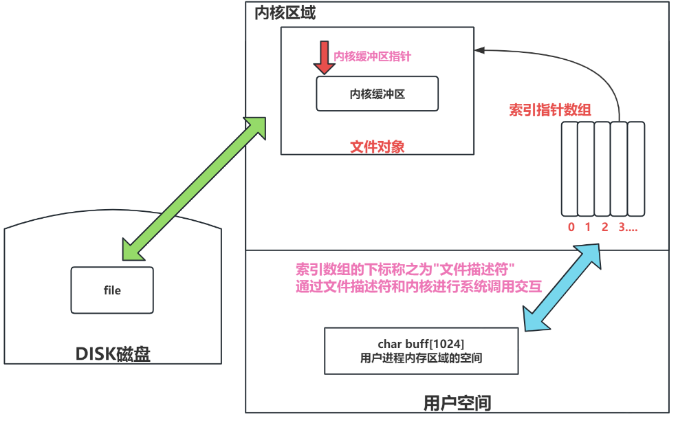

# **文件系统编程**

> | 文件流API            | 函数      | 作用                                   | 注意事项                                                    |
> | :------------------- | --------- | -------------------------------------- | ----------------------------------------------------------- |
> | 打开或关闭文件流     | `fopen`   | 打开文件，返回指向FILE的指针           | 需要指定模式（如“r”, “w”, “a”等），并处理可能的文件打开错误 |
> |                      | `fclose`  | 关闭文件流，释放流资源                 | 确保每个打开的文件流最终都被关闭，避免资源泄露              |
> | 读写二进制文件流     | `fread`   | 从文件流中读取数据                     | 需要检查返回值以确定读取的数据量和是否遇到错误或EOF         |
> |                      | `fwrite`  | 向文件流中写入数据                     | 需要检查返回值以确保数据正确写入                            |
> | 逐字符读写文本文件流 | `fgetc`   | 从文件流中读取下一个字符               | 在达到文件末尾或出现错误时返回EOF                           |
> |                      | `fputc`   | 将一个字符写入文件流                   | 返回写入的字符，若出现错误则返回EOF                         |
> | 逐行读写文本文件流   | `fgets`   | 从文件流中读取字符串（一行）           | 确保正确处理缓冲区长度和行尾字符                            |
> |                      | `fputs`   | 将字符串（不包括NUL终止符）写入文件流  | 不会自动添加换行符，需手动处理                              |
> | 格式化读写文本文件流 | `fscanf`  | 从文件流中格式化读取数据               | 与`scanf`类似，但从文件流读取                               |
> |                      | `fprintf` | 格式化输出到文件流                     | 类似于`printf`，但输出到文件流                              |
> | 文件流状态检查       | `feof`    | 检查文件流的EOF标志                    | 通常用于循环读取数据时判断文件是否结束                      |
> |                      | `ferror`  | 检查文件流的错误指示器                 | 用于错误处理和调试                                          |
> | 文件定位             | `ftell`   | 返回文件流的当前文件位置指示器         | 配合`fseek`可实现文件的随机访问                             |
> |                      | `fseek`   | 设置文件流的文件位置指示器             | 可用于移动文件指针到特定位置                                |
> |                      | `rewind`  | 将文件流的文件位置指示器重置到文件开头 | 等同于`fseek(stream, 0, SEEK_SET)`                          |
> | 刷新输出缓冲区       | `fflush`  | 清空文件流的输出缓冲区                 | 常用于确保所有输出已经从缓冲区写入文件                      |

#### 改变文件权限

```c
#include <sys/stat.h>                        // 使用该函数需要包含的头文件
int chmod(const char *pathname, mode_t mode);
```

> **`chmod`系统调用函数来改变文件或目录的权限**
>
> **形式参数：**
>
> 1. `pathname`：文件或目录的路径字符串。
> 2. `mode`：要设置的新权限，这里要使用权限数字表示法，即八进制数。
>
> **返回值：**
>
> 1. 成功时，`chmod` 返回 0。
> 2. 失败时，返回 -1，并设置 errno 以指示错误原因

#### 获取当前工作目录

> `getcwd`函数，它是一个**POSIX标准**的C语言库函数，用于获取当前工作目录的绝对路径名称。这个库函数的作用，很类似于 `pwd` 这个
>
> shell指令,`getcwd` 不负责管理传入函数的buf空间的生命周期，buf生命周期的管理是程序员的职责。
>
> ```c
> #include <unistd.h>     // 需要包含此头文件调用函数
> char *getcwd(char *buf, size_t size);
> ```
>
> **形式参数：**
>
> 1. buf: 指向存放当前工作目录字符串的字符数组
> 2. size: 这个数组的大小
>
> **返回值：**
>
> 1. 成功时，`getcwd` 返回一个指向 `buf` 的指针，`buf` 中包含了当前工作目录的绝对路径。
>
> 2. 失败时，返回 `NULL`，并设置 `errno` 以指示错误的原因。
>
>    **出错的原因普遍是buf数组过小，无法容纳整个工作目录绝对路径字符串。**

#### 改变当前工作目录

```c
#include <unistd.h>
int chdir(const char *path);
```

> **形式参数：**
>
> 1. `path`: 是一个指向字符数组的指针，这个数组包含了新工作目录的路径。
> 2. 路径可以是绝对的（从根目录开始，例如 "/usr/local/bin"）或相对的（相对于当前工作目录，例如 "../docs"）。
>
> **返回值：**
>
> 1. 成功时，`chdir` 返回 0。
> 2. 失败时，返回 -1，并设置全局变量 `errno` 以指示错误的原因。比较常见的错误，比如目标目录不存在、权限问题、目标不是目录等。
>
>   当前工作目录是进程的属性，也就是说每一个进程都有自己的当前工作目录。而且父进程创建子进程的时候，子进程会继承父进程的当前工
>
> 作目录。这里，我们有一个执行的进程是`shell/bash`进程，它是一个父进程，执行可执行程序就会创建一个子进程，子进程在一开始继承父
>
> 进程的当前工作目录。然后在这个子进程中将工作目录修改了，并不会影响父进程的工作目录。
>
> 所以很明显，`chdir`函数并不等同于`cd`指令，cd这个shell指令可以修改shell/bash进程的当前工作目录。

#### 创建目录

> `mkdir`系统调用函数用于创建一个新目录。
>
> **函数声明如下：**
>
> ```c
> #include <sys/stat.h>
> #include <sys/types.h>
> int mkdir(const char *pathname, mode_t mode);
> ```
>
> **形式参数：**
>
> 1. `pathname`: 要创建的目录的路径名。可以是绝对路径也可以是相对路径名。
> 2. `mode`: 设置新目录的权限。这是一个八进制数，类似于 `chmod` 的权限设置（例如，`0775`）。注意，最终的权限还会受到进程的 umask 设置的影响。
>
> **返回值：**
>
> 1. 成功时，`mkdir` 返回 0。
> 2. 失败时，返回 -1，并设置 `errno` 以指示错误的原因。常见错误比如目录已存在等。

#### 删除目录

> `rmdir`（remove directory）系统调用函数用于删除一个空目录，注意只能删除空目录。
>
> **函数声明如下：**
>
> ```c
> #include <unistd.h>
> int rmdir(const char *pathname);
> ```
>
> 参数：`pathname`: 要删除的空目录的路径名。
>
> **返回值：**
>
> 1. 成功时，`rmdir` 返回 0。
> 2. 失败时，返回 -1，并设置 `errno` 以指示错误的原因。常见的错误原因有目录非空，不存在或无权限等。

## **目录流**

#### 打开目录流与关闭目录流

> **`opendir`**函数，用于打开一个目录流以读取其中的目录项。
>
> 当你使用 `opendir` 打开一个目录时，系统会创建一个目录流，并返回一个指向该流的`DIR`指针。
>
> 该目录流指针一开始指向目录项第一个，然后程序可以通过函数来移动这个目录项指针，从而实现对目录的遍历和管理。
>
> 从使用上来看，它的特点非常类似于文件流的`fopen`函数以及`FILE`指针，只不过文件流是"ISO-C"官方标准C语言的库函数，而目录流是
>
> POSIX标准的库函数，不是官方C标准库函数。
>
> 该函数的声明如下：
>
> ```c
> #include <dirent.h>     // dirent是directory entry的简写，就是目录项的意思
> #include <sys/types.h>
> DIR *opendir(const char *name);
> ```
>
> **形式参数：**`name`: 字符串，代表要打开的目录的路径。
>
> **返回值：**
>
> 1. 成功时，返回指向 `DIR` 类型的指针，即目录流的指针
> 2. 失败时，返回 `NULL` 并设置 `errno` 以指示错误的原因。常见的失败原因，比如目录没有权限打开、目录不存在等。
>
> 
>
> 既然可以打开目录流，那么`closedir`就可以关闭目录流。这样做可以释放分配给目录流的资源，避免内存泄漏。
>
> 函数声明如下：
>
> ```c
> #include <sys/types.h>
> #include <dirent.h>
> int closedir(DIR *dirp);  
> ```
>
> **形式参数：**`dirp`: 由 `opendir` 返回的目录流指针。
>
> **返回值：**
>
> 1. 成功：返回0
> 2. 失败时，返回 `-1` 并设置 `errno` 以指示错误的原因。常见的错误原因就是乱传指针，传入的指针不是打开的目录流指针。

#### 读目录流

>当你使用 `opendir` 打开一个目录流后，可以使用 `readdir` 依次读取目录中的每个条目，直到目录中没有更多条目为止。
>
>**实际上只需要使用`closedir`函数关闭目录流，目录项相应的结构体对象就会被释放销毁，不需要再手动free这个结构体了。**
>
>其函数的声明如下：
>
>```c
>#include <dirent.h>
>struct dirent *readdir(DIR *dirp);
>```
>
>**形式参数：**`dirp`: 由 `opendir` 返回的目录流指针。
>
>**返回值：**
>
>1. 返回值: 成功时，返回指向 `struct dirent` 结构体对象的指针，这个结构体当中包含了目录下文件和子目录的信息（如文件名等）。
>
>2. 当目录中没有更多条目时返回 `NULL`。
>
>3. **当函数出错时该函数也会返回NULL。但只要传给函数的指针是一个打开的目录流指针，该函数一般不会出错，所以可以把返回NULL作**
>
>   **为读完目录流的标记，而不需要做错误处理。**
>
>###### dirent结构体
>
>**就是当前目录下的某个文件/子目录的目录项结构体，这个结构体中会存储当前目录下的某个文件/子目录的信息。**
>
>````c++
>// dirent是directory entry的简写，就是目录项的意思
>struct dirent {
>    ino_t          d_ino;           // 此目录项的inode编号，目录项中会存储文件的inode编号。一般是一个64位无符号整数（64位平台）
>    off_t          d_off;           // 到下一个目录项的偏移量。可以视为指向下一个目录项的指针(近似可以看成链表)，一般是一个64位有符号整数
>    unsigned short d_reclen;        // 此目录项的大小长度，以字节为单位(注意不是目录项所表示文件的大小)
>    unsigned char  d_type;          // 目录项所表示文件的类型，用不同的整数来表示不同的文件类型
>    char           d_name[256];     // 目录项所表示文件的名字，该字段一般决定了目录项的大小。也就是说文件名越长，目录项就越大
>};
>d_type的可选值如下:
>DT_BLK      // 块设备文件，对应整数值6
>DT_CHR      // 字符设备文件，对应整数值2
>DT_DIR      // 目录文件，对应整数值4
>DT_FIFO     // 有名管道文件，对应整数值1
>DT_LNK      // 符号链接文件，对应整数值10
>DT_REG      // 普通文件，对应整数值8
>DT_SOCK     // 套接字文件，对应整数值12
>DT_UNKNOWN  // 未知类型文件，对应整数值0
>```
>````

```c++
/* 用法示例 */
int main(int argc, char *argv[])
{
    ARGS_CHECK(argc,2);
    DIR * dirp = opendir(argv[1]);
    // 打开目录流需要进行错误处理
    ERROR_CHECK(dirp,NULL,"opendir");
    struct dirent * pdirent;
    // 循环读目录项并打印目录信息，循环结束的条件是返回值为NULL   
    while((pdirent = readdir(dirp)) != NULL){
        printf("inode num = %lu, reclen = %hu, type = %u, name = %s\n",
               pdirent->d_ino,      // 64位平台这个inode编号一般是一个64位无符号整数
               pdirent->d_reclen,   // 无符号短整型
               pdirent->d_type,     // 无符号整型
               pdirent->d_name);    // 字符类型打印
    }
    // 及时释放资源，关闭目录流
    closedir(dirp);
    return 0;
}
```

#### 移动目录流指针的位置

#### seekdir和telldir函数

>  `seekdir` 函数用于设置目录流指针的当前位置，但和文件流的`fseek`函数不同的是：该函数没有参照点的概念，只能通过 `telldir` 函数提供
>
>  的返回值来进行指针的移动。
>
>  即：必须先用`telldir`函数记录指针的位置，然后才能够使用`seekdir`返回记录的位置！
>
>  `telldir`函数的声明如下：
>
>  ```c
>  #include <dirent.h>
>  long telldir(DIR *dirp);
>  ```
>
>  **形式参数：**`dirp` 是由 `opendir` 返回的目录流指针。
>
>  **返回值：**
>
>  1. 返回值是目录流指针当前读取位置的标记，是一个长整型值。该返回值需要给`seekdir`函数使用，一般没有其它作用。
>  2. 该函数如果出错，会返回-1。**但只要正确传递已打开的目录流指针，该函数一般不会出错，所以一般不做错误处理。**
>
>  `seekdir`函数的声明如下：
>
>  ```c
>  #include <dirent.h>
>  void seekdir(DIR *dirp, long loc);
>  ```
>
>  **形式参数：**
>
>  1. `dirp` 是由 `opendir` 返回的目录流指针。
>  2. `loc` 是由 `telldir` 返回的位置标记。
>
>  **返回值：**
>
>  1. **该函数没有返回值，这说明函数的设计者认为该函数不需要错误处理。**
>
>  2. 该函数必须传入由`telldir`函数获取的位置，在移动指针的过程中是纯粹的内存操作，也不涉及内
>
>     存数据的读写操作，本身是非常安全的，不会出错，也确实不需要错误处理。
>
>  <span style=background:yellow>**注意**：</span>`readdir` 函数在读取当前目录项并返回`dirent`结构体指针后，会自动移动到目录流中的下一个条目。这意味着每次调用` readdir `后，目录流的内部指针都会向前移动到下一个条目。

> **但是怎么去看第一个目录文件呢？** 有专门的函数来实现这个功能，也就是`rewinddir`，倒带目录流，回到第一个目录项。
>
> `rewinddir` 函数重置目录流的位置到开始处，类似于文件流中的 `rewind` 函数。
>
> 其函数的声明如下：
>
> ```c
> #include <dirent.h>
> void rewinddir(DIR *dirp);
> ```
>
> **形式参数：**`dirp` 是由 `opendir` 返回的目录流指针。
>
> **返回值：**没有返回值。只要给定的指针是正常的目录流指针，该函数不会出错。使用 `rewinddir` 可以使得目录流回到初始位置，这样下一次调用 `readdir` 将返回目录中的第一个条目。

#### stat系统调用函数

>stat是一个系统调用函数，`stat` 用于获取指定文件的相关信息。
>
>它的函数声明如下：                                                   
>
>```c
>#include <sys/stat.h>
>int stat(const char *path, struct stat *buf);
>```
>
>**形式参数：**
>
>1. **`path`**：这是一个指向字符数组的指针，代表要获取信息的文件的路径名。
>2. **`buf`**：这是一个指向 `struct stat` 结构的指针，用于存储获取到的path文件的信息。
>
>**返回值：**
>
>1. **成功**：返回 `0`。
>
>2. **失败**：返回 `-1`，并且 `errno` 被设置以指示错误的原因。常见的出错原因有文件不存在、没有权限等。
>
>   ```c++
>   struct stat {
>       mode_t    st_mode;          // 包含文件的类型以及权限信息
>       nlink_t   st_nlink;         // 文件的硬链接数量 
>       uid_t     st_uid;           // 文件所有者的用户ID
>       gid_t     st_gid;           // 文件所有者组的组ID
>       off_t     st_size;          // 文件的实际大小, 以字节为单位
>   
>       struct timespec st_mtim;  /* 最后修改时间 */
>   };
>   ```

> ##### <注>   stat与dirent：
>
>   `dirent`和`stat`是用于文件和目录操作的两种不同数据结构和系统调用接口，在功能和使用场景上有所不同。
>
> ###### dirent
>
> `dirent` 是定义在 `<dirent.h>` 头文件中的结构体，用于表示目录项（directory entry），它主要用于读取目录内容。使用 `readdir` 函数可以获取 `dirent` 结构体，进而获取目录中的文件名。
>
> ###### stat
>
> `stat` 是定义在 `<sys/stat.h>` 头文件中的系统调用和结构体，用于获取文件的详细信息（元数据），如文件大小、权限、所有者等。
>
> ##### 区别总结
>
> 1. **功能不同**：
>    - `dirent`：用于读取目录内容，获取目录中每个文件的基本信息（如文件名）。
>    - `stat`：用于获取文件的详细状态信息，包括文件类型、权限、大小、时间戳等。
> 2. **使用场景不同**：
>    - `dirent`：常用于遍历目录，列出目录中的文件和子目录。
>    - `stat`：常用于获取和显示单个文件的详细信息。
> 3. **数据内容不同**：
>    - `dirent` 提供的是文件名和基本的目录项信息。
>    - `stat` 提供的是详细的文件元数据。
>
> ##### 综合使用
>
> 在实际应用中，通常会结合使用 `dirent` 和 `stat` 来实现类似于 `ls` 命令的功能：
>
> 1. 使用 `opendir` 和 `readdir` 遍历目录。
> 2. 使用 `stat` 获取每个文件的详细信息。
> 3. 根据需要显示文件的各种属性。

> *** 在使用 `readdir` 函数读取目录内容时，`dirent` 结构体只提供文件名，而不包含文件的完整路径。如果直接将文件名传递给 `stat` 函数，那么它将相对于当前工作目录（current working directory）查找文件。如果当前工作目录与目标目录不同，则需要构造文件的完整路径。
>
>###### 方法一：使用 `chdir` 切换当前工作目录
>
>1. 切换当前工作目录到目标目录 （`chdir(path)` 将进程的当前工作目录切换到 `path` 指定的目录 ）。
>2. 使用文件名作为 `stat` 函数的参数。
>
>###### 方法二：拼接文件名和目录路径，构造绝对路径
>
>1. 直接在代码中拼接目录路径和文件名，形成文件的绝对路径 （使用 `snprintf` 函数将目录路径和文件名拼接成完整路径 ）。 
>2. 使用这个绝对路径作为 `stat` 函数的参数。

## 无缓冲文件流

> <span style=color:red;background:yellow>**无用户态缓冲区，用户进程直接和内核态缓冲区进行系统调用交互的文件流。**</span>



>   在内核区域当中，维护了一个名为<font color=red>**"文件对象"**</font>的数据结构，内核缓冲区就在这个文件对象中，但此文件对象不能直接给到用户空间，也不能直接交互用户空间。
>
> 于是内核区域就维护了一个索引指针数组，该指针数组中存储文件对象的地址，指向这个文件对象。这个索引数组是有下标的，下标从0，1，2，3...（非负数，最大1024）
>
> 这个索引数组的下标就被称之为<span style=color:red;background:yellow>**"文件描述符"**</span>。
>
> 于是：
>
> 1. 当用户进程以无缓冲文件流(系统调用)的形式打开一个文件时，内核区域就会创建一个该文件<font color=red>**文件对象**</font>
> 2. 然后内核会将指向此文件对象的索引指针元素的下标返还给用户进程，用户进程只能得到一个非负整数，这个整数叫做<font color=red>**"文件描述符"**</font>
> 3. 紧接着用户进程就通过文件描述符整数，与内核空间进行系统调用级别的交互。
>
>   在这个过程中，用户进程全程没有获得内核区域的任何地址，没有和内核数据进行任何的直接交互，这样就保证了内核空间的安全，从而保证了操作系统的安全性和稳定性。

#### 打开文件open 与 关闭文件描述符close

>  open函数的作用是**打开一个已存在的文件**或**创建一个新文件**，此时内核区域会创建一个文件对象，并且将此文件对象的文件描述符，返还给函数调用者，该文件描述符可用于后续的读写操作。

```c
#include <fcntl.h>  
#include <sys/types.h> 
#include <sys/stat.h> 
int open(const char *pathname, int flags);
int open(const char *pathname, int flags, mode_t mode);
// ** 返回值：**
1. 成功时，`open` 返回一个非负整数，即新打开或创建文件的文件描述符。
2. 失败时，返回 `-1` 并设置 `errno` 以指示错误类型。
```

| 标志 flags   | 描述/含义                                                    |
| ------------ | ------------------------------------------------------------ |
| **O_RDONLY** | 以只读的方式打开                                             |
| **O_WRONLY** | 以只写的方式打开                                             |
| **O_RDWR**   | 以可读可写的方式打开                                         |
| **O_CREAT**  | 如果文件不存在，则创建文件。如果不添加此标志，那么文件不存在将打开失败 |
| **O_EXCL**   | 仅与O_CREAT连用，单独使用无意义。**如果文件已存在，则open失败** |
| **O_TRUNC**  | 如果文件已存在且成功以写入模式打开，则将其长度截断为 0，即删除文件内容。 |

> 参数`mode_t mode`,只在使用了 `O_CREAT` 标志时才需要带上

> **close函数表示关闭文件描述符，而不是立刻释放文件对象的资源。**

```c++
#include <unistd.h>
int close(int fd);
```

#### read函数

>**read函数的声明如下：**
>
>```` c++
>#include <unistd.h>
>ssize_t read(int fd, void *buf, size_t count);
>````
>
>**形式参数：**
>
>1. `fd`: 文件描述符，它标识了一个已打开的文件流。
>2. `buf`: 用户进程用于接收从内核缓冲区读取到的数据的一块内存区域，可以是数组，也可以是别的。
>3. `count`: 指定最多读取的字节数。
>
>**返回值：**
>
>1. 成功时，`read` 返回实际读取的字节数。可能等于count的值，也可能在最后一次读文件内容时，返回一个小于count的值。
>2. 如果到达文件末尾（EOF），则返回 0。
>3. 出错时，`read` 返回 -1，并设置全局变量 `errno` 来指示错误类型。

>   **（注）**系统调用函数open打开一个磁盘文件时，系统默认分配的文件描述符是3，那么0、1、2去哪里了呢？
>
> 是被系统默认保留了，在类 Unix系统中，当一个进程启动时，它会自动打开三个特殊的文件描述符，这三
>
> 个文件描述符分别是：
>
> 1. `0`：表标准输入（stdin），默认是键盘输入。
> 2. `1`：代表标准输出（stdout），默认是输出到屏幕。
> 3. `2`：代表标准错误（stderr），它用于输出错误消息和诊断信息，默认是输出到屏幕。

> (阻塞read) 利用这`0`这个保留的文件描述符，我们可以实现从键盘接收输入：
>
> ```c++
> int main()
> {
>     char buf[1024] = {0};
>     // 用文件描述符0表示从标准输入中读
>     ssize_t sret = read(0, buf, sizeof(buf));
>     ERROR_CHECK(sret,-1,"read");
>     printf("sret = %ld, buf = %s\n", sret, buf);
>     return 0;
> }
> ```

**非阻塞和阻塞read**:

1. 读磁盘文件数据时是非阻塞read，因为磁盘文件的数据是持久存储的，`read` 操作可以连续进行，直到文件末尾。于是在read磁盘文件时，我们可以正常的使用while循环，因为循环会有明确的结束标志，不会导致死循环。
2. 但从设备文件（例如键盘或网络套接字）的read操作一般是阻塞的。如果没有数据可读了（如用户尚未完成输入、等待网络连接），`read` 函数会阻塞进程执行，直到数据到达，此时read函数就变成了一个阻塞函数。在这种情况下，如果仍然使用循环进行read，就非常容易导致循环无法退出，成为一个阻塞的死循环。

#### memset函数

> 用于将一段内存中的所有字节都设置为特定的值，它经常被用于初始化数组或者清零内存区域。
>
> **此函数的声明如下：**
>
> ```` c++
> #include <string.h>
> void *memset(void *s, int c, size_t n);
> ````
>
> **其中的三个参数的含义是：**
>
> 1. `s`：指向要设定特定值的内存块的指针。此参数是一个传入传出参数，传入后同时还会作为返回值。
> 2. `c`：是一个 `int` 类型的值，但 `memset` 实际上将该值转换为 `unsigned char` 类型，然后用这个字节值来填充指定的内存块。
> 3. `n`：指定要设定特定值的字节数，即要把内存块`s`的多少个字节的内存空间设置为值`c`。
>
> **返回值：**
>
> `memset` 函数返回指向填充的内存块的指针，即参数 `s` 的值。
>
> <span style=color:red;background:yellow>**在利用一个缓冲区数组读写文件的过程中，为了避免存在脏数据，可以选择使用"memset"函数来清零缓冲区数据，但这不是必须的。**</span>

#### write函数

> **write函数的声明如下：**
>
> ```` c++
> #include <unistd.h>
> ssize_t write(int fd, const void *buf, size_t count);
> ````
>
> **形式参数：**
>
> 1. `fd`: 文件描述符，它标识了一个open函数打开的文件流对象。
> 2. `buf`:  指向一个内存区域，该区域包含了要写入的数据。
> 3. `count`: 要写入文件的字节数。
>
> **返回值：**在成功时，返回实际写入的字节数，基本上它就等于`count`，错误返回 `-1`
>
>   **（注**）read/write的过程中，始终存在一个内核态缓冲区指针来指示文件读写的位置，每read一下文件指针就要后移1位**(移动读写元素大小个字节)**，每write一下指
>
> 针同样后移1位。为了实现**读完修改数据写回**于是在read之后，就需要将文件指针向文件的开头移动1位。
>
> **lseek函数：**
>
> ```c++
> #include <sys/types.h>
> #include <unistd.h>
> off_t lseek(int fd, off_t offset, int whence);
> ```
>
> 1. **`offset`**: 根据参数`whence`的设置，这个值会指示文件内的新位置。
>
>      如果是0表示不偏移，如果是负数表示向文件开头偏移，如果是正数表示向文件末尾偏移
>
> 2. **`whence`**: 文件指针偏移的基准点，它可以取以下几个值：
>
>     `SEEK_SET`：offset是相对于文件开头的偏移值 `SEEK_CUR`：offset是相对于文件指针当前位置的偏移值 `SEEK_END`：offset是相对于文件末尾的偏移值
>
> 返回值：**成功**：返回从文件开始到当前文件指针位置的字节数。利用这个特点，我们可以来获取文件的大小。**失败**：返回-1。

> **（注）**什么时候`read/write`的效率会比`fread/fwrite`更高呢？或者说哪些场景下用会`read/write`更好一些呢？
>
> 主要有以下场景：
>
> 1. **实时性要求高的场景：**`read()` 和 `write()` 提供了更为直接的磁盘访问，能够让你更精确地控制数据的读写时机。在需要即时处理数据的实时系统中，使用带缓冲的读写显然是不合适的。
> 2. **系统编程：**Linux系统编程中有很多操作都只支持read、write，这些场景中我们必须用read和write。比如：读写某些设备文件，管道的进程间通信，网络通信等操作，很多时候只能使用无缓冲文件IO。
>
> 相对应的：
>
> 1. 一般的，普通的文件操作
> 2. 需要跨平台的文件操作
> 3. <span style=color:red;background:yellow>**处理文本文件的操作，可以使用fgets/fputs这样读写一整行的函数，符合人类习惯。**</span>
>
> 这些场景下，还是`fread/fwrite`会更好用一些。

#### ftruncate截断文件

> `ftruncate` 是一个文件相关的系统调用函数，用于**改变已打开文件**的长度，这个函数允许你增大或减小文件的大小：
>
> 1. <span style=color:red;background:yellow>**如果文件大小增加，新增的部分将会被填充为零字节。**</span>
> 2. <span style=color:red;background:yellow>**如果文件大小减小，超出新长度部分的数据将会被丢弃，也就是会从文件的末尾开始进行截断。**</span>
>
> ```c++
> #include <unistd.h>
> int ftruncate(int fd, off_t length);
> ```
>
> **形参列表：**
>
> 1. `fd`：文件描述符，它是通过打开文件的系统调用返回的。
> 2. `length`：是想要改变到的新的文件大小，单位是字节。
>
> **返回值：**
>
> 1. 成功时，`ftruncate` 返回 0。
> 2. 失败时，返回 -1 并设置错误码 `errno` 来指示错误的类型。
>
> `ftruncate` 函数常见的使用场景如下：
>
> 1. **减小文件大小**：如果你想要删除文件的一部分内容，可以通过 `ftruncate` 将文件截断到指定的长度，超出的部分将会被去除。
> 2. **增大文件大小**：如果你需要预留文件空间或者为文件追加固定长度的空白部分，可以使用 `ftruncate` 增加文件的大小。新增的部分会用零字节填充。
>
> 一个经典的场景就是**下载**，在下载任务开始前，可以通过`ftruncate`函数预先为文件分配一个特定大小的空间。这样做的好处是可以确保有足够的磁盘空间来存储即将下载的数据，避免在下载过程中因为磁盘空间不足而失败。
>

## 文件映射mmap

>  <span style=color:red;background:yellow>**文件映射（Memory Mapped Files, mmap）**</span>是一种<font color=red>**内存映射文件**</font>的技术，允许将文件的内容在内存中进行映射，使得程序可以像访问普通内存一样来访问文件的内容。一旦文件被映射到内存中，应用程序就可以通过指针操作映射区域，此时就不再需要传统的read、write等API来操作文件了，文件内容的更新也可以立即反映在内存映射中。
>
>**文件映射会带来一个非常大的优势：**<span style=color:red;background:yellow>**由于你可以像操作内存一样操作文件内容，而内存是支持随机访问的，于是你也可以对文件的内容进行随机访问。**</span><span style=color:red;background:yellow>**相比较而言read和write是顺序读写的，它们做不到随机访问。 **</span>
>
>`mmap`系统调用函数。该函数会返回一个指向用户态空间映射文件内容的指针，利用该指针操作映射的内存区域，就可以实现操作文件内容。
>
>```c++
>#include <sys/mman.h>
>void *mmap(void *addr, size_t length, int prot, int flags, int fd, off_t offset);
>```
>
>1. **`void *addr`**：NULL (该参数表示告诉`mmap`函数从用户内存空间的哪里开始映射文件。建议这个参数设为 `NULL`，表示由操作系统决定映射的起始地址)
>2. **`size_t length`**: 想要映射的文件内容的字节大小,<span style=color:red;background:yellow>**注意length必须是大于0的整数值，不能等于0，更不能是负数。**</span>
>3. `off_t offset`：一般就从文件头开始映射，写0
>4. **`int prot`**: 写`PROT_READ|PROT_WRITE`
>5. **`int flags`**: 写`MAP_SHARED`
>6. **`int fd`**: 要映射到进程空间的文件的文件描述符，由`open`函数获取。
>
><font color=red>**返回值：**</font>
>
>1. 成功时，`mmap` 返回用户空间文件映射内存区域的指针。
>2. 失败时，返回 `MAP_FAILED`（即 `(void *)-1`，指向-1这个内存区域的指针，不是空指针），并设置 `errno` 以指示错误。

> 当你通过 `mmap` 创建了一个文件或内存的映射之后，完成操作并不再需要使用这个映射时，应该使用 `munmap` 来释放这部分资源。
>
> ```` c++
> #include <sys/mman.h>
> int munmap(void *addr, size_t length);
> ````
>
> 1. **`void *addr`**：映射区域的起始地址，即 `mmap` 函数的返回值。
> 2. **`size_t length`**: 这是映射区域的长度，应与`mmap`创建映射时使用的长度相同。
>
> **返回值：**成功时，munmap 返回 0,失败时，返回 -1 并设置 errno 以指示错误原因。

**（注）在必要的时候，在mmap映射文件之前，可以先用 ftruncate来调整文件的大小为希望映射区域的大小**:

> 使用mmap映射文件到内存中，需要填入一个希望映射的字节大小。如果这个数值超过了文件的大小，映射操作就可能失败或者超出映射的部分就有可能访问出错。**（未定义行为，有可能会产生一个bus error，总线错误）**但这个操作不是必须的，尤其是希望映射区域小于文件大小时， ftruncate会截断文件，这显然不合理。

> 另外open打开文件的模式应该和文件映射区域的权限标志保持一致，如果文件映射区域的权限标志是`PROT_READ|PROT_WRITE`，那么open打开文件的模式要写：`O_RDWR`，即可读可写模式。

#### 利用mmap实现大文件的复制

需要将src文件分段映射到内存中，然后再将src分段映射的内存数据拷贝到dest文件的内存映射中。

这个过程需要以下两个问题：

1. 文件分段，分几段？所以首先要知道文件的大小
2. 将src映射内存中的数据拷贝到dest映射的内存中，需要知道一种内存数据复制的手段

##### 获取文件大小方法

> 1.利用`lseek`函数跳到文件末尾，返回值就是文件的字节大小.
>
> 2.stat函数，获取stat结构体，该结构体中就存有文件的大小信息。但是要注意文件名和文件路径名的区别。
>
> 3.fstat函数
>
> ```c++
> #include <sys/types.h>
> #include <sys/stat.h>
> #include <unistd.h>
> int fstat(int fd, struct stat *buf);
> ```
>
> 该函数是stat函数的变种，直接利用文件描述符来获取对应stat结构体对象。

##### 内存复制函数

> 希望将一块内存的数据完全复制到另一块，那么`memcpy` 就能够实现这个功能,<span style=color:red;background:yellow>**用于从源内存地址拷贝 n 个字节到目标内存地址**</span>，是进行内存操作十分常用的一个函数。
>
> ```c
> #include <string.h>
> void *memcpy(void *dest, const void *src, size_t n);
> ```
>
> **形参列表：**`dest`：内存复制的目的地内存块指针`src`：内存复制的数据源内存块指针`n`：复制的字节数量。
>
> 返回值：`memcpy` 函数返回一个指向目标内存区域 `dest` 的指针。

利用mmap实现大文件复制的思路如下：

1. 分别open源文件和目标文件，并计算源文件大小
2. `ftruncate`设置目标文件大小，避免文件大小不足，映射失败也能够提前预留空间，避免因空间不足而复制失败。
3. 记录文件复制时dest目标文件的偏移量offset，也就是已复制字节的数量。利用该变量进行循环复制源文件到目标文件。

附录：代码实现

```c++
#define BLOCK_SIZE (1024 * 1024 * 8)  // 定义每次复制的块大小为8MB

long long current_time_millis() {
 struct timespec ts;
 clock_gettime(CLOCK_REALTIME, &ts); // 获取当前时间
 return (long long)ts.tv_sec * 1000LL + ts.tv_nsec / 1000000; // 转换为毫秒
}

int main(int argc, char* argv[]) {
 long t1 = current_time_millis();

 ARGS_CHECK(argc, 3);

 // 打开源文件
 int src_fd = open(argv[1], O_RDONLY);
 ERROR_CHECK(src_fd, -1, "open src");

 // 获取源文件的大小
 off_t src_size = lseek(src_fd, 0, SEEK_END);	// off_t是一个64位有符号整数
 // lseek(src_fd, 0, SEEK_SET); // 重置文件指针到文件开始，思考这一句需要吗？
---------------------------------------------------------------------------------------------------------------------------------------------------   
   /*   回答问题：
    在处理文件操作时，确保文件指针的位置是正确的非常重要。
    	lseek(src_fd, 0, SEEK_END); 用于获取文件的大小，这是通过将文件指针移动到文件末尾并返回当前位置来实现的。
   		lseek(src_fd, 0, SEEK_SET);，这行代码的作用是将文件指针重置到文件的开始位置。
	是否需要这行代码取决于程序接下来的操作。如果程序接下来需要从文件的开始位置读取数据，那么这行代码是必要的。
	-->例如，如果打算使用read函数从文件开始读取数据，那么需要确保文件指针位于文件的开始位置。
	如果程序不需要立即从文件开始读取数据，或者文件指针的位置不会影响后续操作，那么这行代码可能不是必需的。
	-->例如，如果只是需要文件大小信息，而不需要立即读取文件内容，那么可以省略这行代码。
	如果打算使用 mmap 来映射整个文件到内存中，那么在获取文件大小后，通常不需要显式地将文件指针重置到文件开始位置。mmap 函数会自动处理文件指针的位置，并根据提供的地址和长度参数来映射文件内容,调用 mmap 时，它会根据文件描述符（ src_fd）和文件大小（通过 lseek 获取的 src_size）来映射文件。因此，文件指针的位置在 mmap 操作中不是关键因素.
*/
---------------------------------------------------------------------------------------------------------------------------------------------------
 // fstat的方式获取文件大小
 //struct stat sb;
 //int ret = fstat(src_fd, &sb);
 //ERROR_CHECK(ret, -1, "fstat");
 //off_t src_size = sb.st_size;

 // 打开目标文件
 int dest_fd = open(argv[2], O_RDWR | O_CREAT | O_TRUNC, 0666);		// 目标文件以读写模式打开
 ERROR_CHECK(dest_fd, -1, "open dest");

 // 为了避免目标文件大小不足映射失败
 // 且大文件复制提前占位，也能防止中途因空间不足复制失败
 int ret = ftruncate(dest_fd, src_size);
 ERROR_CHECK(ret, -1, "ftruncate");

 off_t bytes_copied = 0;  // 记录已复制的字节数
 while (bytes_copied < src_size) {
     // 确定本次复制的字节大小
     off_t current_block_size = (bytes_copied + BLOCK_SIZE > src_size) ? 
         // 如果已复制字节数加上一次复制的块大小超过了源文件大小，说明这是最后一次映射复制，此时只需要映射剩余文件内容就可以了
         (src_size - bytes_copied) : 
     	// 不是最后一次映射复制，那就继续映射一整个块的大小
     	BLOCK_SIZE;

     // 映射源文件
     void* srcp = 
         mmap(NULL, current_block_size, PROT_READ, MAP_SHARED, src_fd, bytes_copied);
     ERROR_CHECK(srcp, MAP_FAILED, "mmap src");

     // 映射目标文件
     void* destp = 
         mmap(NULL, current_block_size, PROT_READ | PROT_WRITE, MAP_SHARED, dest_fd, bytes_copied);
     ERROR_CHECK(destp, MAP_FAILED, "mmap dest");

     // 执行内存复制
     memcpy(destp, srcp, current_block_size);

     // 解除映射
     munmap(srcp, current_block_size);
     munmap(destp, current_block_size);

     // 更新已复制的字节数
     bytes_copied += current_block_size;
 }
 // 清理资源
 close(src_fd);
 close(dest_fd);
 long t2 = current_time_millis(); 
 printf("time = %ld\n", (t2 - t1));
 return 0;
}
```
