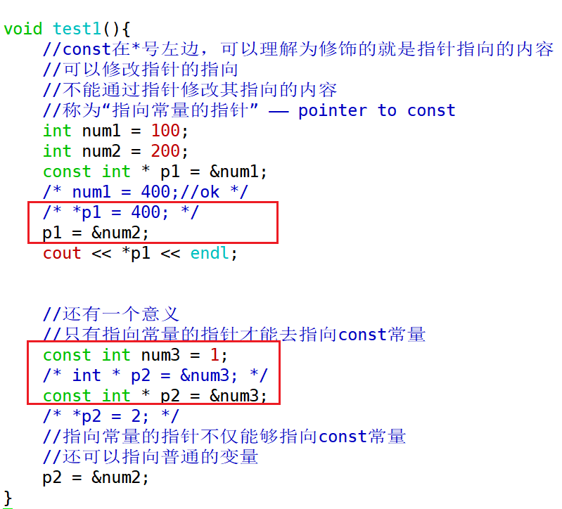
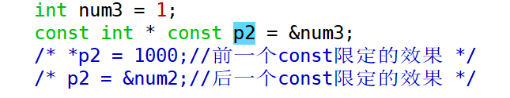
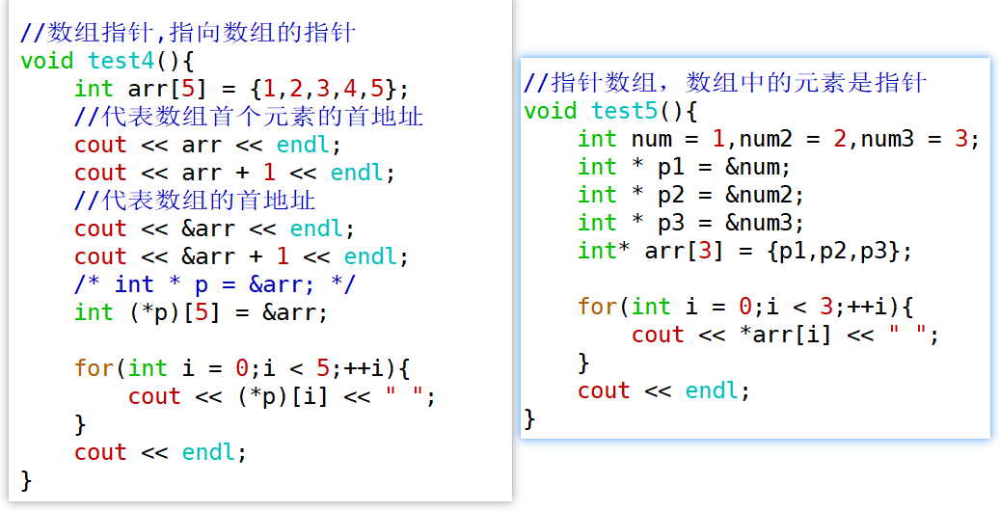
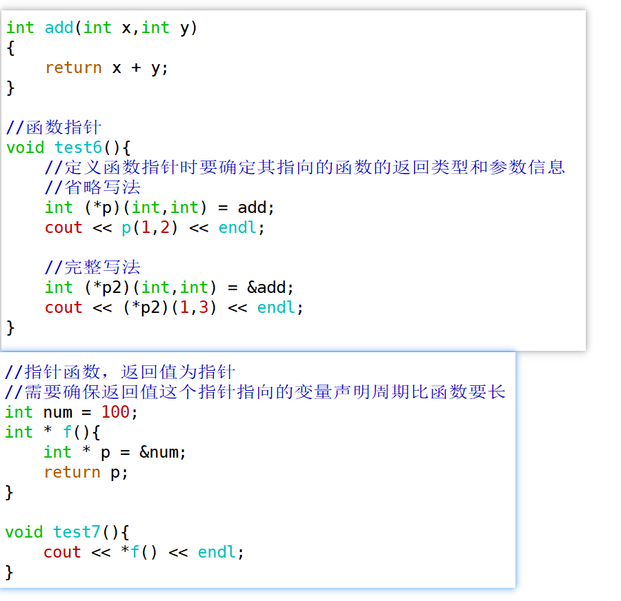

1. 什么是命名空间？其作用是什么？匿名命名空间有什么特点？

> 命名空间是一种将全局作用域划分为更小的、可管理的部分的机制。
>
> 程序员根据需要指定一些有名字的空间域，把一些全局实体分别存放到各个命名空间中，从而与其他全局实体分隔开，以此来避免名字冲突问题。
>
> 命名空间中可以存放：变量、常量、函数、结构体、引用、类、对象、模板、命名空间等，它们都称为实体。
>
> 
>
> 命名空间的作用：
>
> （1）避免命名冲突：命名空间提供了一种将全局作用域划分成更小的作用域的机制，用于避免不同的代码中可能发生的命名冲突问题；
>
> （2）组织代码：将相关的实体放到同一个命名空间；
>
> （3）版本控制：不同版本的代码放到不同的命名空间中；
>
> ​	总之，需要用到代码分隔的情况就可以考虑使用命名空间。
>
> 
>
> 匿名空间的特点：
>
> 匿名空间中的实体不能跨模块调用；
>
> 匿名空间不要定义与全局空间中同名的实体。


2. 什么是常量指针和指向常量的指针？什么是数组指针和指针数组？什么是函数指针和指针函数？请举例说明。

> const修饰指针时，如果const在*左边，即为指向常量的指针（pointer to const），此类指针可以修改指向，但不能通过指针修改其指向的值
>
> 
>
> 如果const在*右边，即为常量指针（const pointer），可以通过此类指针修改其指向的值，但不能修改指向
>
> 
>
> 双重const限定的指针
>
> 


> 数组指针/指针数组
>
> 


> 函数指针/指针函数
>
> 


3. new/delete与malloc/free的区别是什么？(面试常考)

> 1. malloc/free是库函数；new/delete是表达式，后两者使用时不是函数的写法；
> 2. new表达式的返回值是相应类型的指针，malloc返回值是void*；
> 3. malloc申请的空间不会进行初始化，获取到的空间是有脏数据的，但new表达式申请空间时可以直接初始化；
> 4. malloc的参数是字节数，new表达式不需要传递字节数，会根据相应类型自动获取空间大小。


4. 以下代码的输出结果：

``` c++
int foo(int x,int y)
{
	if(x <= 0 ||y <= 0){
		return 1;
    }
	return 3 * foo(x-1, y/2);
}

cout << foo(3,5) << endl;  //3 * foo(2,2)     3 * 3 * foo(1,1)    3 * 3 * 3 * foo(0,0)   27
```


5. 若执行下面的程序时，从键盘上输入5，则输出是（）

``` c++
int main(int argc, char** argv)
{
	int x;
	cin >> x;
	if(x++ > 5)//后置++表达式的返回值是加1之前的副本，x变成了6，x++返回5
	{
		cout << x << endl;
	}
	else
	{
		cout << x-- << endl;//后置--同样也是返回改变之前的副本，x--返回6，x变成了5
	}
	return 0;
}
```


6. 写出下面程序的结果：

``` c++
int main()
{
int a[5]={1,2,3,4,5};
int *ptr=(int *)(&a+1);
printf("%d,%d",*(a+1),*(ptr-1));
}
```

   2,5


