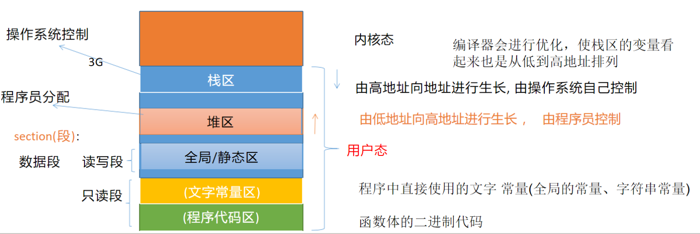

1. 什么是函数重载？其实现原理是什么？如何进行C与C++的混合编程？

> 在同一作用域内，可以有一组具有相同函数名，不同参数列表的函数，这组函数被称为重载函数。
>
> 函数重载的条件：同一作用域，函数名相同，函数参数的个数、类型、顺序任一有所不同，则构成函数重载。只有返回类型不同，参数情况完全相同，是不能构成重载的
>
> 
>
> 实现原理：c++编译器的名字改编机制会将程序员定义的函数名改编成包含参数信息的名字，因此在代码中两个同名的函数，只要参数信息不同，经过名字改编之后会拥有不同的名字。
>
> 
>
> 如果在C++代码中希望嵌入一段C代码，并以C编译器的方式进行编译，可以采用extern "C"的方式。extern "C" { ... }，大括号中的内容会按照C编译器的方式进行编译，不会进行名字改编，一定程度上提升了效率。

2. 什么是inline函数？inline与带参数的宏定义之间的区别是什么？

> 内联函数是C++的增强特性之一，用来降低程序的运行时间。
>
> 在代码中在一个函数的定义之前加上inline关键字，就是对编译器提出了内联的建议。如果建议通过，就会进行内联展开。
>
> 当内联函数收到编译器的指示时，即可发生内联：编译器将使用函数的定义体来替代函数调用语句，**这种替代行为发生在编译阶段而非程序运行阶段。**
>
> 定义方式：定义函数时，在函数的最前面加上关键字“inline”.
>
> 
>
> 区别：
>
> （1）带参数的宏定义（宏函数）的替换时机是在预处理阶段，内联机制的替换是发生在编译阶段；
>
> （2）宏函数不可调试，内联函数可以调试，使用起来更安全。
>
> 

3. C++内存布局是怎样的？可以具体阐述一下么？

> 从高地址到低地址可以分为五个区域：
>
> - 栈区：操作系统控制，由高地址向低地址生长，编译器做了优化，显示地址时栈区和其他区域保持一致的方向。
>
> - 堆区：程序员分配，由低地址向高地址生长，堆区与栈区没有明确的界限。
>
> - 全局/静态区：读写段（数据段），存放全局变量、静态变量。
>
> - 文字常量区：只读段，存放程序中直接使用的常量，如const char * p = "hello";  hello这个内容就存在文字常量区。
>
> - 程序代码区：只读段，存放函数体的二进制代码。
>
>   

4. 定义Student类型，包含数据成员包括姓名、学号、年龄，并用该类型创建不同的对象

