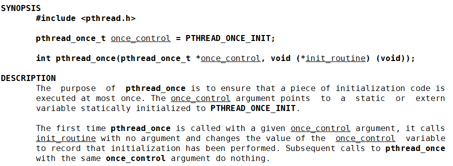
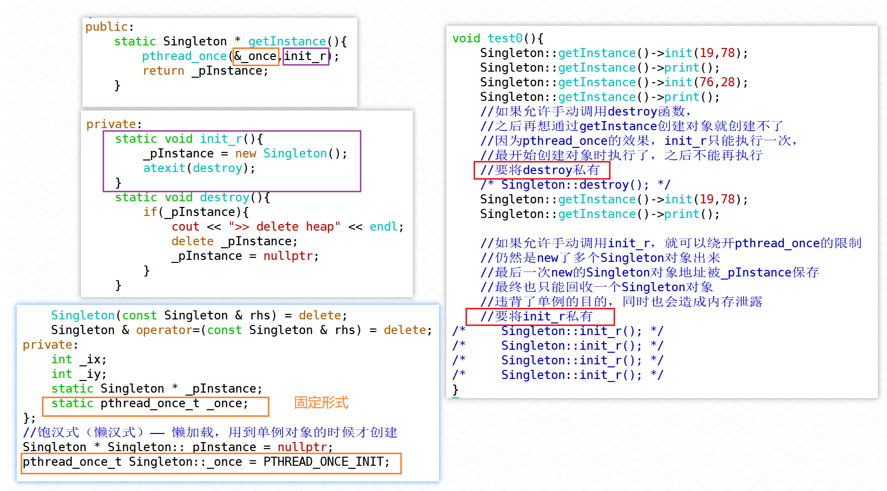
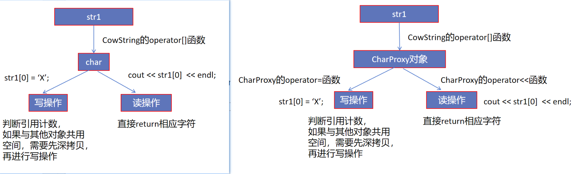
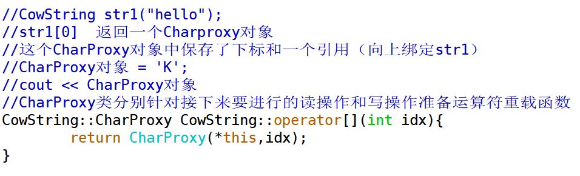

1. 使用pthread_once函数结合destroy函数，实现单例模式的自动释放

> 
>
> 


2. 实现一个采用COW技术的自定义字符串类型CowString，并让其下标访问运算符能区分出读操作和写操作。

> 
>
> 


3. 现以下函数，简单模拟SSO思想的string并验证实现效果

``` c++
class String {
public:
    String(const char * pstr);
    ~String();
    char & operator[](size_t idx);

    friend
    ostream & operator<<(ostream & os,const String & rhs);
private:
	union Buffer{
		char * _pointer = nullptr;
		char _local[16];
	};
	
	size_t _size;
	size_t _capacity;
    Buffer _buffer;
};

void test0(){
    String str1("hello");
    String str2("hello,world!!!!!");
    //...
}
```

> 共用体的特性：
>
> 1.所有成员都存在同一内存空间上，一次只能使用一个成员
>
> 2.对union的某个成员进行写操作可能会导致整个union的内存被重新初始化


