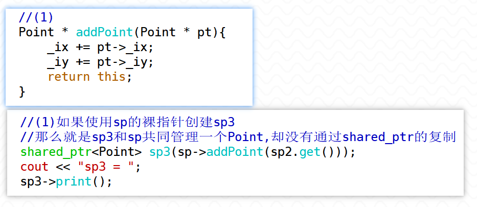

1. 使用类模板模拟RAII的思想，使其管理堆上的Computer资源

> RAII技术，具备以下基本特征：
>
> - 在构造函数中初始化资源，或托管资源；
> - 在析构函数中释放资源；
> - 一般不允许进行复制或者赋值（对象语义）；
> - 提供若干访问资源的方法（如：读写文件）。
>
> 即使Computer类的数据成员申请了堆空间，当栈上的RAII对象销毁时，调用析构函数，即delete一个Computer*，会先执行Computer的析构，完成_brand管理的空间的回收，再调用operator delete回收掉堆上的Computer对象本身的空间。不会有内存泄露问题。
>
> 


2. C++提供了哪几种智能指针，其各自的特点是什么？请通过代码进行练习、验证

> (1)auto_ptr:允许复制赋值，但底层实际的处理方式是移交管理权，存在隐患
>
> (2)unique_ptr:
>
> - 特点1：不允许复制或者赋值
>
> - 特点2：独享所有权的智能指针
>
> ``` c++
> void test0(){
>     unique_ptr<int> up(new int(10));
>     cout << "*up:" << *up << endl;
>     cout << "up.get(): " << up.get() << endl;
> 
>     cout << endl;
>     //独享所有权的智能指针，对托管的空间独立拥有
>     //拷贝构造已经被删除
>     unique_ptr<int> up2 = up;//复制操作 error
> 
>     //赋值运算符函数也被删除
>     unique_ptr<int> up3(new int(20));
>     up3 = up;//赋值操作 error
> }
> ```
>
> - 特点3：利用移动语义作为容器元素
>
> ``` c++
> 	vector<unique_ptr<Point>> vec;
>     unique_ptr<Point> up4(new Point(10,20));
>     //up4是一个左值
>     //将up4这个对象作为参数传给了push_back函数，会调用拷贝构造
>     //但是unique_ptr的拷贝构造已经删除了
>     //所以这样写会报错
>     vec.push_back(up4);  //error
> 
>     vec.push_back(std::move(up4));  //ok 移动构造
>     vec.push_back(unique_ptr<Point>(new Point(1,3))); //ok
> ```
>
> 
>
> (3)shared_ptr:
>
> 特征1：共享所有权的智能指针 —— 可以使用**引用计数**记录对象的个数。
>
> 特征2：可以进行复制或者赋值，表明具备值语义。
>
> 特征3：也可以作为容器的元素 —— 作为容器元素的时候，即可以传递左值，也可以传递右值。
>
> 特征4：也具备移动语义，可以使用移动构造和移动赋值函数
>
> ``` c++
> 	vector<shared_ptr<int>> vec;
> 	vec.push_back(sp);//ok
> 	vec.push_back(std::move(sp2));//ok
> 	vec.push_back(shared_ptr<Point>(new Point(1,3))); //ok
> ```
>
> 
>
> (4)weak_ptr:
>
> weak_ptr是弱引用的智能指针，它是shared_ptr的一个补充，使用它进行复制或者赋值时，并不会导致引用计数加1，是为了解决shared_ptr的问题而诞生的。
>
> weak_ptr知道所托管的对象是否还存活，如果存活，必须要提升为shared_ptr才能对资源进行访问，不能直接访问。
>
> 特点为”托管“资源，但不增加该资源的引用计数。


3. 理解shared_ptr的循环引用问题（面试容易问到），掌握解决的方法，通过代码验证

> 如下：
>
> 
>
> 经过赋值后，实际上形成了这样的结构
>
> 
>
> ——程序结束时，发现Parent和child的析构函数都没有被调用
>
> 因为childPtr和parentPtr会先后销毁，但是堆上的Parent对象和Child对象的引用计数都变成了1，而不会减到0，所以没有回收
>
> 

> <font color=red>**—— 解决方式，引入一个weak_ptr(指向但不增加引用计数)**</font>
>
> 
>
> 
>
> 
>
> 栈上的childPtr对象先销毁，会使堆上的Child对象的引用计数减1，因为这个Child对象的引用计数本来就是1，所以减为了0，回收这个Child对象，造成堆上的Parent对象的引用计数也减1
>
> 
>
> 
>
> 再当parentPtr销毁时，会再让堆上的Parent对象的引用计数减1，所以也能够回收。
>
> 


4. unique_ptr和shared_ptr需要注意哪些误用的情况，应该如何解决（避免），请通过代码进行说明。

> —— unique_ptr要注意的误用
>
> ``` c++
> void test0(){
> //需要人为注意避免
> Point * pt = new Point(1,2);
> unique_ptr<Point> up(pt);
> unique_ptr<Point> up2(pt);
> }
> 
> void test1(){
> unique_ptr<Point> up(new Point(1,2));
> unique_ptr<Point> up2(new Point(1,2));
> //让两个unique_ptr对象托管了同一片空间
> up.reset(up2.get());
> }
> ```
>
> ——shared_ptr要注意的误用
>
> 使用不同的智能指针托管同一片堆空间,只能通过shared_ptr开放的接口——拷贝构造、赋值运算符函数
>
> 如果是用裸指针的形式将一片资源交给不同的智能指针对象管理，即使是shared_ptr也是不行的。
>
> ``` c++
> void test2(){
> Point * pt = new Point(10,20);
> shared_ptr<Point> sp(pt);
> shared_ptr<Point> sp2(pt);
> }
> 
> void test3(){
> //使用不同的智能指针托管同一片堆空间
> shared_ptr<Point> sp(new Point(1,2));
> shared_ptr<Point> sp2(new Point(1,2));
> sp.reset(sp2.get());
> }
> ```

> 还有一种比较隐蔽的误用情况
>
> —— 还有一种误用
>
> 给Point类加入了这样的成员函数
>
> ``` c++
> Point * addPoint(Point * pt){
> 	_ix += pt->_ix;
> 	_iy += pt->_iy;
> 	return this;
> }
> ```
>
> 使用时，这样还是使得sp3和sp同时托管了同一个堆对象
>
> ```` c++
> shared_ptr<Point> sp(new Point(1,2));    
> shared_ptr<Point> sp2(new Point(3,4));
> 
> //创建sp3的参数实际上是sp所对应的裸指针
> //效果还是多个智能指针托管了同一块空间
> shared_ptr<Point> sp3(sp->addPoint(sp2.get()));
> cout << "sp3 = ";
> sp3->print();
> ````
>
> 需要给sp3的构造函数传入`shared_ptr<Point>` 对象，而不是裸指针
>
> ——使用智能指针辅助类enable_shared_from_this的成员函数shared_from_this
>
> 
>
> 
>
> 在Point的addPoint函数中需要使用shared_from_this函数返回的shared_ptr作为返回值，要想在Point类中调用enable_shared_from_this的成员函数，最佳方案可以让Point类继承enable_shared_from_this类。
>
> 
>
> —— **探索过程**
>
> 
>
> 
>
> 


