### 项目名称

**设计师云存储解决方案 (Designer Cloud Storage Solution, DCSS)**

### 项目背景

  在当今数字化时代，设计师群体越来越依赖于高效、安全的云存储解决方案来管理其庞大的素材库。设计师需要频繁地在多个设备和地点之间共享、上传和下载大量的高质量素材文件（如图像、视频、设计稿等），这些文件往往体积庞大，且对数据的完整性和传输效率有着严格的要求。同时，设计师对数据的实时性和可用性也有较高的要求，任何数据丢失或延迟都可能对其工作造成重大影响。因此，为设计师群体打造一个专属的云存储模块，以满足其独特的需求，是一个极具挑战和价值的项目。

  本项目旨在开发一个基于Linux系统的高效云存储解决方案，专为设计师群体服务，提供安全、可靠和高效的用户数据存储和管理功能。该系统不仅要支持设计师通过不同客户端进行素材的上传、下载和寻址，还需具备防止数据丢失的机制，并能处理大规模的客户信息文件的上传和存储。

  项目旨在实现用户数据的高效存储和管理，采用私有协议在服务器上部署关键用户数据，支持用户通过不同客户端进行素材的上传、下载和寻址。系统还需处理大规模客户信息文件的上传和存储，通过HTTP和SRPC协议结合Workflow框架实现API网关，将大量客户信息文件上传到阿里云OSS。

**项目亮点**：

1. **虚拟文件表**：利用MD5文件校验机制，实现文件在磁盘中的唯一存储。相同文件再次上传时使用秒传机制，删除操作也采用虚拟删除，提升了存储效率。
2. **零拷贝技术**：使用mmap将文件映射到内存，结合write将文件内容直接写入套接字，减少了数据拷贝，提高了传输效率。
3. **断点续传**：实现了大文件的断点续传功能，通过记录已传输的文件块信息，减少了由于网络问题导致的重新下载，只传输尚未成功传输的文件块，提高了用户体验。
4. **分块上传**：将要上传的文件切分成若干小片，每个小片单独传输，服务端接收所有小片后合并以获取原始文件。这样可以降低传输失败的风险，并实现灵活的传输过程。
5. **高效上传与存储**：通过HTTP和SRPC协议结合Workflow框架实现数据上传的解耦，提高了上传效率。
6. **Nginx负载均衡**：优化Nginx配置，使系统响应时间显著提升，改善了整体用户体验。

**项目贡献**：

通过该项目，设计师群体可以高效、安全地管理和传输他们的素材文件。私有协议的应用和多层次的存储策略确保了数据的高效管理和传输，完善的数据备份与恢复机制以及云存储的使用，确保了用户数据的安全性和可靠性。断点续传、分块上传和零拷贝技术显著提高了文件上传、下载和管理的效率和体验。通过Nginx负载均衡的优化，使系统的响应时间大幅提升，极大地改善了用户体验。

# Web服务器

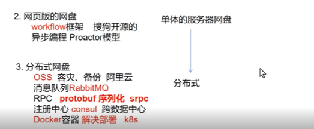

## **框架部分：**workflow

之前的 Reactor框架（造轮子）

现在使用第三方框架（库）进行二次开发 （使用轮子） **HTTP 协议异步回调workflow框架** 

  **使用哪一种模型？**

​			 Reactor反应器模式 (同步+非阻塞)              **Proactor主动器模式(异步+回调函数)**

==**workflow**基于**Proactor** 既可以模拟客户端（可以作为HTTP/MySQL/Redis客户端） 也可以模拟服务器（HTTP服务器）抽象成异步任务流 任务是基本单位，多任务之间可以进程串并联的组合==

==**workflow的编程范式**==

1.对业务进行拆分成多个不同的任务

2.每一个任务存在两个阶段    （异步：数据已经完成了接受和发送）

 **a.基本工作 ：工作内容由任务类型来决定 （框架实现）       b.回调函数 程序员自定义**        

3.将任务按串并联的方式组合

4.设置任务属性

5.将任务递送给框架，由框架分配资源 运行

==**使用workflow作为HTTP客户端**== 

用户可以通过以下的方式进行控制任务的属性： 

创建任务的时候，根据任务类型给**工厂函数**传递一些属性参数，比如HTTP任务的URL,最大重定向次数、连接失败的时候的重试次数和用户的回调函数（没有回调函数则传入nullptr)等参数； 

在创建任务之后且任务启动之前，可以配置任务的各种参数，比如HTTP任务的目标URI、请求方法等；

在创建任务的时候需要配置一个**回调函数**，这个回调函数会任务的其余所有步骤都执行完成以后调用。 

  

**workflow框架在运行时会创建多个线程，来调度任务，由于是异步不知道到底具体哪一个线程去执行哪一个任务**

当回调函数执行时，已经完成了数据的接收，**回调函数**可以设置获取本次任务的执行状态和失败的原因，还可以获取http请求报文和响应报文的内容

**调用start方法可以异步启动任务。**需要值得特别注意的是，只有客户端才可以调用start方法。通过观察得知，start方法的底层逻辑就是根据本任务对象创建一个序列，其中本任务是序列当中的第一个任务， 随后启动该任务。

**避免进程提前终止**  **阻塞当前主进程**

由于任务的启动是异步的，所以任务的执行和主线的执行是并行的，如果不加任何的控制，那么当主线程执行完所有操作以后直接退出，并且导致整个进程的终止。 WFFacilities::WaitGroup（类似于计数器（原子操作） , done()方法减去计数） 可以根据情况**阻塞线程或者恢复运行**，可以用来主线的运行情况。

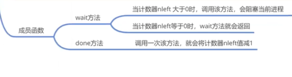

总结

1. 通过工厂类WFTaskFactory创建WFHttpTask任务
2. 设置WFHttpTask任务的属性
3. WFHttpTask任务调用start方法，交给框架去运行

==**workflow的序列机制**==

**1.串行任务**

在workflow当中，所有的任务都是异步执行的，如果用户需要两个任务同步执行，比如一个Redis任务先执行一次 SET key value ，再执行一次 GET key 指令，就需要将两个指令分配两个任务，并且将两个任务**串联**起来 ——**这里就用到了workflow的序列机制**。workflow的序列机制用于将若干个任务串联起来，从而可以同步地执行任务。在某个任务调用**方法start**而启动时，其本质是创建一个序列，并且将该任务作为序列当中的第一个任务，然后按次序执行序列当中的任务。

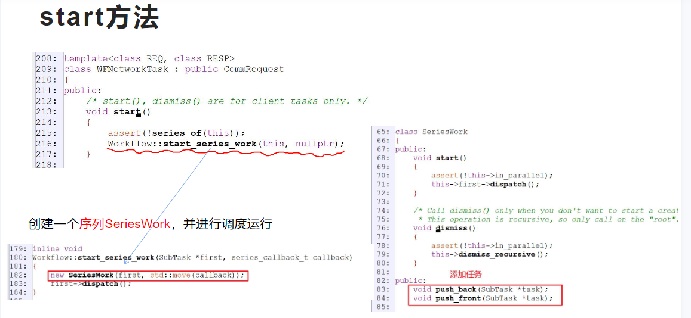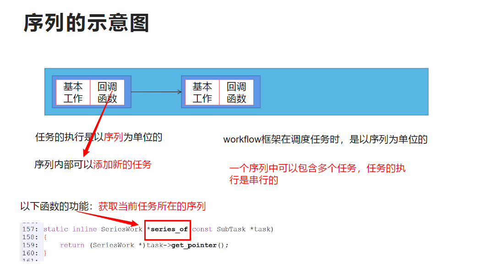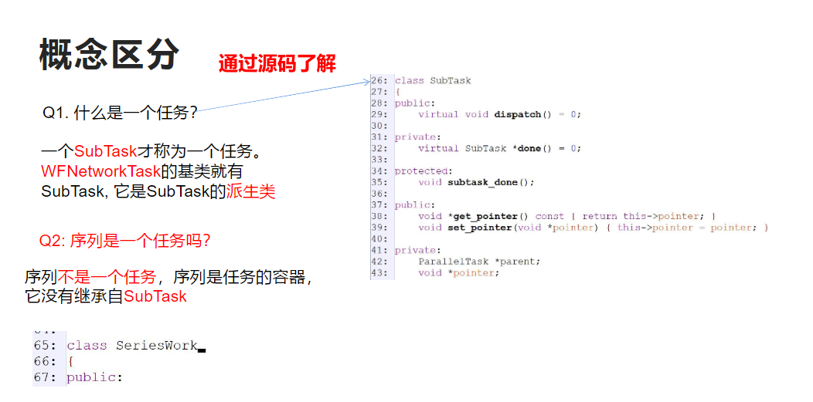

==**多任务之间访问共享资源**==

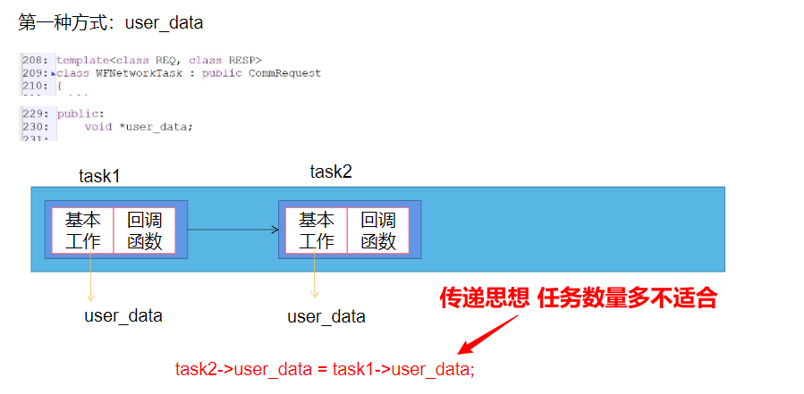

第二种方式：采用的序列的context (上下文)

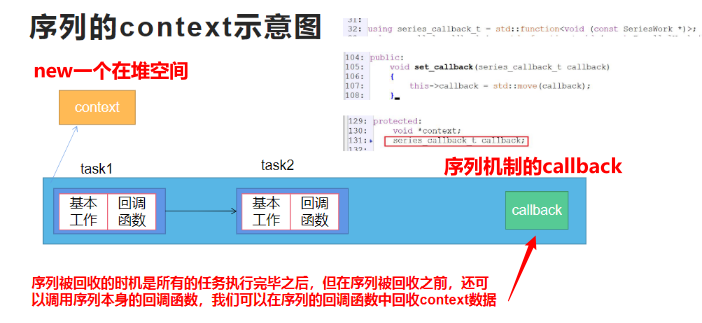

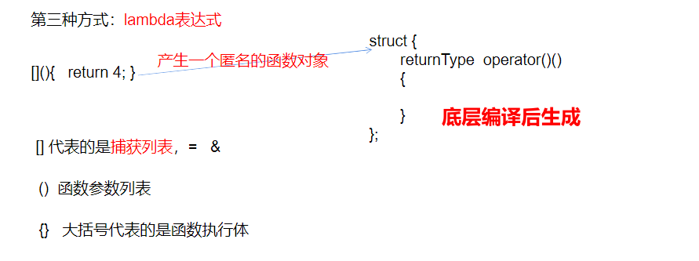

**2.并行任务** 

与SeriesWork对应的ParallelWork类，描述了一个**并行任务**，并行任务由序列构成，代表若干个序列的并行执行。所有序列结束，则这个并行任务的基本工作结束，随后执行相应的回调函数。需要特别注意的是，ParallelWork本身也是一种任务，所以它可以加入到其他序列中——（而这个序列又可以用来构建更加复杂的并行任务）这样的话，用户就可以任意地构造复杂的任务流程图，并且 还可以在运行过程中动态地创建任务。

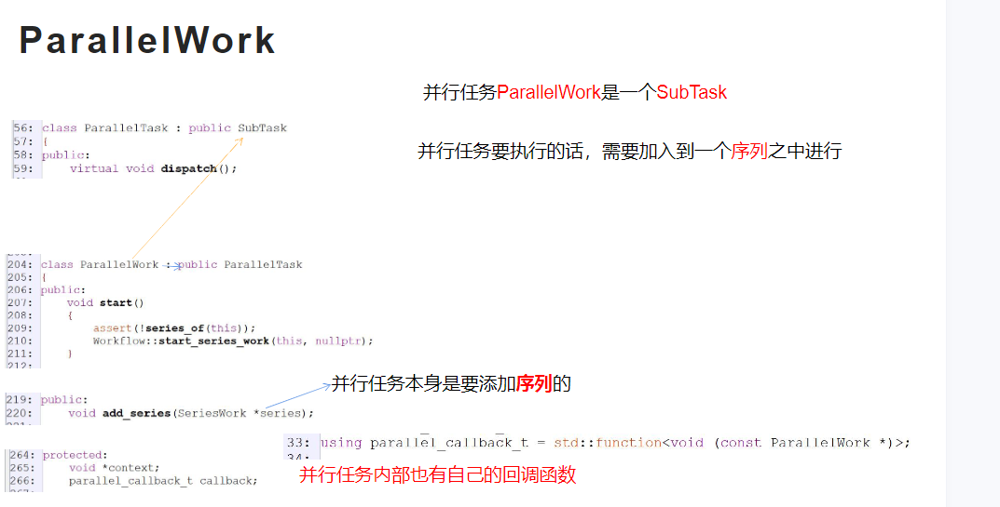

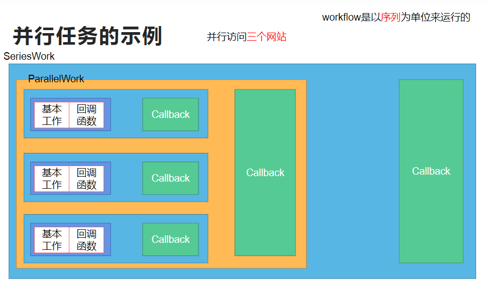

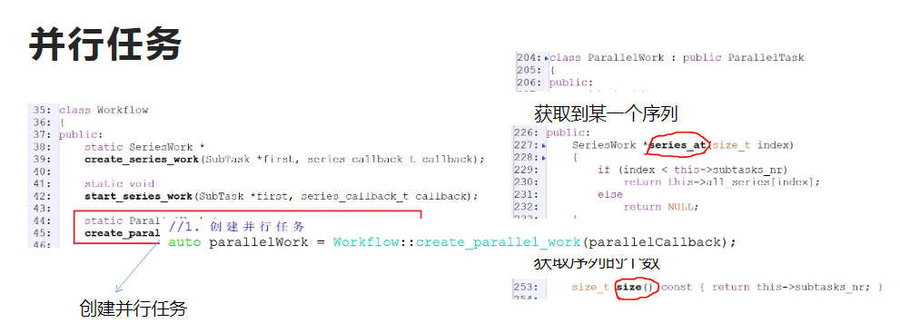

**==使用workflow作为HTTP服务器==** 

服务端的使用过程并非是主动地创建任务然后异步启动之，相反地，它是一个被动的过程——workflow使用一个专门的**WFHttpServer对象**来描述服务端，**WFHttpServer对象负责监听端口等待客户端连接**，每当有客户端接入的时候，server就会自动创建 一个特殊的服务端任务。 

这个服务端任务有以下特殊之处： 这个任务是在客户端接入之后由框架自动生成的； 用户需要设置一个**process函数**来找到服务端任务； 这个服务端任务回调函数会在序列中所有其他任务执行完之后执行； 回复给客户端的响应内容，一定是服务端任务的响应内容； 在服务端任务所在序列执行完毕之后，将响应回复给客户端。

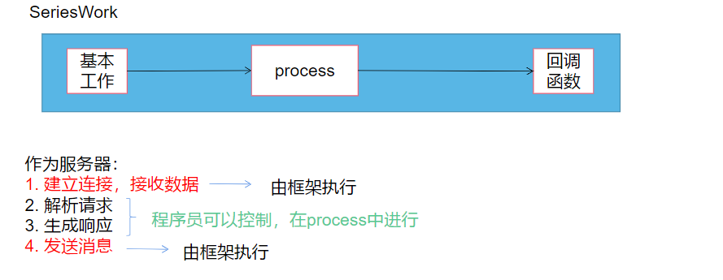

当回调函数执行时，httpResponse已经发送完成 在回调函数之中不能对其进行设置

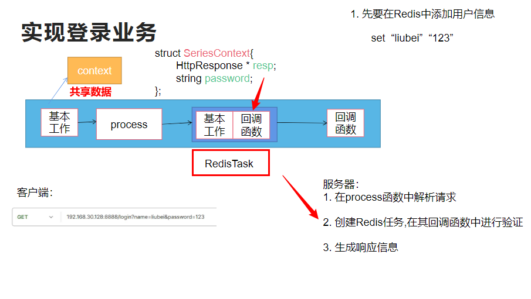

当该回调函数被执行时，响应信息已经发送完毕了，再执行回调函数时，可以检查任务的状态和进行回收的操作

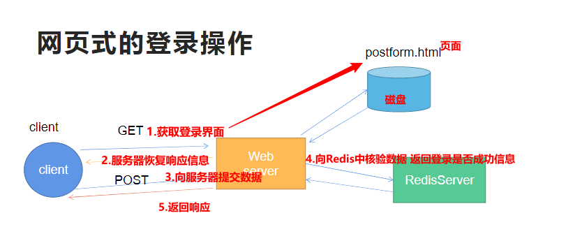

## ==**分片上传**==  ：对于大文件而言，不能一次性把所有的文件上传，可以分成多个片段进行 

==**面试必吹**：与阿里云的OSS的分片上传思路保持一致==

在上传文件的时候，假如文件的体积过大，就会导致单次传输时间过长，传输失败的风险大大增加。为 了使传输过程更加灵活，也为了实现断点续传功能，一种解决方案就是分片——将要上传的文件切分成若干小片，每个小片单独传输，服务端会接收某个文件的若干小片，最后合并这些分片以获取原始文件。

**客户端上传到服务器**

1.初始化     2.上传分片   3.进行校验

要实现分片上传功能，**服务端**需要做如下工作： 

1. 初始化上传：为不同的文件上传任务分配不同的ID；
2. 单个分片：存储某个文件分片；
3. 分片信息查询：记录分片的信息，有哪些是已经上传完成了的；
4. 分片合并：如果所有分片都已经上传完成，则合并分片得到原始文件。

**阶段一：**

1.**客户端**把文件相关相关信息告诉服务器 ，客户端用post请求去添加数据 Body携带一个json的字符串的信息包含

 **文件名filename   文件的大小  文件的一个hash值**

2.**服务器**收到数据之后，解析请求（获取用户名，文件名，文件大小，文件hash） ，对于每一个文件的上传生成**唯一的ID（用户名+时间信息）**，生成分片信息（每一个分片的最大长度）通过最大长度可以推算出分片数量，生成响应信息打包成JSON，发送给客户端，服务器也要存储ID对应的信息，存入Redis（hashset）作为缓存，这里键选用上传ID，值数据类型是哈希表。

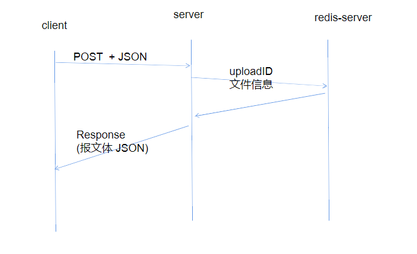

**为每个文件上传任务分配一个上传ID，使用ID的原因如下：** 

服务端可能会并发地执行多个上传文件的任务，服务端可以通过ID识别不同的文件任务； 

如果由于各种原因导致本次上传失败，需要重启上传任务，使用ID可以获取缓存的上传进度信息；

**阶段二：**

**客户端**收到分片大小和分片数量，通过一个post请求告诉服务器我现在上传的是哪一个分片信息，以及它的内容。

**服务器**由于不同的接口会使用相同的URL路径部分进行上传，所以需要在URL的查询部分来携带上传ID和分片信息。因此该接口的第一步是解析用户请求。解析请求得到（ ID、分片大小、分片内容 ）存储分片的内容 通过ID生成一个临时文件夹 把分片内容写入临时文件夹 在Redis中写入分片的记录也就是上传进度 告知客户端分片信息接收成功

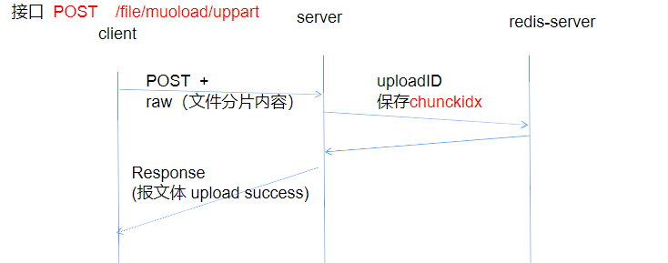

**阶段三：**

**客户端**告诉服务器文件上传完毕

**服务器**接收数据之后解析请求，访问Redis 检查分片信息是否完整，进行校验检查分片记录是否完全 分片记录完整的情况下合并文件、校验hash值、删除临时文件夹、生成响应信息，发送给客户端

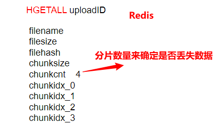

**如何检查分片是否完全：**

首先需要在缓存中查找上传进度，在redis的结果当中获取前缀为chkidx_的键并统计总数，倘若总数和分片数量一致，则说明分片上传完成。 当分片上传完成了之后，可以使用**workflow的文件IO任务**（并联成并行任务），将所有的分片合并成原始文件。

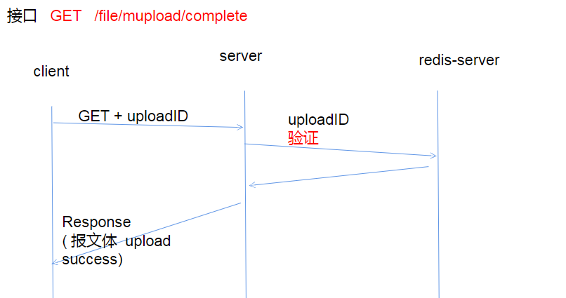

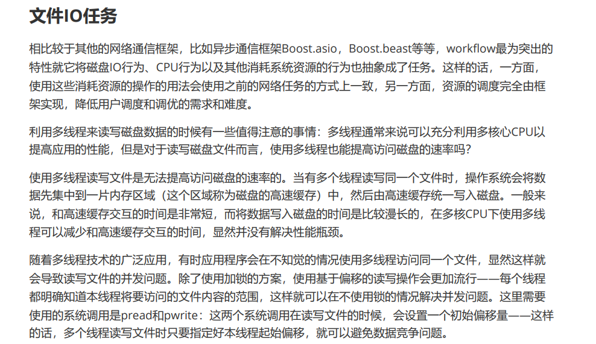

利用workflow当中的HTTP服务端设计以及文件IO接口就可以使用实现一个静态资源服务器，其基本的原 理是当客户端接入时，process执行过程中会创建一个文件IO任务，并加入到服务端任务所在的序列当 中，这样的话，只要文件IO任务执行完毕了，就可以将IO得到的内容作为响应回复给客户端了。
